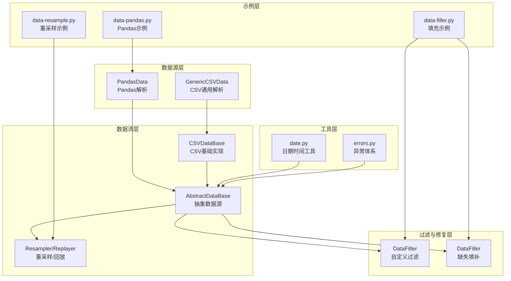
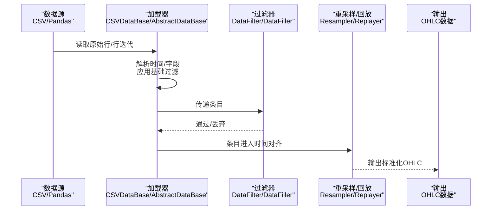
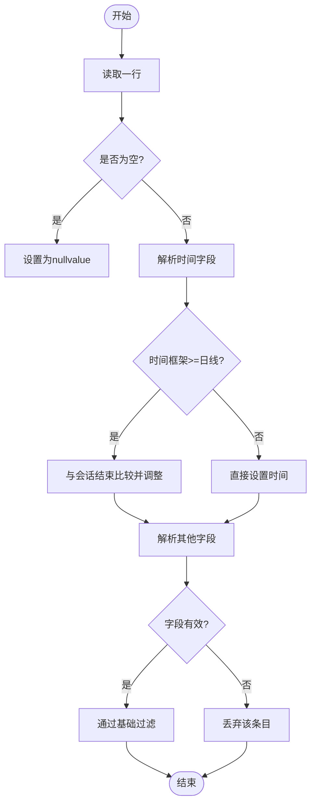
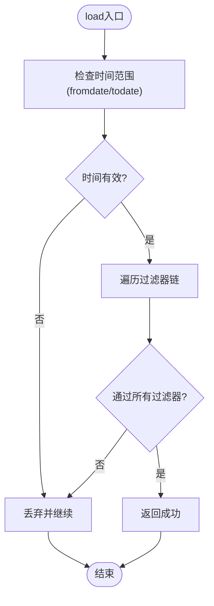
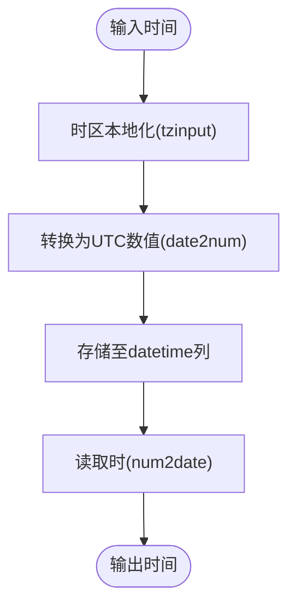
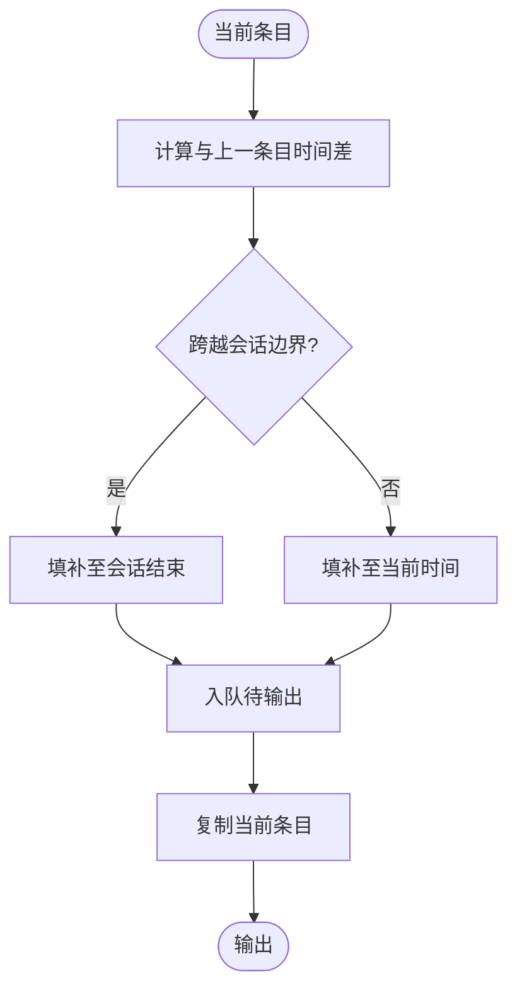
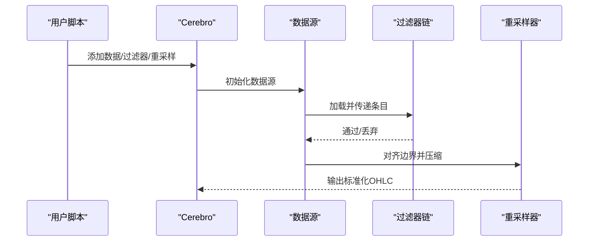
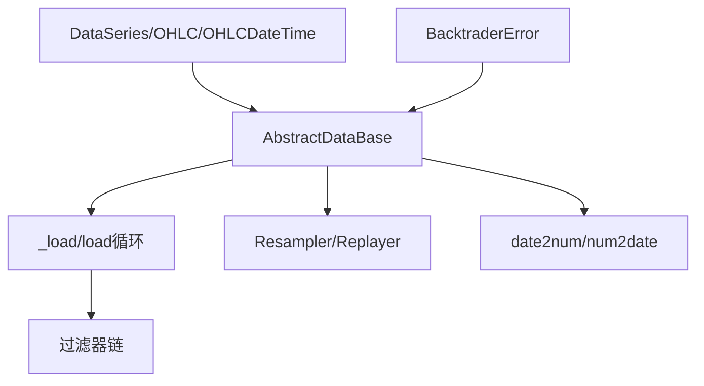

# 数据质量保证

<cite>
**本文档引用的文件**
- [feed.py](file://backtrader/feed.py)
- [dataseries.py](file://backtrader/dataseries.py)
- [lineseries.py](file://backtrader/lineseries.py)
- [date.py](file://backtrader/utils/date.py)
- [errors.py](file://backtrader/errors.py)
- [datafilter.py](file://backtrader/filters/datafilter.py)
- [datafiller.py](file://backtrader/filters/datafiller.py)
- [resamplerfilter.py](file://backtrader/resamplerfilter.py)
- [csvgeneric.py](file://backtrader/feeds/csvgeneric.py)
- [pandafeed.py](file://backtrader/feeds/pandafeed.py)
- [data-filler.py](file://samples/data-filler/data-filler.py)
- [data-resample.py](file://samples/data-resample/data-resample.py)
- [data-pandas.py](file://samples/data-pandas/data-pandas.py)
</cite>

## 目录
1. [引言](#引言)
2. [项目结构](#项目结构)
3. [核心组件](#核心组件)
4. [架构总览](#架构总览)
5. [详细组件分析](#详细组件分析)
6. [依赖关系分析](#依赖关系分析)
7. [性能考虑](#性能考虑)
8. [故障排除指南](#故障排除指南)
9. [结论](#结论)
10. [附录](#附录)

## 引言
本指南面向Backtrader用户与开发者，系统化阐述数据质量保证体系的设计与实施方法。内容覆盖数据完整性检查（缺失值检测、重复数据处理、异常值识别）、数据一致性验证（时间戳排序、价格范围检查、成交量匹配验证）、数据标准化流程（时间格式统一、货币单位转换、数据精度控制），并提供清洗与预处理最佳实践（边界情况处理、错误恢复机制、性能优化策略）。文档同时给出在数据加载过程中实施质量控制的具体路径与常见问题处理方案。

## 项目结构
Backtrader的数据质量保证能力主要由以下层次构成：
- 数据源层：CSV/Pandas等数据适配器负责原始数据读取与初步解析。
- 数据流层：AbstractDataBase/CSVDataBase等基类实现数据加载、过滤、重采样与回放等核心流程。
- 过滤与修复层：DataFilter、DataFiller等过滤器对数据进行筛选与填补。
- 时间与精度工具层：日期时间转换、时区处理与数值精度控制。
- 示例与集成层：samples中的示例脚本展示如何在真实场景中组合使用上述组件。

**图表来源**
- [feed.py](file://backtrader/feed.py#L122-L598)
- [dataseries.py](file://backtrader/dataseries.py#L60-L212)
- [lineseries.py](file://backtrader/lineseries.py#L444-L645)
- [csvgeneric.py](file://backtrader/feeds/csvgeneric.py#L32-L163)
- [pandafeed.py](file://backtrader/feeds/pandafeed.py#L107-L274)
- [datafilter.py](file://backtrader/filters/datafilter.py#L27-L74)
- [datafiller.py](file://backtrader/filters/datafiller.py#L30-L177)
- [resamplerfilter.py](file://backtrader/resamplerfilter.py#L435-L753)
- [date.py](file://backtrader/utils/date.py#L25-L29)
- [errors.py](file://backtrader/errors.py#L28-L52)
- [data-filler.py](file://samples/data-filler/data-filler.py#L37-L93)
- [data-resample.py](file://samples/data-resample/data-resample.py#L30-L72)
- [data-pandas.py](file://samples/data-pandas/data-pandas.py#L32-L75)

**章节来源**
- [feed.py](file://backtrader/feed.py#L122-L598)
- [dataseries.py](file://backtrader/dataseries.py#L60-L212)
- [lineseries.py](file://backtrader/lineseries.py#L444-L645)

## 核心组件
本节聚焦数据质量保证的关键构件及其职责：
- 抽象数据源与CSV基础实现：负责打开文件、逐行读取、分词、时间解析与基础过滤。
- 数据系列与OHLC结构：定义标准字段（时间、开盘、最高、最低、收盘、成交量、持仓量）及访问接口。
- 过滤器与填补器：提供自定义过滤逻辑与缺失时段填补策略。
- 重采样与回放：确保不同时间框架下的连续性与时序一致性。
- 工具与异常：提供日期时间转换、时区处理与统一异常类型。

**章节来源**
- [feed.py](file://backtrader/feed.py#L649-L727)
- [dataseries.py](file://backtrader/dataseries.py#L107-L212)
- [datafilter.py](file://backtrader/filters/datafilter.py#L27-L74)
- [datafiller.py](file://backtrader/filters/datafiller.py#L30-L177)
- [resamplerfilter.py](file://backtrader/resamplerfilter.py#L435-L753)
- [date.py](file://backtrader/utils/date.py#L25-L29)
- [errors.py](file://backtrader/errors.py#L28-L52)

## 架构总览
Backtrader的数据质量保证遵循“加载-过滤-标准化-输出”的流水线模式。数据从适配器进入，经过过滤器剔除无效条目，通过填补器补齐缺失时段，再经重采样/回放统一到目标时间框架，最终以OHLC结构输出供策略使用。

**图表来源**
- [feed.py](file://backtrader/feed.py#L699-L727)
- [datafilter.py](file://backtrader/filters/datafilter.py#L57-L74)
- [datafiller.py](file://backtrader/filters/datafiller.py#L110-L177)
- [resamplerfilter.py](file://backtrader/resamplerfilter.py#L495-L561)
- [dataseries.py](file://backtrader/dataseries.py#L107-L212)

## 详细组件分析

### 组件A：数据加载与完整性检查（CSV）
该组件负责从CSV文件读取原始数据，执行时间格式解析、空值替换与基础过滤。关键点包括：
- 行读取与分词：逐行读取并按分隔符拆分。
- 时间解析：支持字符串格式、Unix时间戳与自定义可调用函数；日线及以上时间框架下对会话结束时间进行校正。
- 空值处理：空字段使用nullvalue占位，便于后续统一处理。
- 基础过滤：根据fromdate/todate与会话起止时间进行过滤。

**图表来源**
- [csvgeneric.py](file://backtrader/feeds/csvgeneric.py#L103-L158)
- [feed.py](file://backtrader/feed.py#L699-L727)

**章节来源**
- [csvgeneric.py](file://backtrader/feeds/csvgeneric.py#L32-L163)
- [feed.py](file://backtrader/feed.py#L649-L727)

### 组件B：数据一致性验证（时间戳排序、价格范围、成交量匹配）
该组件通过过滤器实现一致性检查：
- 时间戳排序：在load循环中对时间进行前后比较，若发现早于fromdate或晚于todate则丢弃。
- 价格范围检查：可在自定义过滤器中实现，例如检查高/低/开/收之间的逻辑关系与合理区间。
- 成交量匹配验证：确保成交量与持仓量字段存在且非负，必要时进行一致性比对。

**图表来源**
- [feed.py](file://backtrader/feed.py#L505-L536)

**章节来源**
- [feed.py](file://backtrader/feed.py#L464-L536)

### 组件C：数据标准化流程（时间格式统一、货币单位转换、精度控制）
- 时间格式统一：通过date2num/num2date与tzinput进行时区本地化与UTC转换，确保跨数据源时间一致性。
- 货币单位转换：可在自定义过滤器中实现，对OHLC与成交量进行比例换算，并记录转换因子。
- 数据精度控制：统一使用浮点数存储，避免混合类型导致的比较与计算误差。

**图表来源**
- [feed.py](file://backtrader/feed.py#L497-L504)
- [date.py](file://backtrader/utils/date.py#L25-L29)

**章节来源**
- [feed.py](file://backtrader/feed.py#L246-L257)
- [date.py](file://backtrader/utils/date.py#L25-L29)

### 组件D：数据清洗与预处理（缺失填补、重复处理、异常值识别）
- 缺失填补：DataFiller按时间框架与压缩倍数自动填补缺失时段，使用前收盘价填充OHLC，可配置缺失成交量/持仓量。
- 重复处理：通过重采样/回放的边界对齐与压缩机制，合并同一边界内的多条输入，避免重复。
- 异常值识别：在自定义过滤器中实现阈值检查与统计检验，对明显偏离正常范围的价格/成交量进行标记或剔除。

**图表来源**
- [datafiller.py](file://backtrader/filters/datafiller.py#L110-L177)

**章节来源**
- [datafiller.py](file://backtrader/filters/datafiller.py#L30-L177)
- [resamplerfilter.py](file://backtrader/resamplerfilter.py#L495-L561)

### 组件E：示例集成（在数据加载中实施质量控制）
- 填充示例：演示如何添加SessionFilter与SessionFiller，结合会话起止时间进行过滤与填补。
- 重采样示例：展示如何将分钟级数据重采样为周线/月线，确保边界对齐与压缩。
- Pandas示例：演示如何将DataFrame作为数据源，自动映射列名并进行时间转换。

**图表来源**
- [data-filler.py](file://samples/data-filler/data-filler.py#L37-L93)
- [data-resample.py](file://samples/data-resample/data-resample.py#L30-L72)
- [data-pandas.py](file://samples/data-pandas/data-pandas.py#L32-L75)

**章节来源**
- [data-filler.py](file://samples/data-filler/data-filler.py#L37-L93)
- [data-resample.py](file://samples/data-resample/data-resample.py#L30-L72)
- [data-pandas.py](file://samples/data-pandas/data-pandas.py#L32-L75)

## 依赖关系分析
- 数据系列与OHLC结构：DataSeries/OHLC/OHLCDateTime定义了标准字段顺序与访问方式，是所有数据源输出的基础。
- 数据流与过滤：AbstractDataBase的load循环贯穿过滤器链，决定条目的去留。
- 时间工具：date.py提供date2num/num2date等核心转换函数，支撑跨时区与边界对齐。
- 异常体系：errors.py提供统一异常类型，便于在数据质量控制失败时进行错误恢复。

**图表来源**
- [dataseries.py](file://backtrader/dataseries.py#L60-L212)
- [feed.py](file://backtrader/feed.py#L464-L536)
- [resamplerfilter.py](file://backtrader/resamplerfilter.py#L435-L753)
- [date.py](file://backtrader/utils/date.py#L25-L29)
- [errors.py](file://backtrader/errors.py#L28-L52)

**章节来源**
- [dataseries.py](file://backtrader/dataseries.py#L60-L212)
- [feed.py](file://backtrader/feed.py#L464-L536)
- [resamplerfilter.py](file://backtrader/resamplerfilter.py#L435-L753)
- [date.py](file://backtrader/utils/date.py#L25-L29)
- [errors.py](file://backtrader/errors.py#L28-L52)

## 性能考虑
- 预加载与缓冲：在预加载阶段一次性读取并关闭文件句柄，减少I/O开销。
- 过滤器链短路：尽早丢弃无效条目，避免后续处理。
- 边界对齐与压缩：合理设置压缩倍数与右边界，减少输出条目数量。
- 内存管理：使用qbuffer与最小缓冲策略，降低内存占用。
- 时区转换：尽量在加载阶段完成一次转换，避免重复计算。

[本节为通用指导，无需具体文件分析]

## 故障排除指南
- 数据异常抛出：统一使用BacktraderError及其子类，便于捕获与分类处理。
- 策略跳过：StrategySkipError用于初始化阶段跳过特定策略，避免因数据质量问题引发策略失败。
- 模块导入错误：ModuleImportError/FromModuleImportError用于提示缺失依赖，便于快速定位环境问题。

**章节来源**
- [errors.py](file://backtrader/errors.py#L28-L52)

## 结论
Backtrader通过抽象数据源、过滤器链、填补器与重采样机制，构建了完整的数据质量保证体系。实践中应结合业务需求，在数据加载阶段实施完整性检查、一致性验证与标准化处理，并利用示例脚本快速集成到实际策略中。遇到异常时，依托统一的异常体系进行恢复与告警，确保回测/实盘的稳定性与可靠性。

[本节为总结性内容，无需具体文件分析]

## 附录
- 实施清单
  - 在CSV加载器中启用nullvalue占位与dtformat/tmformat配置。
  - 使用DataFilter实现业务规则过滤（如价格范围、成交量阈值）。
  - 使用DataFiller填补缺失时段，确保策略回测连续性。
  - 使用Resampler/Replayer对齐边界与压缩，统一时间框架。
  - 在策略初始化阶段捕获StrategySkipError，优雅降级。
- 推荐实践
  - 将数据质量检查前置到数据源层，减少下游复杂度。
  - 对异常值采用统计方法识别与标记，而非直接剔除。
  - 在生产环境中记录数据质量指标（缺失率、异常率、填补次数）。

[本节为补充性内容，无需具体文件分析]