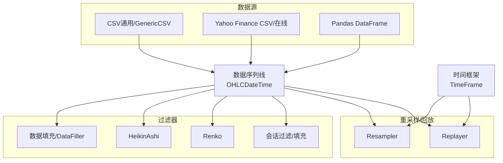
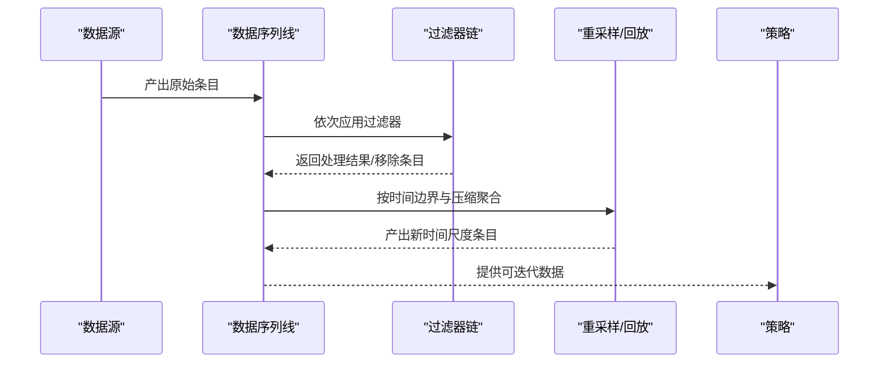
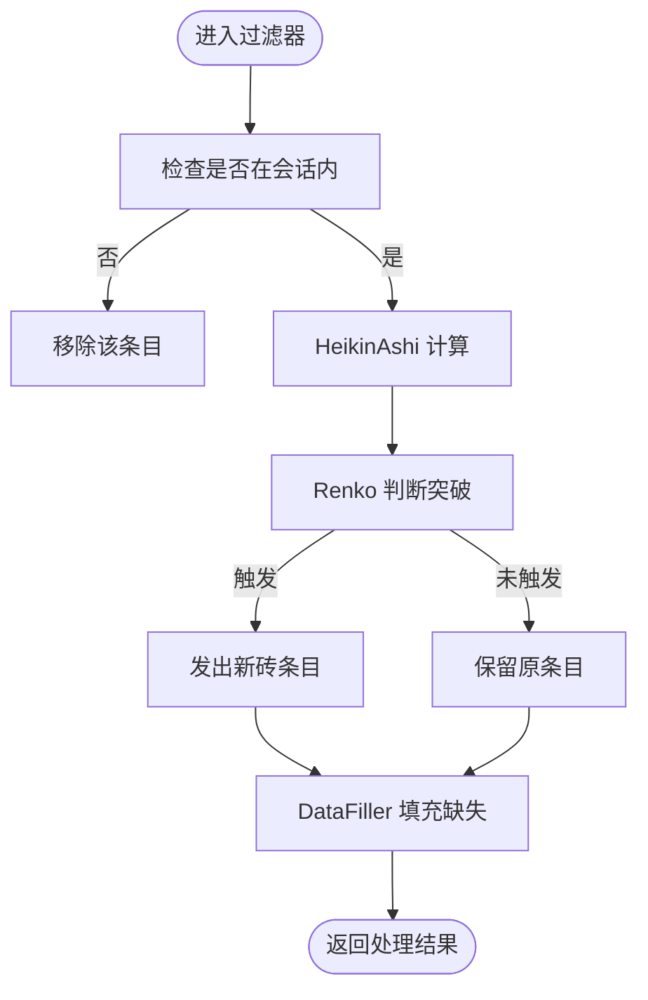
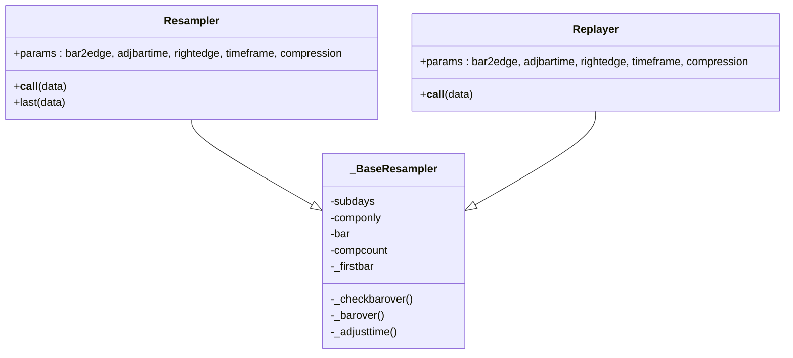
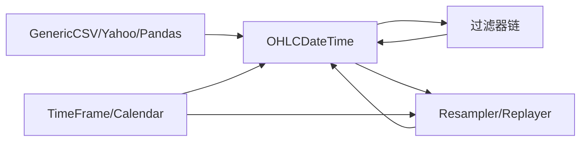

# 数据集成

<cite>
**本文引用的文件**
- [backtrader/feeds/__init__.py](file://backtrader/feeds/__init__.py)
- [backtrader/filters/__init__.py](file://backtrader/filters/__init__.py)
- [backtrader/feed.py](file://backtrader/feed.py)
- [backtrader/dataseries.py](file://backtrader/dataseries.py)
- [backtrader/resamplerfilter.py](file://backtrader/resamplerfilter.py)
- [backtrader/filters/datafiller.py](file://backtrader/filters/datafiller.py)
- [backtrader/filters/heikinashi.py](file://backtrader/filters/heikinashi.py)
- [backtrader/filters/renko.py](file://backtrader/filters/renko.py)
- [backtrader/filters/session.py](file://backtrader/filters/session.py)
- [backtrader/feeds/yahoo.py](file://backtrader/feeds/yahoo.py)
- [backtrader/feeds/pandafeed.py](file://backtrader/feeds/pandafeed.py)
- [backtrader/feeds/csvgeneric.py](file://backtrader/feeds/csvgeneric.py)
- [samples/data-pandas/data-pandas.py](file://samples/data-pandas/data-pandas.py)
- [samples/data-resample/data-resample.py](file://samples/data-resample/data-resample.py)
- [samples/renko/renko.py](file://samples/renko/renko.py)
</cite>

## 目录
1. [简介](#简介)
2. [项目结构](#项目结构)
3. [核心组件](#核心组件)
4. [架构总览](#架构总览)
5. [详细组件分析](#详细组件分析)
6. [依赖关系分析](#依赖关系分析)
7. [性能考量](#性能考量)
8. [故障排查指南](#故障排查指南)
9. [结论](#结论)
10. [附录](#附录)

## 简介
本文件面向Backtrader数据集成系统，系统化梳理其多数据源接入、数据过滤与处理（含Renko、Heikin Ashi）、多时间框架支持（重采样/回放）、数据填充策略（缺失与连续性）以及配置与质量保障最佳实践。目标是帮助用户构建稳定可靠的数据管道，覆盖从CSV、Yahoo Finance、pandas DataFrame到实时API等多类数据源，并在复杂时间维度下保持一致性和可预测性。

## 项目结构
Backtrader的数据层由“数据源”“过滤器”“重采样/回放”“时间框架”“序列线”等模块协同组成。数据源负责从外部加载原始条目；过滤器对条目进行二次加工或剔除；重采样/回放在不同时间尺度间聚合；时间框架与日历控制会话边界；序列线承载OHLCV等字段。

图表来源
- [backtrader/feeds/csvgeneric.py](file://backtrader/feeds/csvgeneric.py#L32-L163)
- [backtrader/feeds/yahoo.py](file://backtrader/feeds/yahoo.py#L37-L382)
- [backtrader/feeds/pandafeed.py](file://backtrader/feeds/pandafeed.py#L30-L274)
- [backtrader/filters/datafiller.py](file://backtrader/filters/datafiller.py#L30-L177)
- [backtrader/filters/heikinashi.py](file://backtrader/filters/heikinashi.py#L28-L55)
- [backtrader/filters/renko.py](file://backtrader/filters/renko.py#L31-L140)
- [backtrader/filters/session.py](file://backtrader/filters/session.py#L31-L245)
- [backtrader/resamplerfilter.py](file://backtrader/resamplerfilter.py#L435-L753)
- [backtrader/dataseries.py](file://backtrader/dataseries.py#L33-L113)

章节来源
- [backtrader/feeds/__init__.py](file://backtrader/feeds/__init__.py#L25-L55)
- [backtrader/filters/__init__.py](file://backtrader/filters/__init__.py#L27-L35)

## 核心组件
- 抽象数据基类与生命周期：负责启动/停止、时间转换、通知队列、过滤器注册、预加载、前进/后退指针移动、最后阶段收尾等。
- 时间框架与日历：定义时间粒度枚举、会话边界、交易日历接口，用于重采样边界判定与时间对齐。
- 数据序列线：定义OHLCV等标准字段顺序与写入接口，支撑过滤器与指标读取。
- 重采样/回放：按时间边界与压缩倍数聚合底层数据，支持右边界对齐与时间调整。
- 过滤器生态：会话过滤/填充、Heikin Ashi、Renko、数据填充等，统一通过包装器接入数据流。

章节来源
- [backtrader/feed.py](file://backtrader/feed.py#L122-L598)
- [backtrader/dataseries.py](file://backtrader/dataseries.py#L33-L212)
- [backtrader/resamplerfilter.py](file://backtrader/resamplerfilter.py#L96-L753)

## 架构总览
下图展示从数据源到策略执行的关键调用链：数据源逐条产出条目，经过滤器链处理，再由重采样/回放生成更高时间尺度的条目，最终进入策略。

图表来源
- [backtrader/feed.py](file://backtrader/feed.py#L471-L536)
- [backtrader/resamplerfilter.py](file://backtrader/resamplerfilter.py#L495-L560)

## 详细组件分析

### 数据源接入
- CSV通用与自定义列映射
  - GenericCSVData支持通过参数指定各字段索引，支持日期/时间格式解析、时区输入转换、空值替换等。
  - 支持分离的日期/时间字段与自定义解析函数。
- Yahoo Finance
  - YahooFinanceCSVData：解析预下载CSV，支持反向排序、复权价格/成交量调整、舍入等。
  - YahooFinanceData：直接使用yfinance在线下载，自动映射时间框架到yfinance区间，带重试与代理设置。
- Pandas DataFrame
  - PandasData/PandasDirectData：支持列名或索引映射，自动识别datetime位置（索引或列），并转换为内部时间格式。

章节来源
- [backtrader/feeds/csvgeneric.py](file://backtrader/feeds/csvgeneric.py#L32-L163)
- [backtrader/feeds/yahoo.py](file://backtrader/feeds/yahoo.py#L37-L382)
- [backtrader/feeds/pandafeed.py](file://backtrader/feeds/pandafeed.py#L30-L274)

### 数据过滤与处理
- 会话过滤与填充
  - SessionFilter/SessionFilterSimple：剔除非会话时段条目或简单判断。
  - SessionFiller：在会话内按时间步长填充缺失条目，支持跳过首段填充。
- Heikin Ashi
  - 基于前一根条目的开/收计算HA开高低，形成平滑K线。
- Renko
  - 按价格突破砖块尺寸触发新砖，支持高/低或收盘决策、自动尺寸、动态尺寸、对齐因子与起始四舍五入。
- 数据填充（缺失/连续性）
  - DataFiller：按时间框架与压缩步长向前填充缺失条目，使用上一根收盘价或指定值，支持成交量/未平仓量填充。

图表来源
- [backtrader/filters/session.py](file://backtrader/filters/session.py#L187-L245)
- [backtrader/filters/heikinashi.py](file://backtrader/filters/heikinashi.py#L28-L55)
- [backtrader/filters/renko.py](file://backtrader/filters/renko.py#L31-L140)
- [backtrader/filters/datafiller.py](file://backtrader/filters/datafiller.py#L30-L177)

章节来源
- [backtrader/filters/session.py](file://backtrader/filters/session.py#L31-L245)
- [backtrader/filters/heikinashi.py](file://backtrader/filters/heikinashi.py#L28-L55)
- [backtrader/filters/renko.py](file://backtrader/filters/renko.py#L31-L140)
- [backtrader/filters/datafiller.py](file://backtrader/filters/datafiller.py#L30-L177)

### 多时间框架支持：重采样与回放
- 重采样（Resampler）
  - 将细粒度数据聚合到更粗粒度时间边界，支持边界对齐、右边界选择、时间调整、压缩倍数。
  - 适用于历史数据降采样，确保边界对齐与连续性。
- 回放（Replayer）
  - 在较粗粒度时间尺度上“模拟”市场行为，逐步构建完整K线后再推进长度，适合演示或测试。
- 边界判定与时间调整
  - 基于交易日历或会话结束时间判断边界，支持微秒/秒/分/日/周/月/年等多级时间框架。
  - 可选将条目时间调整到边界点，避免“滞后”时间戳。

图表来源
- [backtrader/resamplerfilter.py](file://backtrader/resamplerfilter.py#L96-L753)

章节来源
- [backtrader/resamplerfilter.py](file://backtrader/resamplerfilter.py#L435-L753)
- [backtrader/feed.py](file://backtrader/feed.py#L592-L598)

### 数据填充策略：缺失数据与连续性
- DataFiller
  - 以时间框架与压缩为单位，向前填充缺失的条目，使用上一根收盘价或指定值，避免策略因断层而误判。
  - 支持跨会话边界与跨交易日的连续性维护。
- SessionFiller
  - 在会话范围内按最小时间步长填充，便于绘制连续图表与指标计算。

章节来源
- [backtrader/filters/datafiller.py](file://backtrader/filters/datafiller.py#L30-L177)
- [backtrader/filters/session.py](file://backtrader/filters/session.py#L31-L185)

### 时间框架与日历
- TimeFrame枚举与名称映射，支持Ticks/MicroSeconds/Seconds/Minutes/Days/Weeks/Months/Years/NoTimeFrame。
- 日历与会话边界
  - 通过交易日历或会话开始/结束时间控制边界，支持周/月/年的边界判定与月末/年末最后一日逻辑。

章节来源
- [backtrader/dataseries.py](file://backtrader/dataseries.py#L33-L58)
- [backtrader/feed.py](file://backtrader/feed.py#L211-L235)

## 依赖关系分析
- 数据源到序列线：所有数据源最终将值写入OHLCDateTime序列线，统一字段顺序与访问接口。
- 过滤器链：过滤器以包装器形式接入，按顺序执行，可能移除条目或修改值。
- 重采样/回放：作为过滤器的一种，改变时间尺度与边界，影响后续策略输入。
- 时间框架与日历：贯穿数据加载、过滤、重采样全过程，决定边界与对齐策略。

图表来源
- [backtrader/feeds/csvgeneric.py](file://backtrader/feeds/csvgeneric.py#L32-L163)
- [backtrader/feeds/yahoo.py](file://backtrader/feeds/yahoo.py#L37-L382)
- [backtrader/feeds/pandafeed.py](file://backtrader/feeds/pandafeed.py#L30-L274)
- [backtrader/filters/__init__.py](file://backtrader/filters/__init__.py#L27-L35)
- [backtrader/resamplerfilter.py](file://backtrader/resamplerfilter.py#L96-L753)
- [backtrader/dataseries.py](file://backtrader/dataseries.py#L33-L113)

章节来源
- [backtrader/feeds/__init__.py](file://backtrader/feeds/__init__.py#L25-L55)
- [backtrader/filters/__init__.py](file://backtrader/filters/__init__.py#L27-L35)

## 性能考量
- 预加载与内存占用：预加载可减少I/O但增加内存；可通过缓冲参数与回放模式平衡。
- 过滤器链深度：过多过滤器会增加每根条目的处理成本；建议合并或延迟计算。
- 重采样边界：合理设置压缩倍数与右边界，避免过度对齐导致额外条目与计算。
- Pandas数据源：直接迭代比多次索引更快；必要时使用PandasDirectData以减少列查找开销。
- Yahoo在线下载：启用重试与指数回退，避免频繁请求失败；在代理网络中正确设置环境变量。

## 故障排查指南
- 数据为空或提前结束
  - 检查时间范围参数与会话边界；确认fromdate/todate与sessionstart/sessionend设置。
  - 对于在线数据，确认网络与代理配置，查看错误消息。
- 条目缺失或不连续
  - 启用DataFiller或SessionFiller；检查时间框架与压缩是否匹配数据粒度。
- 重采样结果异常
  - 核对bar2edge、adjbartime、rightedge参数；确认交易日历与会话结束时间。
- Heikin Ashi/ Renko输出不符合预期
  - 检查HeikinAshi是否在有足够历史时才生效；Renko尺寸、对齐与动态尺寸参数是否合适。

章节来源
- [backtrader/feed.py](file://backtrader/feed.py#L180-L200)
- [backtrader/filters/datafiller.py](file://backtrader/filters/datafiller.py#L110-L177)
- [backtrader/filters/renko.py](file://backtrader/filters/renko.py#L66-L140)
- [backtrader/resamplerfilter.py](file://backtrader/resamplerfilter.py#L435-L560)

## 结论
Backtrader的数据集成体系以“数据源—过滤器—重采样/回放—策略”的清晰分层实现多数据源、多时间框架与多样化处理需求。通过标准化的时间框架、严格的边界判定与丰富的填充策略，系统在保证数据质量的同时提供了灵活的扩展能力。建议在实际工程中结合业务场景选择合适的数据源与过滤器组合，并通过合理的重采样参数与填充策略确保数据连续性与一致性。

## 附录

### 不同数据源的配置示例与最佳实践
- CSV通用（GenericCSV）
  - 使用参数映射各字段索引，dtformat/tmformat控制日期/时间解析；time>=0表示日期/时间分列。
  - 最佳实践：明确nullvalue，避免空字段导致异常；对分钟级数据注意会话结束时间对齐。
- Yahoo Finance
  - 在线下载：设置proxies、period、retries；时间框架映射到yfinance区间；注意反向排序默认已关闭。
  - CSV解析：启用adjclose/adjvolume，控制舍入精度；必要时交换close与adjclose列。
  - 最佳实践：在代理网络中设置HTTP_PROXY/HTTPS_PROXY；对高频数据启用重试与指数回退。
- Pandas DataFrame
  - 自动列映射：datetime/open/high/low/close/volume/openinterest可为None/-1自动检测或字符串列名。
  - 最佳实践：确保datetime列为可转换为datetime对象；使用PandasDirectData减少列查找。
- 示例参考
  - Pandas数据接入：参见示例脚本对PandasData的使用。
  - 重采样示例：参见示例脚本对resampledata的调用。
  - Renko示例：参见示例脚本对Renko过滤器的添加与克隆使用。

章节来源
- [backtrader/feeds/csvgeneric.py](file://backtrader/feeds/csvgeneric.py#L32-L163)
- [backtrader/feeds/yahoo.py](file://backtrader/feeds/yahoo.py#L192-L382)
- [backtrader/feeds/pandafeed.py](file://backtrader/feeds/pandafeed.py#L107-L274)
- [samples/data-pandas/data-pandas.py](file://samples/data-pandas/data-pandas.py#L32-L93)
- [samples/data-resample/data-resample.py](file://samples/data-resample/data-resample.py#L30-L96)
- [samples/renko/renko.py](file://samples/renko/renko.py#L42-L136)