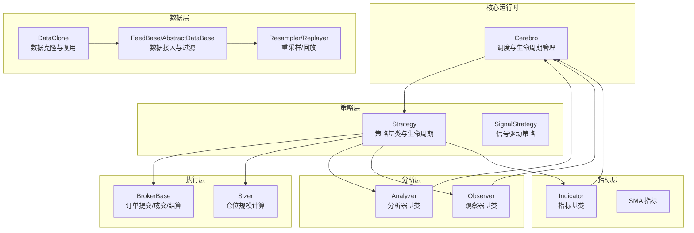
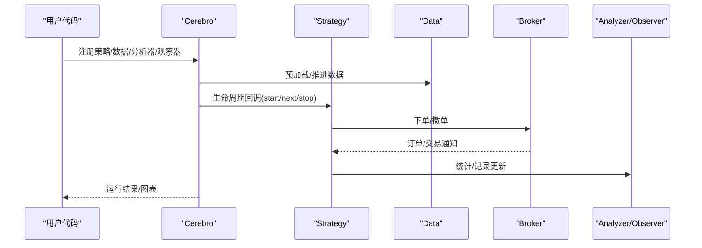
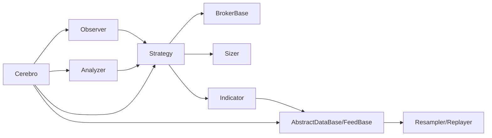

# 核心功能特性

<cite>
**本文档引用的文件**
- [backtrader/__init__.py](file://backtrader/__init__.py)
- [backtrader/cerebro.py](file://backtrader/cerebro.py)
- [backtrader/strategy.py](file://backtrader/strategy.py)
- [backtrader/feed.py](file://backtrader/feed.py)
- [backtrader/broker.py](file://backtrader/broker.py)
- [backtrader/indicator.py](file://backtrader/indicator.py)
- [backtrader/analyzer.py](file://backtrader/analyzer.py)
- [backtrader/observer.py](file://backtrader/observer.py)
- [backtrader/sizer.py](file://backtrader/sizer.py)
- [backtrader/resamplerfilter.py](file://backtrader/resamplerfilter.py)
- [backtrader/strategies/sma_crossover.py](file://backtrader/strategies/sma_crossover.py)
- [backtrader/indicators/sma.py](file://backtrader/indicators/sma.py)
- [samples/data-multitimeframe/data-multitimeframe.py](file://samples/data-multitimeframe/data-multitimeframe.py)
- [samples/multidata-strategy/multidata-strategy.py](file://samples/multidata-strategy/multidata-strategy.py)
- [samples/optimization/optimization.py](file://samples/optimization/optimization.py)
</cite>

## 目录
1. [引言](#引言)
2. [项目结构](#项目结构)
3. [核心组件](#核心组件)
4. [架构总览](#架构总览)
5. [详细组件分析](#详细组件分析)
6. [依赖关系分析](#依赖关系分析)
7. [性能考量](#性能考量)
8. [故障排除指南](#故障排除指南)
9. [结论](#结论)
10. [附录](#附录)

## 引言
本文件系统性梳理Backtrader量化交易框架的核心功能特性，围绕回测引擎、实时交易、技术分析指标库、多数据源支持等关键能力展开，结合代码级架构与实现原理，给出可操作的使用场景、配置选项与扩展方法，并通过示例路径指引帮助开发者快速上手。

## 项目结构
Backtrader采用模块化分层组织：核心运行时（Cerebro）、策略层（Strategy）、数据层（Feed/Data）、执行层（Broker）、分析层（Analyzer/Observers）、指标层（Indicators）以及工具层（Resampler/Replayer、Timer、Writers等）。通过统一的入口导出，形成清晰的对外接口与内部协作关系。

图示来源
- [backtrader/cerebro.py](file://backtrader/cerebro.py#L60-L320)
- [backtrader/strategy.py](file://backtrader/strategy.py#L107-L120)
- [backtrader/feed.py](file://backtrader/feed.py#L122-L200)
- [backtrader/broker.py](file://backtrader/broker.py#L49-L169)
- [backtrader/analyzer.py](file://backtrader/analyzer.py#L89-L138)
- [backtrader/observer.py](file://backtrader/observer.py#L46-L69)
- [backtrader/indicator.py](file://backtrader/indicator.py#L90-L138)
- [backtrader/resamplerfilter.py](file://backtrader/resamplerfilter.py#L96-L133)
- [backtrader/indicators/sma.py](file://backtrader/indicators/sma.py#L27-L46)

章节来源
- [backtrader/__init__.py](file://backtrader/__init__.py#L24-L91)

## 核心组件
- 回测引擎（Cerebro）
  - 负责策略、数据、分析器、观察器、定时器等的注册与生命周期管理；支持向量化运行模式与内存优化；提供优化、写入器、交易历史等高级能力。
- 策略（Strategy）
  - 定义交易逻辑的生命周期（start/next/prenext/stop），提供下单、撤单、通知接收、计时器注册等接口；支持多数据源与多时间框架协同。
- 数据（Feed/Data）
  - 抽象数据源与CSV数据源，支持过滤器链、重采样/回放、会话时间、时区转换、克隆复制等；兼容多数据源接入。
- 执行（Broker）
  - 订单提交/取消/成交通知，资金与头寸管理，佣金信息配置；抽象Broker便于对接不同交易所或仿真环境。
- 指标（Indicator）
  - 指标基类与运行时推进机制，支持多数据/多时间框架下的同步与最小周期约束；提供缓存与向量化加速。
- 分析器/观察器（Analyzer/Observer）
  - 分析器在策略生命周期中收集统计；观察器用于可视化与状态记录；二者均随策略生命周期同步推进。
- 规模（Sizer）
  - 基于策略上下文与佣金模型计算下单规模，支持固定规模与按百分比等策略。
- 工具（Resampler/Replayer/Timer/Writers）
  - 提供多时间框架处理、回放/重采样、定时触发、结果输出等辅助能力。

章节来源
- [backtrader/cerebro.py](file://backtrader/cerebro.py#L60-L320)
- [backtrader/strategy.py](file://backtrader/strategy.py#L107-L120)
- [backtrader/feed.py](file://backtrader/feed.py#L122-L200)
- [backtrader/broker.py](file://backtrader/broker.py#L49-L169)
- [backtrader/indicator.py](file://backtrader/indicator.py#L90-L138)
- [backtrader/analyzer.py](file://backtrader/analyzer.py#L89-L138)
- [backtrader/observer.py](file://backtrader/observer.py#L46-L69)
- [backtrader/sizer.py](file://backtrader/sizer.py#L29-L85)
- [backtrader/resamplerfilter.py](file://backtrader/resamplerfilter.py#L96-L133)

## 架构总览
Backtrader以Cerebro为中心，策略作为业务逻辑载体，数据与执行通过Broker耦合，Analyzer/Observer贯穿策略生命周期提供统计与可视化，Indicator独立参与计算并与策略共享时钟。

图示来源
- [backtrader/cerebro.py](file://backtrader/cerebro.py#L60-L320)
- [backtrader/strategy.py](file://backtrader/strategy.py#L393-L494)
- [backtrader/broker.py](file://backtrader/broker.py#L145-L163)
- [backtrader/analyzer.py](file://backtrader/analyzer.py#L190-L200)
- [backtrader/observer.py](file://backtrader/observer.py#L64-L69)

## 详细组件分析

### 回测引擎（Cerebro）
- 关键职责
  - 策略注册与实例化、数据接入、分析器/观察器/定时器注册、运行参数控制（向量化、预加载、内存优化、优化模式等）。
- 性能与内存优化
  - runonce向量化、exactbars精确条目、optdatas/optreturn优化、objcache对象缓存、quicknotify快速通知等。
- 多数据/多时间框架
  - 支持多数据源与不同时间框架的同步推进；提供重采样/回放过滤器；支持旧版同步策略。
- 实时/回放开关
  - live模式自动禁用preload/runonce；支持order history/fund history注入评估。
- 使用示例路径
  - 多时间框架示例：[samples/data-multitimeframe/data-multitimeframe.py](file://samples/data-multitimeframe/data-multitimeframe.py#L93-L172)
  - 优化示例：[samples/optimization/optimization.py](file://samples/optimization/optimization.py#L51-L102)

章节来源
- [backtrader/cerebro.py](file://backtrader/cerebro.py#L60-L320)
- [backtrader/cerebro.py](file://backtrader/cerebro.py#L274-L294)
- [backtrader/cerebro.py](file://backtrader/cerebro.py#L752-L800)
- [samples/data-multitimeframe/data-multitimeframe.py](file://samples/data-multitimeframe/data-multitimeframe.py#L93-L172)
- [samples/optimization/optimization.py](file://samples/optimization/optimization.py#L51-L102)

### 策略（Strategy）
- 生命周期
  - start/next/nextstart/prenext/stop；支持next_open/nextstart_open/prenext_open等开盘前逻辑。
- 计时器
  - 在策略内注册定时器，支持会话开始/结束、周/月日触发、时区转换、cheat提前执行等。
- 订单与通知
  - 提供buy/sell/cancel接口；接收notify_order/notify_trade/notify_cashvalue/notify_fund等通知。
- 多数据/多时间框架
  - 自动计算最小周期，确保指标/观察器在合适时机推进；支持多数据源对齐。
- 使用示例路径
  - 多数据策略示例：[samples/multidata-strategy/multidata-strategy.py](file://samples/multidata-strategy/multidata-strategy.py#L33-L115)
  - SMA交叉策略示例：[backtrader/strategies/sma_crossover.py](file://backtrader/strategies/sma_crossover.py#L29-L75)

章节来源
- [backtrader/strategy.py](file://backtrader/strategy.py#L107-L120)
- [backtrader/strategy.py](file://backtrader/strategy.py#L274-L320)
- [backtrader/strategy.py](file://backtrader/strategy.py#L393-L494)
- [backtrader/strategy.py](file://backtrader/strategy.py#L615-L725)
- [samples/multidata-strategy/multidata-strategy.py](file://samples/multidata-strategy/multidata-strategy.py#L33-L115)
- [backtrader/strategies/sma_crossover.py](file://backtrader/strategies/sma_crossover.py#L29-L75)

### 数据（Feed/Data）
- 抽象数据源
  - 支持会话时间、时区、日期范围过滤、通知队列、克隆/复制、过滤器链（含last阶段）。
- CSV数据源
  - 统一的CSV读取流程，子类仅需实现行解析；支持头部跳过与分隔符自定义。
- 重采样/回放
  - 通过Resampler/Replayer过滤器实现多时间框架数据生成；支持边界对齐、压缩、会话边界处理。
- 使用示例路径
  - 多时间框架示例：[samples/data-multitimeframe/data-multitimeframe.py](file://samples/data-multitimeframe/data-multitimeframe.py#L122-L161)
  - 多数据策略示例：[samples/multidata-strategy/multidata-strategy.py](file://samples/multidata-strategy/multidata-strategy.py#L127-L143)

章节来源
- [backtrader/feed.py](file://backtrader/feed.py#L122-L200)
- [backtrader/feed.py](file://backtrader/feed.py#L649-L726)
- [backtrader/resamplerfilter.py](file://backtrader/resamplerfilter.py#L96-L133)
- [samples/data-multitimeframe/data-multitimeframe.py](file://samples/data-multitimeframe/data-multitimeframe.py#L122-L161)
- [samples/multidata-strategy/multidata-strategy.py](file://samples/multidata-strategy/multidata-strategy.py#L127-L143)

### 执行（Broker）
- 接口职责
  - 订单提交/取消、资金/头寸查询、佣金配置、资金模式设置；抽象接口便于对接真实/仿真Broker。
- 佣金模型
  - 支持按比例/绝对值、保证金、杠杆、利息等参数配置；按资产名区分默认与特定资产规则。
- 使用示例路径
  - 多数据策略示例中设置佣金与现金：[samples/multidata-strategy/multidata-strategy.py](file://samples/multidata-strategy/multidata-strategy.py#L150-L155)

章节来源
- [backtrader/broker.py](file://backtrader/broker.py#L49-L169)
- [samples/multidata-strategy/multidata-strategy.py](file://samples/multidata-strategy/multidata-strategy.py#L150-L155)

### 指标（Indicator）
- 运行机制
  - 通过advance推进与多数据/多时间框架同步；支持once/next/prenext族方法；MetaIndicator提供缓存与最小周期推导。
- 多时间框架处理
  - 指标按其“时钟”推进，与主数据时钟对齐；支持子指标的最小周期聚合。
- 使用示例路径
  - SMA指标实现：[backtrader/indicators/sma.py](file://backtrader/indicators/sma.py#L27-L46)

章节来源
- [backtrader/indicator.py](file://backtrader/indicator.py#L90-L138)
- [backtrader/indicator.py](file://backtrader/indicator.py#L32-L88)
- [backtrader/indicators/sma.py](file://backtrader/indicators/sma.py#L27-L46)

### 分析器/观察器（Analyzer/Observer）
- Analyzer
  - 自动绑定策略数据与线别名；支持父子分析器树；在策略生命周期中接收通知并产出分析结果。
- Observer
  - 可选择策略级时钟或数据级时钟；可注册子分析器；默认prestart即next。
- 使用示例路径
  - 多数据策略示例中使用内置观察器：[samples/multidata-strategy/multidata-strategy.py](file://samples/multidata-strategy/multidata-strategy.py#L145-L163)

章节来源
- [backtrader/analyzer.py](file://backtrader/analyzer.py#L89-L138)
- [backtrader/observer.py](file://backtrader/observer.py#L46-L69)
- [samples/multidata-strategy/multidata-strategy.py](file://samples/multidata-strategy/multidata-strategy.py#L145-L163)

### 规模（Sizer）
- 功能
  - 基于佣金模型、可用资金、方向与目标数据计算下单规模；可访问策略/Broker上下文。
- 使用示例路径
  - 多数据策略示例中通过策略下单（默认使用默认Sizer）：[samples/multidata-strategy/multidata-strategy.py](file://samples/multidata-strategy/multidata-strategy.py#L98-L109)

章节来源
- [backtrader/sizer.py](file://backtrader/sizer.py#L29-L85)
- [samples/multidata-strategy/multidata-strategy.py](file://samples/multidata-strategy/multidata-strategy.py#L98-L109)

### 多时间框架与多数据流
- 多时间框架
  - 通过Resampler/Replayer在数据层生成更高/更低时间框架；策略可同时持有多个数据源并按各自时间推进。
- 多数据流
  - 支持不同起止时间、不同压缩倍数的数据源；通过同步机制保证策略推进一致性。
- 使用示例路径
  - 多时间框架示例：[samples/data-multitimeframe/data-multitimeframe.py](file://samples/data-multitimeframe/data-multitimeframe.py#L122-L161)
  - 多数据策略示例：[samples/multidata-strategy/multidata-strategy.py](file://samples/multidata-strategy/multidata-strategy.py#L127-L143)

章节来源
- [backtrader/resamplerfilter.py](file://backtrader/resamplerfilter.py#L96-L133)
- [samples/data-multitimeframe/data-multitimeframe.py](file://samples/data-multitimeframe/data-multitimeframe.py#L122-L161)
- [samples/multidata-strategy/multidata-strategy.py](file://samples/multidata-strategy/multidata-strategy.py#L127-L143)

### 集成分析器与观察器
- 集成点
  - 策略启动时初始化分析器/观察器；在next/nextstart/prenext生命周期中推进；在stop阶段收尾。
- 典型用途
  - 收益率、最大回撤、夏普比率、交易次数、手续费统计等。
- 使用示例路径
  - 多数据策略示例中运行并绘制图表：[samples/multidata-strategy/multidata-strategy.py](file://samples/multidata-strategy/multidata-strategy.py#L157-L163)

章节来源
- [backtrader/strategy.py](file://backtrader/strategy.py#L393-L494)
- [backtrader/analyzer.py](file://backtrader/analyzer.py#L190-L200)
- [backtrader/observer.py](file://backtrader/observer.py#L64-L69)
- [samples/multidata-strategy/multidata-strategy.py](file://samples/multidata-strategy/multidata-strategy.py#L157-L163)

## 依赖关系分析
Backtrader各模块间存在清晰的依赖与协作关系：Cerebro协调Strategy/Data/Broker/Analyzer/Observer；Strategy依赖Broker/Sizer/Analyzer/Observer；Indicator/Data/Analyzer/Observer均与Cerebro生命周期耦合；Resampler/Replayer位于数据层提供多时间框架能力。

图示来源
- [backtrader/cerebro.py](file://backtrader/cerebro.py#L60-L320)
- [backtrader/strategy.py](file://backtrader/strategy.py#L107-L120)
- [backtrader/feed.py](file://backtrader/feed.py#L122-L200)
- [backtrader/broker.py](file://backtrader/broker.py#L49-L169)
- [backtrader/analyzer.py](file://backtrader/analyzer.py#L89-L138)
- [backtrader/observer.py](file://backtrader/observer.py#L46-L69)
- [backtrader/indicator.py](file://backtrader/indicator.py#L90-L138)
- [backtrader/resamplerfilter.py](file://backtrader/resamplerfilter.py#L96-L133)

## 性能考量
- 向量化运行（runonce）
  - 在满足条件时启用向量化计算以提升指标与策略执行效率。
- 内存优化（exactbars）
  - 通过精确条目与最小缓冲减少内存占用；不同取值影响预加载、绘图与runonce行为。
- 优化加速（optdatas/optreturn）
  - 优化阶段复用数据预加载与裁剪返回对象，显著缩短优化时间。
- 对象缓存（objcache）
  - 指标对象缓存减少重复创建，但存在边界情况风险。
- 快速通知（quicknotify）
  - 实时场景下优先投递通知，避免延迟。

章节来源
- [backtrader/cerebro.py](file://backtrader/cerebro.py#L274-L294)
- [backtrader/cerebro.py](file://backtrader/cerebro.py#L163-L177)

## 故障排除指南
- 数据未就绪/时间未对齐
  - 检查最小周期计算与数据长度状态；确认是否处于prenext阶段；必要时调整时间框架或使用DataClone。
- 订单未成交/通知缺失
  - 确认Broker已正确设置佣金与资金；检查quicknotify与实时数据队列等待设置；核对订单状态与通知回调。
- 多时间框架错位
  - 使用Resampler/Replayer并确保压缩倍数与时间边界设置正确；必要时切换到旧同步策略验证问题。
- 内存不足
  - 开启exactbars并选择合适的保存策略；关闭不必要的绘图与runonce；减少指标数量或简化逻辑。

章节来源
- [backtrader/strategy.py](file://backtrader/strategy.py#L268-L320)
- [backtrader/broker.py](file://backtrader/broker.py#L112-L163)
- [backtrader/resamplerfilter.py](file://backtrader/resamplerfilter.py#L142-L200)

## 结论
Backtrader以Cerebro为核心，构建了从数据接入、策略执行到分析可视化的完整闭环。其多时间框架、多数据源、向量化与内存优化等特性，既满足高精度回测需求，也为实时交易与扩展提供了坚实基础。通过合理配置运行参数与扩展点，开发者可在同一框架内完成从策略研究到实盘部署的全流程工作。

## 附录
- 常用配置项速览
  - 运行模式：preload、runonce、live、maxcpus、stdstats、oldsync、tz、cheat_on_open、broker_coo、quicknotify
  - 内存优化：exactbars、optdatas、optreturn、objcache
  - 输出与历史：writer、tradehistory
- 示例参考
  - 多时间框架：[samples/data-multitimeframe/data-multitimeframe.py](file://samples/data-multitimeframe/data-multitimeframe.py#L93-L172)
  - 多数据策略：[samples/multidata-strategy/multidata-strategy.py](file://samples/multidata-strategy/multidata-strategy.py#L117-L163)
  - 优化示例：[samples/optimization/optimization.py](file://samples/optimization/optimization.py#L51-L102)
  - SMA交叉策略：[backtrader/strategies/sma_crossover.py](file://backtrader/strategies/sma_crossover.py#L29-L75)
  - SMA指标：[backtrader/indicators/sma.py](file://backtrader/indicators/sma.py#L27-L46)