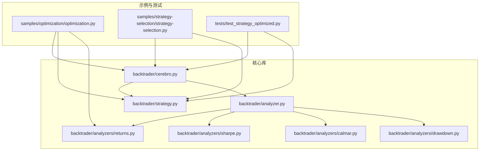
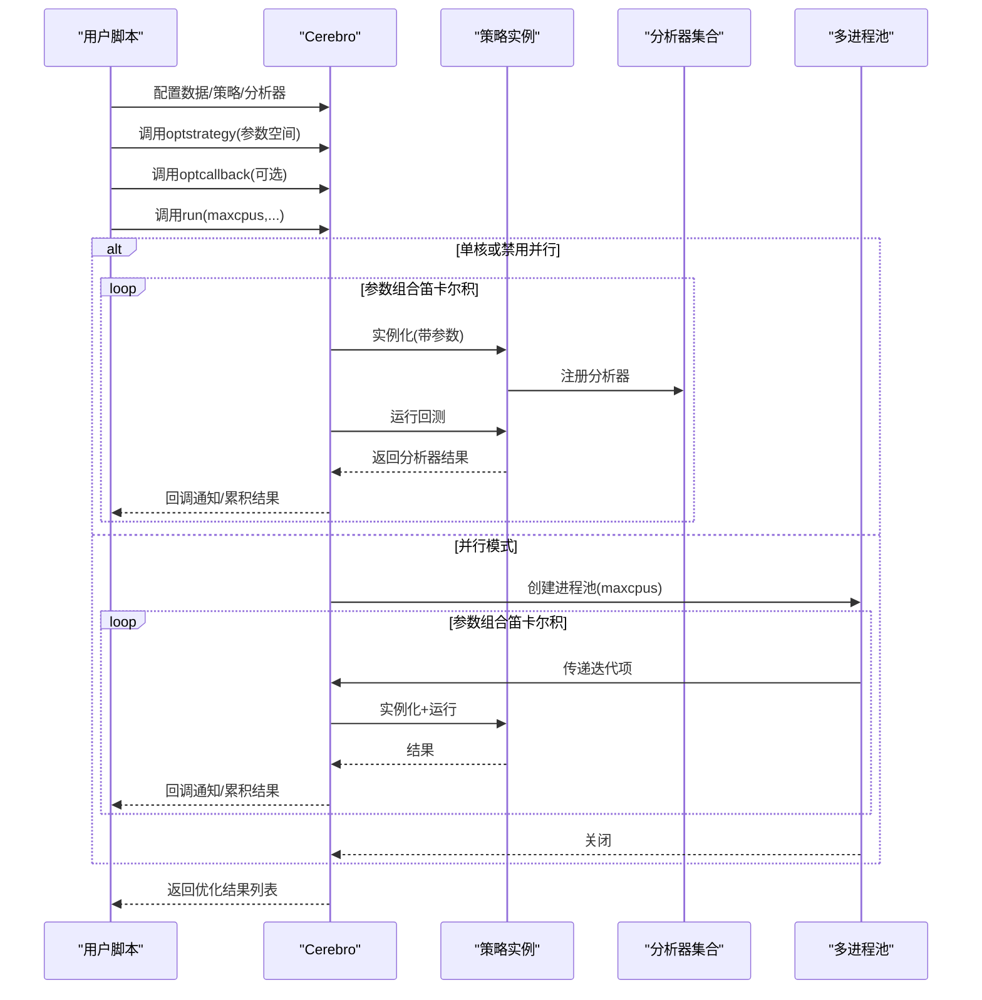
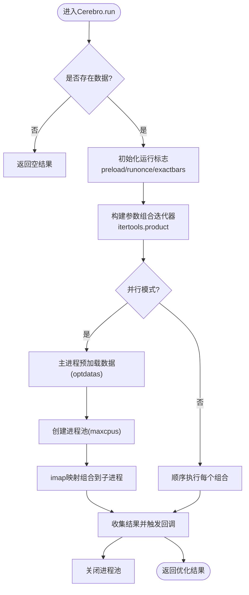
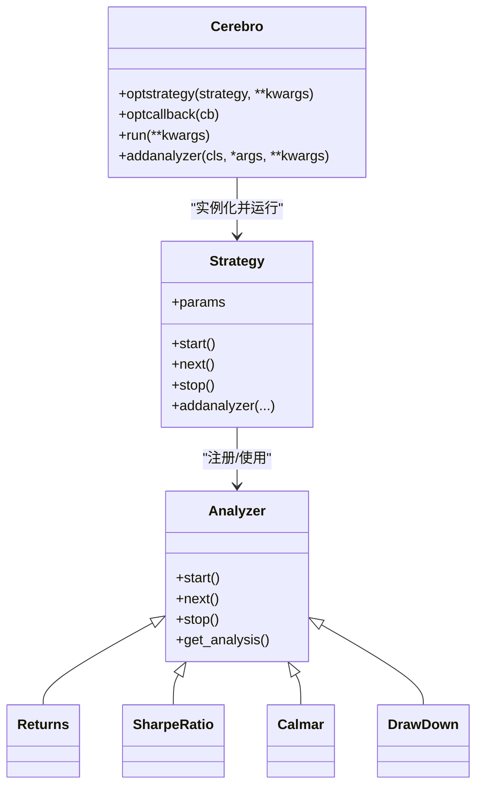
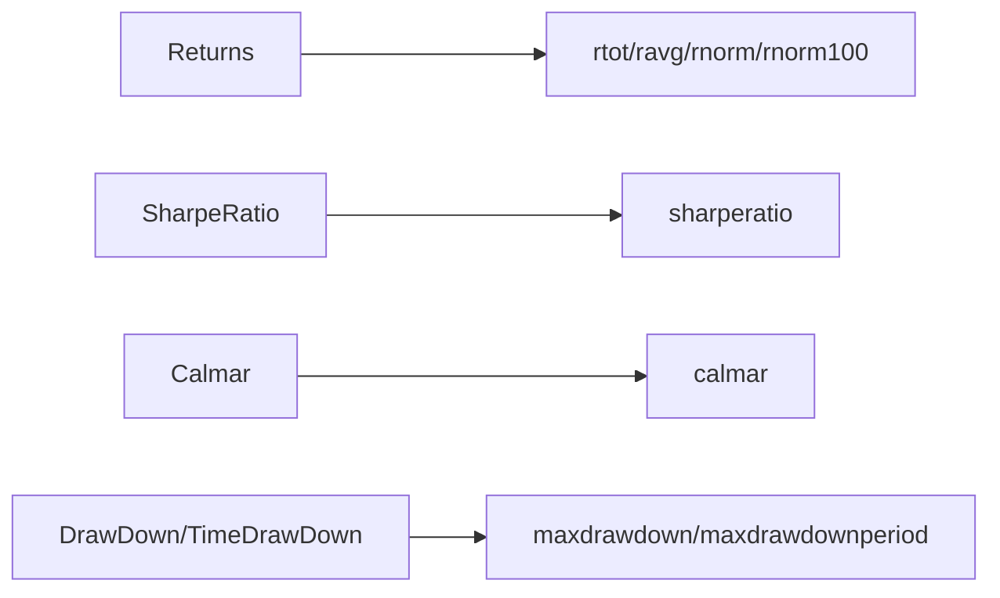
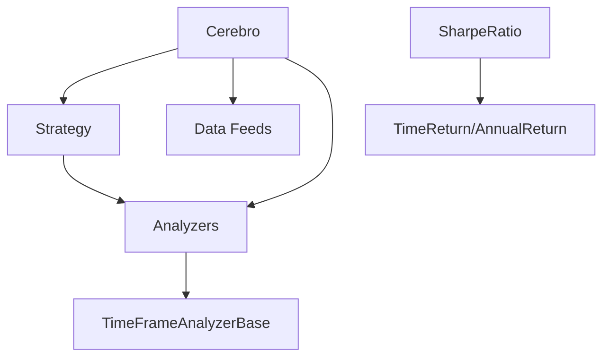

# 优化工具

<cite>
**本文引用的文件**
- [optimization.py](file://samples/optimization/optimization.py)
- [cerebro.py](file://backtrader/cerebro.py)
- [strategy.py](file://backtrader/strategy.py)
- [analyzer.py](file://backtrader/analyzer.py)
- [returns.py](file://backtrader/analyzers/returns.py)
- [sharpe.py](file://backtrader/analyzers/sharpe.py)
- [calmar.py](file://backtrader/analyzers/calmar.py)
- [drawdown.py](file://backtrader/analyzers/drawdown.py)
- [strategy-selection.py](file://samples/strategy-selection/strategy-selection.py)
- [test_strategy_optimized.py](file://tests/test_strategy_optimized.py)
</cite>

## 目录
1. [引言](#引言)
2. [项目结构](#项目结构)
3. [核心组件](#核心组件)
4. [架构总览](#架构总览)
5. [详细组件分析](#详细组件分析)
6. [依赖关系分析](#依赖关系分析)
7. [性能考量](#性能考量)
8. [故障排查指南](#故障排查指南)
9. [结论](#结论)
10. [附录](#附录)

## 引言
本文件面向Backtrader用户，系统化讲解策略优化工具的使用方法与最佳实践。内容涵盖：
- 优化的重要性与基本原理：参数扫描、网格搜索、随机搜索等方法的理论基础与适用场景
- 内置优化工具的使用：参数范围设置、优化目标定义、约束条件配置
- 优化过程的监控与控制：停止条件、异常处理、结果评估
- 高级功能：并行优化、多目标优化、自适应优化思路
- 实战示例：不同策略类型的优化流程、参数敏感性分析与过拟合规避策略

## 项目结构
Backtrader的优化能力由Cerebro引擎驱动，策略类提供参数化接口，分析器提供评估指标。示例与测试代码展示了从简单网格搜索到回调监控、并行加速与结果提取的完整路径。

**图表来源**
- [optimization.py](file://samples/optimization/optimization.py#L1-L197)
- [strategy-selection.py](file://samples/strategy-selection/strategy-selection.py#L1-L93)
- [test_strategy_optimized.py](file://tests/test_strategy_optimized.py#L1-L164)
- [cerebro.py](file://backtrader/cerebro.py#L859-L1163)
- [strategy.py](file://backtrader/strategy.py#L107-L494)
- [analyzer.py](file://backtrader/analyzer.py#L89-L287)
- [returns.py](file://backtrader/analyzers/returns.py#L30-L156)
- [sharpe.py](file://backtrader/analyzers/sharpe.py#L33-L222)
- [calmar.py](file://backtrader/analyzers/calmar.py#L31-L114)
- [drawdown.py](file://backtrader/analyzers/drawdown.py#L31-L198)

**章节来源**
- [optimization.py](file://samples/optimization/optimization.py#L1-L197)
- [strategy-selection.py](file://samples/strategy-selection/strategy-selection.py#L1-L93)
- [test_strategy_optimized.py](file://tests/test_strategy_optimized.py#L1-L164)
- [cerebro.py](file://backtrader/cerebro.py#L859-L1163)

## 核心组件
- Cerebro（优化调度器）
  - 提供optstrategy注册策略参数空间、optcallback注册优化完成回调、run执行优化并返回结果
  - 支持并行优化（multiprocessing.Pool）与数据预加载优化（optdatas）、返回对象简化（optreturn）
- Strategy（策略基类）
  - 通过params声明可优化参数；在生命周期中自动收集分析器结果
- Analyzer（分析器基类）
  - 提供get_analysis统一输出评估指标；时间框架分析器支持按周期聚合
- 分析器子类
  - Returns：总收益、平均收益、年化/标准化收益
  - SharpeRatio：夏普比率（支持年化转换）
  - Calmar：卡玛比率（滚动期数）
  - DrawDown/TimeDrawDown：最大回撤、回撤长度等

**章节来源**
- [cerebro.py](file://backtrader/cerebro.py#L859-L1163)
- [strategy.py](file://backtrader/strategy.py#L107-L494)
- [analyzer.py](file://backtrader/analyzer.py#L89-L287)
- [returns.py](file://backtrader/analyzers/returns.py#L30-L156)
- [sharpe.py](file://backtrader/analyzers/sharpe.py#L33-L222)
- [calmar.py](file://backtrader/analyzers/calmar.py#L31-L114)
- [drawdown.py](file://backtrader/analyzers/drawdown.py#L31-L198)

## 架构总览
Backtrader优化流程以Cerebro为中心，围绕策略参数空间生成器、策略实例化、回测运行、分析器收集与结果聚合展开。并行模式下，主进程负责数据预加载与分发，子进程执行策略回测，完成后回调汇总。

**图表来源**
- [cerebro.py](file://backtrader/cerebro.py#L1030-L1163)
- [cerebro.py](file://backtrader/cerebro.py#L1127-L1158)
- [strategy.py](file://backtrader/strategy.py#L107-L494)
- [analyzer.py](file://backtrader/analyzer.py#L89-L287)

## 详细组件分析

### 组件A：Cerebro优化接口与并行执行
- optstrategy
  - 接收策略类及参数空间（可为元组、range、迭代器），内部通过itertools.product生成全量组合
  - 将策略、参数键值对与实参打包，延迟到run阶段实例化
- optcallback
  - 注册每次策略运行完成后的回调，便于实时记录最优参数或进行早停判断
- run
  - 单核：直接顺序遍历组合，逐个运行并收集结果
  - 多核：使用multiprocessing.Pool并行执行，主进程预加载数据（optdatas）以提升吞吐
  - 结果封装：默认返回简化对象（optreturn），仅包含params与analyzers，节省内存与IO
- 关键参数
  - maxcpus：并发CPU数量
  - optdatas：是否在主进程预加载数据以节省子进程重复加载开销
  - optreturn：是否返回简化对象以加速优化

**图表来源**
- [cerebro.py](file://backtrader/cerebro.py#L1030-L1163)
- [cerebro.py](file://backtrader/cerebro.py#L1127-L1158)

**章节来源**
- [cerebro.py](file://backtrader/cerebro.py#L859-L1163)

### 组件B：策略参数化与分析器集成
- Strategy.params
  - 在策略类中声明可优化参数，Cerebro在实例化时注入对应值
- 生命周期钩子
  - start/stop用于统计耗时、记录最终净值等
  - next/notify_*用于交易事件与分析器联动
- 分析器注册
  - 在策略中添加分析器，分析器在start/stop/next期间累积指标
  - 分析器结果可通过get_analysis统一读取

**图表来源**
- [strategy.py](file://backtrader/strategy.py#L107-L494)
- [analyzer.py](file://backtrader/analyzer.py#L89-L287)
- [returns.py](file://backtrader/analyzers/returns.py#L30-L156)
- [sharpe.py](file://backtrader/analyzers/sharpe.py#L33-L222)
- [calmar.py](file://backtrader/analyzers/calmar.py#L31-L114)
- [drawdown.py](file://backtrader/analyzers/drawdown.py#L31-L198)

**章节来源**
- [strategy.py](file://backtrader/strategy.py#L107-L494)
- [analyzer.py](file://backtrader/analyzer.py#L89-L287)

### 组件C：分析器指标体系
- Returns
  - 计算总复合收益、平均收益、年化/标准化收益，支持资金曲线模式切换
- SharpeRatio
  - 基于时间框架的收益序列计算夏普比率，支持年化转换与样本修正
- Calmar
  - 滚动期数下的卡玛比率（年化收益/最大回撤）
- DrawDown/TimeDrawDown
  - 最大回撤、回撤金额、回撤长度等

**图表来源**
- [returns.py](file://backtrader/analyzers/returns.py#L92-L156)
- [sharpe.py](file://backtrader/analyzers/sharpe.py#L112-L206)
- [calmar.py](file://backtrader/analyzers/calmar.py#L77-L114)
- [drawdown.py](file://backtrader/analyzers/drawdown.py#L63-L198)

**章节来源**
- [returns.py](file://backtrader/analyzers/returns.py#L30-L156)
- [sharpe.py](file://backtrader/analyzers/sharpe.py#L33-L222)
- [calmar.py](file://backtrader/analyzers/calmar.py#L31-L114)
- [drawdown.py](file://backtrader/analyzers/drawdown.py#L31-L198)

## 依赖关系分析
- Cerebro依赖
  - 策略：通过optstrategy注册参数空间，run时实例化
  - 数据：通过adddata注入，支持预加载与重放
  - 分析器：通过addanalyzer注册，随策略生命周期运行
- 策略依赖
  - 分析器：在策略中注册后自动参与回测统计
- 分析器依赖
  - 时间框架分析器依赖底层时间轴与压缩因子
  - 组合分析器（如SharpeRatio）依赖子分析器（TimeReturn/AnnualReturn）

**图表来源**
- [cerebro.py](file://backtrader/cerebro.py#L859-L1163)
- [strategy.py](file://backtrader/strategy.py#L107-L494)
- [analyzer.py](file://backtrader/analyzer.py#L289-L447)
- [sharpe.py](file://backtrader/analyzers/sharpe.py#L134-L206)

**章节来源**
- [cerebro.py](file://backtrader/cerebro.py#L859-L1163)
- [strategy.py](file://backtrader/strategy.py#L107-L494)
- [analyzer.py](file://backtrader/analyzer.py#L289-L447)

## 性能考量
- 并行优化
  - 使用maxcpus>1启用多进程；建议CPU核心数与数据规模匹配
  - 启用optdatas可在主进程预加载数据，减少子进程重复IO
  - 启用optreturn可显著降低结果对象体积，加快序列化与传输
- 内存与速度权衡
  - runonce与preload在向量化加速与内存占用间折衷
  - exactbars=-1/-2可保留绘图与部分缓存，但会禁用runonce
- 数据与策略复杂度
  - 参数空间越大，组合爆炸越严重；优先使用分层扫描与局部搜索
  - 复杂策略与大量分析器会增加单次运行时间，建议按需启用分析器

[本节为通用指导，无需列出具体文件来源]

## 故障排查指南
- 优化未执行或无结果
  - 确认已调用optstrategy并传入参数空间
  - 确认已调用run；若未添加数据，run将直接返回空
- 并行异常
  - 确保策略与分析器可pickle；避免使用不可序列化对象
  - 若optdatas启用，注意数据预加载与重放模式的互斥
- 结果为空或指标异常
  - 检查分析器参数（如fund模式、时间框架）与策略资金曲线一致性
  - 对于SharpeRatio，确认收益序列非空且标准差有效
- 性能瓶颈
  - 减少分析器数量或关闭非必要输出
  - 适当增大maxcpus，但避免超过CPU核心数导致上下文切换开销

**章节来源**
- [cerebro.py](file://backtrader/cerebro.py#L1047-L1048)
- [cerebro.py](file://backtrader/cerebro.py#L1137-L1158)
- [sharpe.py](file://backtrader/analyzers/sharpe.py#L182-L206)

## 结论
Backtrader的优化工具以Cerebro为核心，结合策略参数化与分析器指标，提供了从网格搜索到并行加速的完整链路。通过合理设置参数空间、选择合适的目标函数与约束、利用回调与并行能力，可以在保证稳定性的同时高效探索参数空间。建议在实践中结合敏感性分析与回测区间拆分，避免过拟合并验证泛化能力。

[本节为总结性内容，无需列出具体文件来源]

## 附录

### A. 基础使用步骤
- 定义策略参数
  - 在策略类中通过params声明待优化参数
- 注册优化空间
  - 使用optstrategy传入参数范围（如range、元组、迭代器）
- 添加分析器
  - 使用addanalyzer注册Returns/SharpeRatio/DrawDown等指标
- 执行优化
  - 调用run，可设置maxcpus、optdatas、optreturn等参数
- 获取结果
  - 通过回调或直接遍历返回的策略对象读取params与分析器结果

**章节来源**
- [optimization.py](file://samples/optimization/optimization.py#L51-L101)
- [cerebro.py](file://backtrader/cerebro.py#L859-L1163)

### B. 示例一：网格搜索与并行加速
- 示例脚本展示了SMA与MACD参数的网格搜索，并通过maxcpus实现并行加速
- 可通过命令行参数指定数据范围、日期区间与CPU数量

**章节来源**
- [optimization.py](file://samples/optimization/optimization.py#L51-L101)

### C. 示例二：策略选择与多目标评估
- 通过optstrategy对策略类型进行选择（如不同信号策略），结合Returns分析器比较表现
- 可配合optreturn减少结果对象体积，提升批量评估效率

**章节来源**
- [strategy-selection.py](file://samples/strategy-selection/strategy-selection.py#L53-L69)

### D. 示例三：参数敏感性与过拟合规避
- 测试用例展示了在不同runonce/preload/exactbars组合下，对同一策略的参数扫描
- 建议在训练集与测试集上分别评估，避免参数过度拟合

**章节来源**
- [test_strategy_optimized.py](file://tests/test_strategy_optimized.py#L121-L164)

### E. 高级功能与最佳实践
- 并行优化
  - 设置maxcpus>1；启用optdatas与optreturn进一步提速
- 多目标优化
  - 同时注册多个分析器（如Returns+SharpeRatio+DrawDown），在回调中综合排序
- 自适应优化
  - 使用optcallback根据当前组合表现动态调整后续参数空间（如早停、局部细化）

**章节来源**
- [cerebro.py](file://backtrader/cerebro.py#L184-L215)
- [cerebro.py](file://backtrader/cerebro.py#L859-L1163)