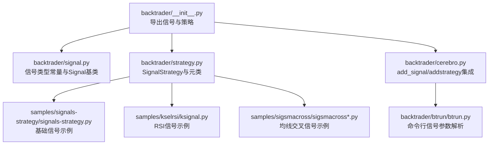
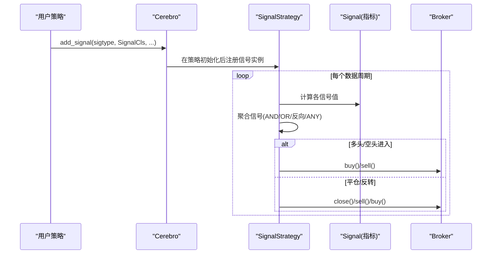
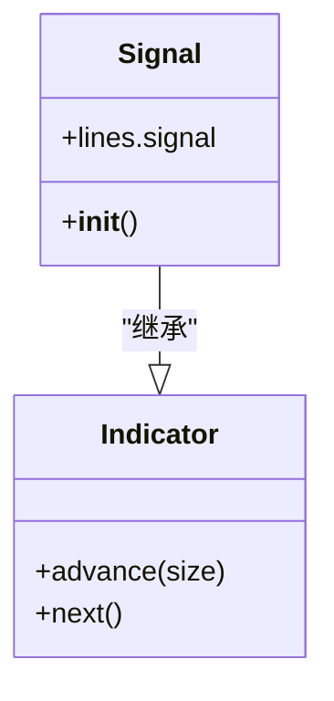
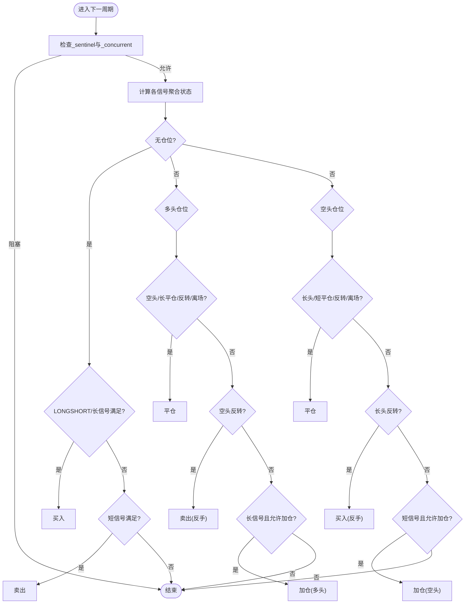
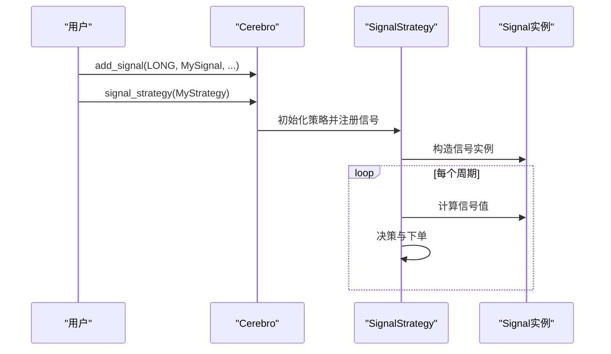
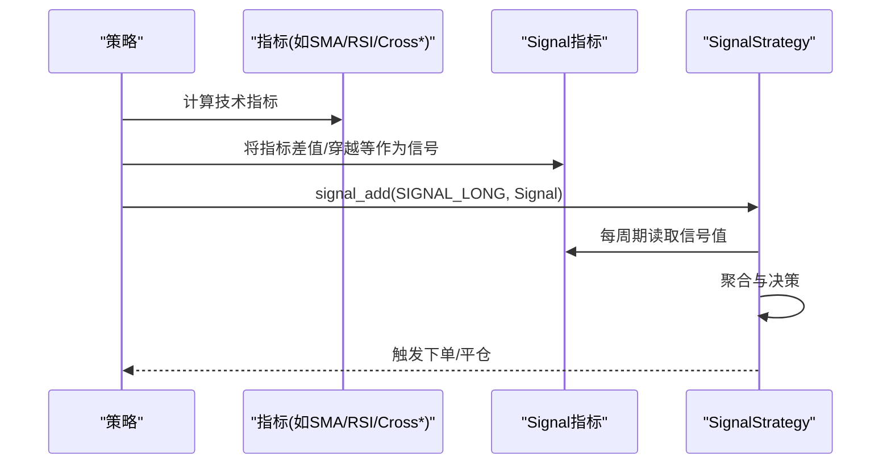
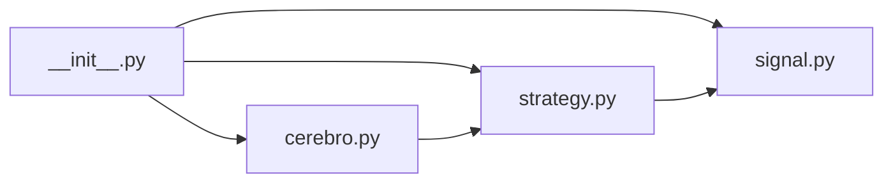

# 信号系统

<cite>
**本文引用的文件**
- [backtrader/signal.py](file://backtrader/signal.py)
- [backtrader/strategy.py](file://backtrader/strategy.py)
- [backtrader/cerebro.py](file://backtrader/cerebro.py)
- [backtrader/__init__.py](file://backtrader/__init__.py)
- [backtrader/indicator.py](file://backtrader/indicator.py)
- [samples/signals-strategy/signals-strategy.py](file://samples/signals-strategy/signals-strategy.py)
- [samples/kselrsi/ksignal.py](file://samples/kselrsi/ksignal.py)
- [samples/sigsmacross/sigsmacross.py](file://samples/sigsmacross/sigsmacross.py)
- [samples/sigsmacross/sigsmacross2.py](file://samples/sigsmacross/sigsmacross2.py)
- [backtrader/btrun/btrun.py](file://backtrader/btrun/btrun.py)
</cite>

## 目录
1. [简介](#简介)
2. [项目结构](#项目结构)
3. [核心组件](#核心组件)
4. [架构总览](#架构总览)
5. [详细组件分析](#详细组件分析)
6. [依赖关系分析](#依赖关系分析)
7. [性能考量](#性能考量)
8. [故障排查指南](#故障排查指南)
9. [结论](#结论)
10. [附录：配置与参数指南](#附录配置与参数指南)

## 简介
本文件系统性梳理 Backtrader 的信号系统，围绕以下目标展开：
- 解释信号系统的设计理念与工作原理：多头/空头信号生成、信号组合策略、信号过滤器的使用方法
- 深入讲解 SignalStrategy 基类的实现细节：信号接收、处理与执行的完整流程
- 阐述信号系统的扩展机制：如何自定义信号类型与信号处理器
- 提供配置选项与参数设置指南：信号阈值、信号延迟、信号确认等关键参数
- 通过示例展示不同信号类型的使用场景与实现方法

## 项目结构
Backtrader 的信号系统由“信号类型常量”“信号基类 Signal”“策略基类 SignalStrategy”以及“Cerebro 集成入口”构成，并在示例中演示了多种信号用法。

**图示来源**
- [backtrader/__init__.py](file://backtrader/__init__.py#L60-L60)
- [backtrader/signal.py](file://backtrader/signal.py#L26-L53)
- [backtrader/strategy.py](file://backtrader/strategy.py#L1524-L1524)
- [backtrader/cerebro.py](file://backtrader/cerebro.py#L592-L610)
- [samples/signals-strategy/signals-strategy.py](file://samples/signals-strategy/signals-strategy.py#L80-L87)
- [samples/kselrsi/ksignal.py](file://samples/kselrsi/ksignal.py#L44-L60)
- [samples/sigsmacross/sigsmacross.py](file://samples/sigsmacross/sigsmacross.py#L46-L51)
- [backtrader/btrun/btrun.py](file://backtrader/btrun/btrun.py#L540-L572)

**章节来源**
- [backtrader/__init__.py](file://backtrader/__init__.py#L60-L60)
- [backtrader/signal.py](file://backtrader/signal.py#L26-L53)
- [backtrader/strategy.py](file://backtrader/strategy.py#L1524-L1524)
- [backtrader/cerebro.py](file://backtrader/cerebro.py#L592-L610)
- [backtrader/btrun/btrun.py](file://backtrader/btrun/btrun.py#L540-L572)

## 核心组件
- 信号类型常量与 Signal 基类
  - 定义了 SIGNAL_NONE、SIGNAL_LONGSHORT、SIGNAL_LONG、SIGNAL_LONG_INV、SIGNAL_LONG_ANY、SIGNAL_SHORT、SIGNAL_SHORT_INV、SIGNAL_SHORT_ANY、SIGNAL_LONGEXIT、SIGNAL_LONGEXIT_INV、SIGNAL_LONGEXIT_ANY、SIGNAL_SHORTEXIT、SIGNAL_SHORTEXIT_INV、SIGNAL_SHORTEXIT_ANY 等信号类型
  - Signal 类继承 Indicator，将自身输出映射到数据主时钟，便于绘图与时间推进
- SignalStrategy 策略基类
  - 自动化交易：根据信号生成多头/空头/平仓指令
  - 支持 LONGSHORT、LONG/LONG_INV/LONG_ANY、SHORT/SHORT_INV/SHORT_ANY、LONGEXIT/SHORTEXIT 及其反向变体
  - 内置并发控制（_concurrent）与加仓控制（_accumulate）
- Cerebro 集成
  - add_signal(sigtype, sigcls, ...) 将信号注册到系统
  - signal_strategy(...) 绑定 SignalStrategy 子类
  - signal_concurrent/on/off 控制并发下单
  - signal_accumulate/on/off 控制加仓

**章节来源**
- [backtrader/signal.py](file://backtrader/signal.py#L26-L53)
- [backtrader/signal.py](file://backtrader/signal.py#L56-L64)
- [backtrader/strategy.py](file://backtrader/strategy.py#L1524-L1618)
- [backtrader/strategy.py](file://backtrader/strategy.py#L1630-L1719)
- [backtrader/cerebro.py](file://backtrader/cerebro.py#L592-L610)

## 架构总览
信号系统从“信号定义—策略接收—策略决策—订单执行”的链路组织，Cerebro 负责收集信号并注入 SignalStrategy；SignalStrategy 在每个周期计算信号聚合结果并触发交易。

**图示来源**
- [backtrader/cerebro.py](file://backtrader/cerebro.py#L592-L610)
- [backtrader/strategy.py](file://backtrader/strategy.py#L1509-L1521)
- [backtrader/strategy.py](file://backtrader/strategy.py#L1635-L1719)

## 详细组件分析

### 信号类型与 Signal 基类
- 信号类型覆盖：
  - 主要方向：LONGSHORT、LONG、SHORT
  - 反向/任意：LONG_INV/LONG_ANY、SHORT_INV/SHORT_ANY
  - 退出：LONGEXIT/SHORTEXIT 及其反向/任意变体
- Signal 基类：
  - 输出线名固定为 signal
  - 将自身绑定到数据主时钟，确保与数据推进同步

**图示来源**
- [backtrader/signal.py](file://backtrader/signal.py#L56-L64)
- [backtrader/indicator.py](file://backtrader/indicator.py#L90-L137)

**章节来源**
- [backtrader/signal.py](file://backtrader/signal.py#L26-L53)
- [backtrader/signal.py](file://backtrader/signal.py#L56-L64)
- [backtrader/indicator.py](file://backtrader/indicator.py#L90-L137)

### SignalStrategy 工作流与决策逻辑
- 信号接收与聚合
  - 读取各信号类型的当前值，支持“全部为正/负/任意”三种聚合模式
  - 对 LONG/LONG_INV/LONG_ANY、SHORT/SHORT_INV/SHORT_ANY、LONGEXIT/SHORTEXIT 及其反向/任意进行 OR/AND 组合
- 进出场与反转
  - 当无仓位时：若 LONGSHORT 或 LONG/SHORT 任一满足则开仓
  - 多头持仓：遇到 SHORT 或 LONGEXIT 或反转条件或离场条件则平仓；若存在反转条件则反手
  - 空头持仓：遇到 LONG 或 SHORTEXIT 或反转条件或离场条件则平仓；若存在反转条件则反手
- 并发与加仓
  - 若 _sentinel 非空且 _concurrent 为 False，则跳过本轮下单
  - 若 _accumulate 为 True，则允许在同方向上继续加仓

**图示来源**
- [backtrader/strategy.py](file://backtrader/strategy.py#L1635-L1719)

**章节来源**
- [backtrader/strategy.py](file://backtrader/strategy.py#L1524-L1618)
- [backtrader/strategy.py](file://backtrader/strategy.py#L1635-L1719)

### Cerebro 与命令行集成
- add_signal(sigtype, sigcls, *sigargs, **sigkwargs)
  - 将信号注册到内部队列，策略初始化后批量构造
- signal_strategy(stratcls, ...)
  - 绑定可接收信号的策略类
- signal_concurrent/onoff：允许并发下单
- signal_accumulate/onoff：允许同向加仓
- 命令行参数 --signal/-sig 支持模块/类/参数的灵活指定

**图示来源**
- [backtrader/cerebro.py](file://backtrader/cerebro.py#L592-L610)
- [backtrader/strategy.py](file://backtrader/strategy.py#L1509-L1521)
- [backtrader/btrun/btrun.py](file://backtrader/btrun/btrun.py#L540-L572)

**章节来源**
- [backtrader/cerebro.py](file://backtrader/cerebro.py#L592-L610)
- [backtrader/btrun/btrun.py](file://backtrader/btrun/btrun.py#L540-L572)

### 示例：基础信号与组合策略
- signals-strategy 示例
  - 使用 SMA 作为信号源，分别添加主信号与退出信号
  - 展示了 cerebro.add_signal 的调用方式与参数传递
- kselrsi 示例
  - RSI 上下轨与穿越信号，结合 LONG/LONGEXIT/SHORT/SHORTEXIT 实现区间策略
- sigsmacross 示例
  - 均线交叉信号直接接入 LONG 信号通道

**图示来源**
- [samples/signals-strategy/signals-strategy.py](file://samples/signals-strategy/signals-strategy.py#L80-L87)
- [samples/kselrsi/ksignal.py](file://samples/kselrsi/ksignal.py#L44-L60)
- [samples/sigsmacross/sigsmacross.py](file://samples/sigsmacross/sigsmacross.py#L46-L51)

**章节来源**
- [samples/signals-strategy/signals-strategy.py](file://samples/signals-strategy/signals-strategy.py#L80-L87)
- [samples/kselrsi/ksignal.py](file://samples/kselrsi/ksignal.py#L44-L60)
- [samples/sigsmacross/sigsmacross.py](file://samples/sigsmacross/sigsmacross.py#L46-L51)
- [samples/sigsmacross/sigsmacross2.py](file://samples/sigsmacross/sigsmacross2.py#L25-L31)

### 扩展机制：自定义信号类型与信号处理器
- 自定义信号类型
  - 在策略中使用 signal_add(sigtype, signal) 注册自定义信号
  - sigtype 可选用内置类型（如 SIGNAL_LONG/SIGNAL_LONGEXIT 等）
- 自定义信号处理器
  - 任何继承 Indicator 的类均可作为信号处理器
  - 通过 Signal 基类约定输出名为 signal，即可被 SignalStrategy 识别
- 信号组合策略
  - 同一 sigtype 下可叠加多个信号，SignalStrategy 会按 AND/OR/反向/任意规则聚合
  - 可通过参数控制是否允许并发下单与加仓

**章节来源**
- [backtrader/strategy.py](file://backtrader/strategy.py#L1616-L1617)
- [backtrader/signal.py](file://backtrader/signal.py#L56-L64)
- [backtrader/indicator.py](file://backtrader/indicator.py#L90-L137)

## 依赖关系分析
- 模块耦合
  - backtrader/__init__.py 将 signal 与 strategy 导出，形成统一入口
  - signal.py 仅定义常量与基类，低耦合
  - strategy.py 依赖 signal 常量与 cerebro 注入的信号列表
  - cerebro.py 作为信号注册中心，连接策略与信号
- 关键依赖链
  - Cerebro.add_signal → 策略元类初始化 → SignalStrategy 构造信号实例 → 每周期信号值 → 决策与下单

**图示来源**
- [backtrader/__init__.py](file://backtrader/__init__.py#L60-L60)
- [backtrader/signal.py](file://backtrader/signal.py#L26-L53)
- [backtrader/strategy.py](file://backtrader/strategy.py#L1509-L1521)
- [backtrader/cerebro.py](file://backtrader/cerebro.py#L592-L610)

**章节来源**
- [backtrader/__init__.py](file://backtrader/__init__.py#L60-L60)
- [backtrader/strategy.py](file://backtrader/strategy.py#L1509-L1521)
- [backtrader/cerebro.py](file://backtrader/cerebro.py#L592-L610)

## 性能考量
- 信号聚合复杂度
  - 每周期对各信号类型进行聚合，时间复杂度近似 O(N)，N 为信号数量
- 并发与加仓控制
  - _concurrent 与 _accumulate 参数可减少无效下单与过度加仓，降低滑点与手续费成本
- 缓存与对象复用
  - 指标层具备对象缓存能力，可在合适场景提升运行效率（需注意缓存一致性）

[本节为通用指导，不直接分析具体文件]

## 故障排查指南
- 未产生订单
  - 检查 _sentinel 是否阻塞（并发开关）
  - 检查信号聚合是否满足（AND/OR/反向/ANY）
  - 检查是否已设置 signal_strategy 与 add_signal
- 重复下单或频繁反转
  - 调整并发与加仓策略（signal_concurrent/signal_accumulate）
  - 为信号增加过滤器（如时间窗口、趋势过滤）
- 信号未生效
  - 确认 Signal 输出线名为 signal
  - 确认 Signal 绑定到正确数据主时钟

**章节来源**
- [backtrader/strategy.py](file://backtrader/strategy.py#L1635-L1719)
- [backtrader/signal.py](file://backtrader/signal.py#L56-L64)

## 结论
Backtrader 的信号系统以简洁的信号类型与 Signal 基类为核心，通过 SignalStrategy 实现自动化的信号聚合与交易执行。借助 Cerebro 的注册机制与命令行工具，用户可以快速构建多信号组合策略，并通过参数灵活控制并发与加仓行为。示例展示了从简单均线交叉到 RSI 区间策略的多种实践路径，便于扩展与定制。

[本节为总结性内容，不直接分析具体文件]

## 附录：配置与参数指南
- 关键参数
  - _concurrent：是否允许并发下单（影响_sentinel阻塞）
  - _accumulate：是否允许同向加仓
  - 信号阈值与过滤：通过自定义 Signal 指标实现（如 RSI 上下轨、时间过滤）
  - 信号延迟与确认：通过在 Signal 中引入滞后项或确认条件实现
- 常用设置步骤
  - 在策略中使用 signal_add 添加信号
  - 通过 cerebro.add_signal 注册信号类与参数
  - 使用 signal_strategy 绑定 SignalStrategy 子类
  - 使用 signal_concurrent/signal_accumulate 控制行为
  - 使用命令行 --signal/-sig 指定信号模块/类/参数

**章节来源**
- [backtrader/strategy.py](file://backtrader/strategy.py#L1509-L1521)
- [backtrader/cerebro.py](file://backtrader/cerebro.py#L592-L610)
- [backtrader/btrun/btrun.py](file://backtrader/btrun/btrun.py#L540-L572)