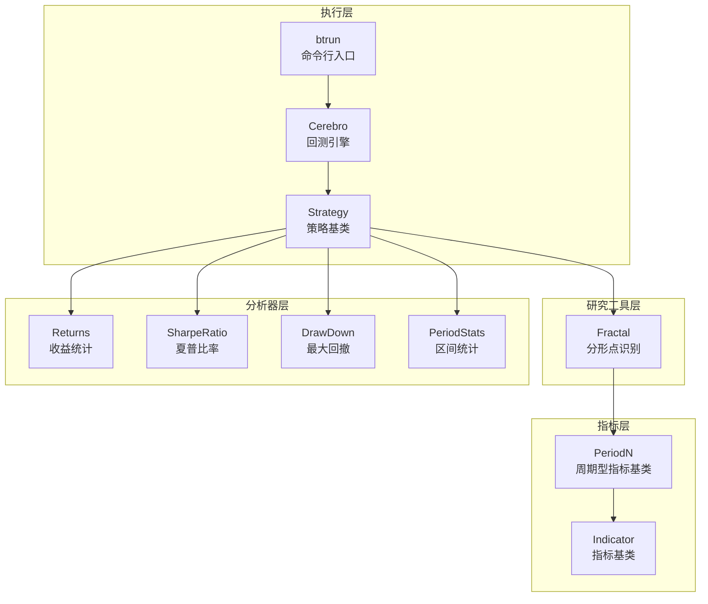
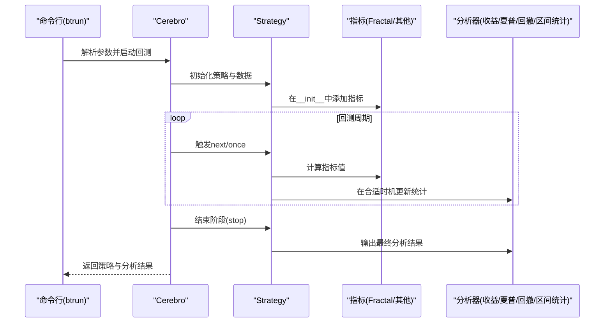
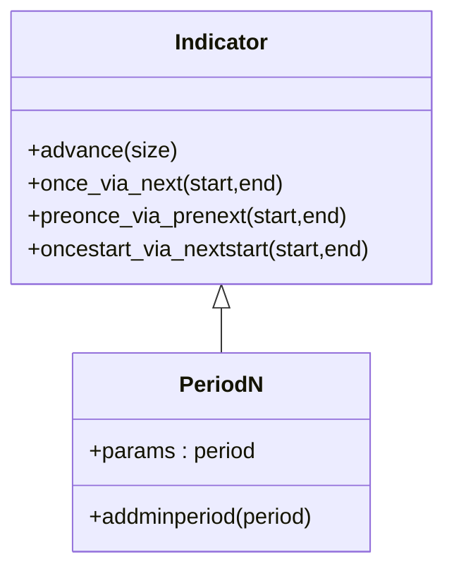
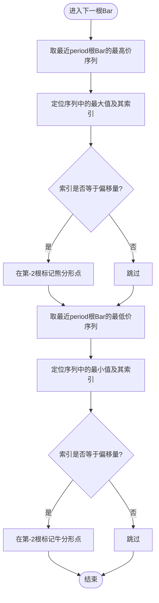
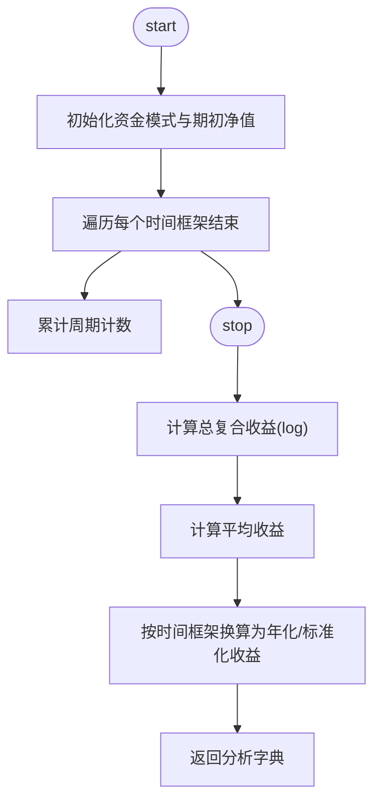
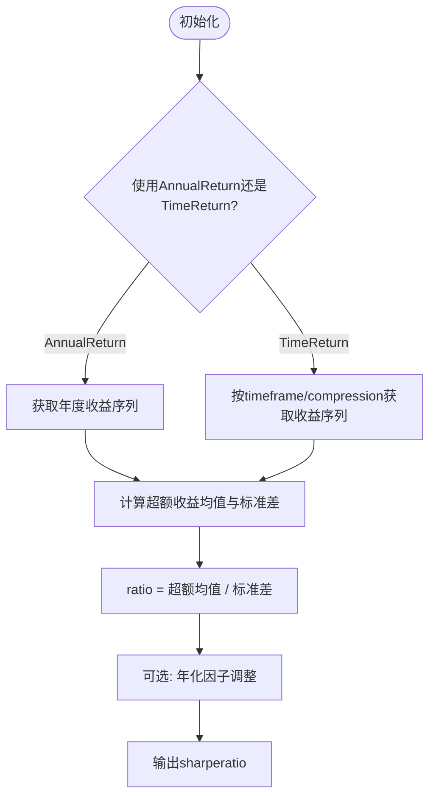
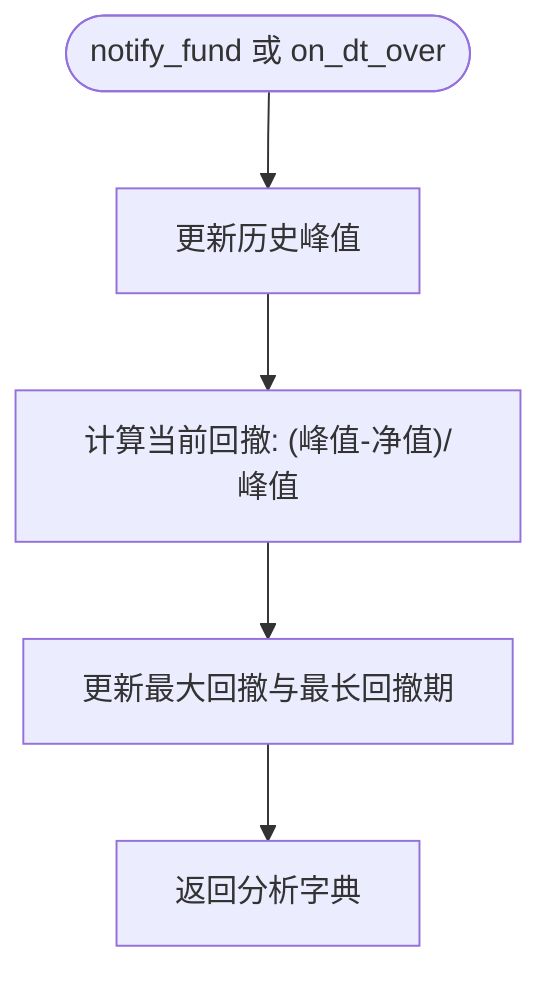
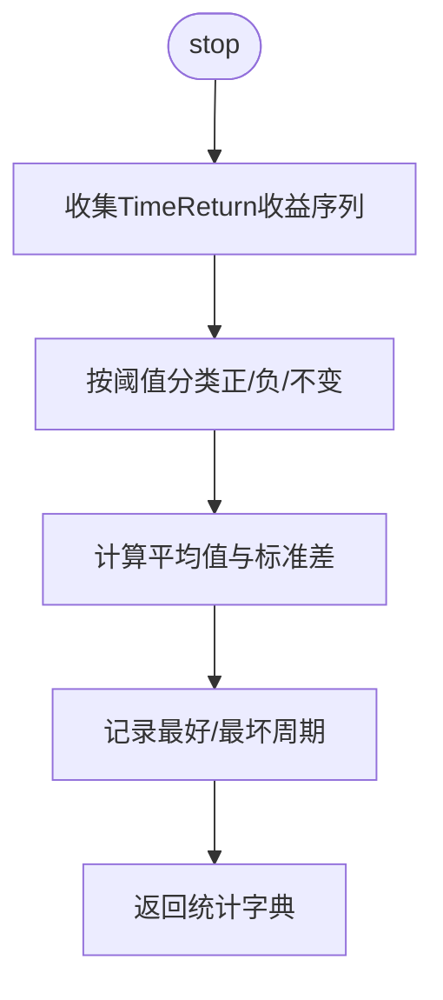
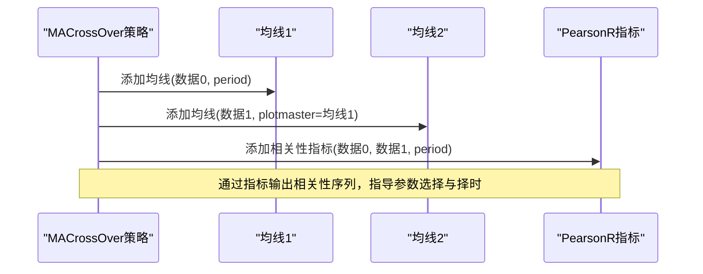
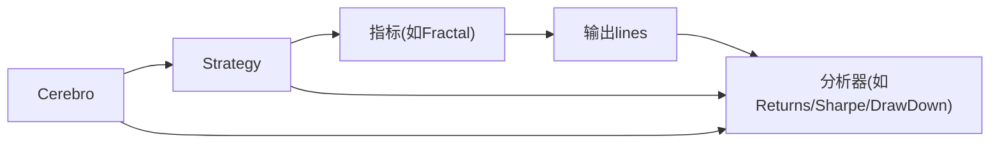

# 研究模块

<cite>
**本文引用的文件**
- [studies/__init__.py](file://backtrader/studies/__init__.py)
- [studies/contrib/fractal.py](file://backtrader/studies/contrib/fractal.py)
- [indicators/basicops.py](file://backtrader/indicators/basicops.py)
- [indicator.py](file://backtrader/indicator.py)
- [analyzers/__init__.py](file://backtrader/analyzers/__init__.py)
- [analyzers/returns.py](file://backtrader/analyzers/returns.py)
- [analyzers/sharpe.py](file://backtrader/analyzers/sharpe.py)
- [analyzers/drawdown.py](file://backtrader/analyzers/drawdown.py)
- [analyzers/periodstats.py](file://backtrader/analyzers/periodstats.py)
- [cerebro.py](file://backtrader/cerebro.py)
- [strategy.py](file://backtrader/strategy.py)
- [gold-vs-sp500.py](file://samples/gold-vs-sp500/gold-vs-sp500.py)
- [btrun.py](file://backtrader/btrun/btrun.py)
</cite>

## 目录
1. [引言](#引言)
2. [项目结构](#项目结构)
3. [核心组件](#核心组件)
4. [架构总览](#架构总览)
5. [详细组件分析](#详细组件分析)
6. [依赖关系分析](#依赖关系分析)
7. [性能考量](#性能考量)
8. [故障排查指南](#故障排查指南)
9. [结论](#结论)
10. [附录](#附录)

## 引言
本指南聚焦Backtrader的研究模块（Studies），旨在帮助用户通过系统化研究改进交易策略表现与参数配置。研究模块并非一个独立的“研究框架”，而是以指标（Indicators）与分析器（Analyzers）为核心的研究工具集合：通过指标对价格、成交量等市场数据进行加工，形成可观察的趋势、动量、波动等信号；通过分析器对策略运行结果进行统计评估，输出收益、风险与夏普比率等关键指标。结合内置的PearsonR相关性分析示例与多时间框架回测，读者可以掌握如何用研究工具指导策略设计与参数选择，并在此基础上扩展自定义研究工具。

## 项目结构
研究模块在Backtrader中主要由以下层次构成：
- 指标层：提供基础计算能力与可视化支持，如PeriodN基类、Plot设置等
- 研究工具层：基于指标构建的特定研究工具，如Fractal分形点识别
- 分析器层：对策略运行结果进行统计评估，如Returns、SharpeRatio、DrawDown、PeriodStats
- 集成执行层：Cerebro负责回测调度，Strategy驱动策略生命周期，btrun提供命令行接入

图表来源
- [studies/contrib/fractal.py](file://backtrader/studies/contrib/fractal.py#L30-L71)
- [indicators/basicops.py](file://backtrader/indicators/basicops.py#L33-L44)
- [indicator.py](file://backtrader/indicator.py#L90-L165)
- [analyzers/returns.py](file://backtrader/analyzers/returns.py#L30-L156)
- [analyzers/sharpe.py](file://backtrader/analyzers/sharpe.py#L33-L222)
- [analyzers/drawdown.py](file://backtrader/analyzers/drawdown.py#L31-L198)
- [analyzers/periodstats.py](file://backtrader/analyzers/periodstats.py#L78-L112)
- [cerebro.py](file://backtrader/cerebro.py#L60-L200)
- [strategy.py](file://backtrader/strategy.py#L349-L388)
- [btrun.py](file://backtrader/btrun/btrun.py#L574-L662)

章节来源
- [studies/__init__.py](file://backtrader/studies/__init__.py#L25-L26)
- [studies/contrib/fractal.py](file://backtrader/studies/contrib/fractal.py#L30-L71)
- [indicators/basicops.py](file://backtrader/indicators/basicops.py#L33-L44)
- [indicator.py](file://backtrader/indicator.py#L90-L165)
- [analyzers/__init__.py](file://backtrader/analyzers/__init__.py#L27-L44)

## 核心组件
- 指标基类与周期型指标
  - Indicator：所有指标的基类，提供统一的生命周期与缓存机制
  - PeriodN：带period参数的指标基类，自动注册最小周期
- 研究工具示例
  - Fractal：基于最近若干周期的高低点识别牛熊分形点，用于趋势转折信号
- 分析器
  - Returns：按对数法计算总复合收益、平均收益与年化/标准化收益
  - SharpeRatio：基于子分析器TimeReturn或AnnualReturn计算夏普比率
  - DrawDown：跟踪净值回撤幅度与长度，支持资金模式切换
  - PeriodStats：按指定时间框架聚合周期收益并统计均值、标准差、正负周期数与最好/最坏周期

章节来源
- [indicator.py](file://backtrader/indicator.py#L90-L165)
- [indicators/basicops.py](file://backtrader/indicators/basicops.py#L33-L44)
- [studies/contrib/fractal.py](file://backtrader/studies/contrib/fractal.py#L30-L71)
- [analyzers/returns.py](file://backtrader/analyzers/returns.py#L30-L156)
- [analyzers/sharpe.py](file://backtrader/analyzers/sharpe.py#L33-L222)
- [analyzers/drawdown.py](file://backtrader/analyzers/drawdown.py#L31-L198)
- [analyzers/periodstats.py](file://backtrader/analyzers/periodstats.py#L78-L112)

## 架构总览
研究模块围绕“指标生成信号、分析器评估表现”的双轨路径工作。策略在回测过程中调用指标生成中间变量，同时分析器在关键时点（如每个时间框架结束）收集收益序列并计算统计指标。Cerebro负责调度策略、指标与分析器的生命周期，btrun提供命令行参数解析与批量执行能力。

图表来源
- [btrun.py](file://backtrader/btrun/btrun.py#L574-L662)
- [cerebro.py](file://backtrader/cerebro.py#L60-L200)
- [strategy.py](file://backtrader/strategy.py#L349-L388)
- [analyzers/returns.py](file://backtrader/analyzers/returns.py#L104-L156)
- [analyzers/sharpe.py](file://backtrader/analyzers/sharpe.py#L134-L206)
- [analyzers/drawdown.py](file://backtrader/analyzers/drawdown.py#L87-L111)
- [analyzers/periodstats.py](file://backtrader/analyzers/periodstats.py#L85-L112)

## 详细组件分析

### 指标基类与周期型指标
- Indicator
  - 提供统一的生命周期管理（advance、once_via_next、preonce_via_prenext等）
  - 支持对象缓存与最小周期控制，确保指标在满足最小周期后才产生有效输出
- PeriodN
  - 通过p.period注册最小周期，避免过早输出无效信号
  - 作为研究工具的通用基类，便于快速实现周期型信号

图表来源
- [indicator.py](file://backtrader/indicator.py#L90-L165)
- [indicators/basicops.py](file://backtrader/indicators/basicops.py#L33-L44)

章节来源
- [indicator.py](file://backtrader/indicator.py#L90-L165)
- [indicators/basicops.py](file://backtrader/indicators/basicops.py#L33-L44)

### 研究工具：Fractal（分形点）
- 设计目标
  - 基于最近K根Bar的高点/低点识别潜在转折形态，标记牛熊分形点，辅助趋势判断
- 关键参数
  - period：窗口大小（默认5）
  - bardist：容差比例，用于微调分形点标记位置
  - shift_to_potential_fractal：中间极值的位置偏移（默认2）
- 可视化
  - 默认关闭主图叠加，使用独立标记符号显示分形点

图表来源
- [studies/contrib/fractal.py](file://backtrader/studies/contrib/fractal.py#L52-L71)

章节来源
- [studies/contrib/fractal.py](file://backtrader/studies/contrib/fractal.py#L30-L71)

### 分析器：Returns（收益统计）
- 功能要点
  - 使用对数法计算总复合收益、平均收益与年化/标准化收益
  - 支持按时间框架与压缩周期统计
  - 自动检测资金模式（broker fundmode）决定资产价值来源
- 输出字段
  - rtot：总复合收益
  - ravg：期间平均收益
  - rnorm：年化/标准化收益
  - rnorm100：百分比形式的人类可读值

图表来源
- [analyzers/returns.py](file://backtrader/analyzers/returns.py#L104-L156)

章节来源
- [analyzers/returns.py](file://backtrader/analyzers/returns.py#L30-L156)

### 分析器：SharpeRatio（夏普比率）
- 功能要点
  - 基于子分析器TimeReturn或AnnualReturn获取收益序列
  - 支持风险无率转换与样本标准差修正（Bessel校正）
  - 可选年化输出
- 参数要点
  - timeframe/compression：时间框架与压缩
  - riskfreerate：无风险利率（年化）
  - convertrate/annualize：转换与年化开关
  - stddev_sample：样本标准差
  - legacyannual/fund：兼容旧版与资金模式

图表来源
- [analyzers/sharpe.py](file://backtrader/analyzers/sharpe.py#L134-L206)

章节来源
- [analyzers/sharpe.py](file://backtrader/analyzers/sharpe.py#L33-L222)

### 分析器：DrawDown（最大回撤）
- 功能要点
  - 实时跟踪当前净值与历史峰值，计算回撤幅度与长度
  - 支持按资金模式记录cash/value或fundvalue
  - 提供区间型TimeDrawDown，按指定时间框架统计最大回撤与最长回撤期

图表来源
- [analyzers/drawdown.py](file://backtrader/analyzers/drawdown.py#L90-L111)

章节来源
- [analyzers/drawdown.py](file://backtrader/analyzers/drawdown.py#L31-L198)

### 分析器：PeriodStats（区间统计）
- 功能要点
  - 对TimeReturn收益序列进行区间统计
  - 输出平均值、标准差、正/负/不变周期数、最好/最坏周期
  - 支持zeroispos参数将零变化归类为正

图表来源
- [analyzers/periodstats.py](file://backtrader/analyzers/periodstats.py#L85-L112)

章节来源
- [analyzers/periodstats.py](file://backtrader/analyzers/periodstats.py#L78-L112)

### 策略与研究工具的集成
- 示例：PearsonR相关性分析与均线交叉策略
  - PearsonR：基于两个数据源的滑动窗口计算皮尔逊相关系数，作为研究信号
  - MACrossOver：在两个数据上叠加均线，同时挂载PearsonR指标，用于研究两序列的线性相关性随时间的变化
  - 多时间框架：示例中对两个数据分别重采样到周级别，配合观察者LogReturns2进行周度收益观察

图表来源
- [samples/gold-vs-sp500/gold-vs-sp500.py](file://samples/gold-vs-sp500/gold-vs-sp500.py#L48-L68)

章节来源
- [samples/gold-vs-sp500/gold-vs-sp500.py](file://samples/gold-vs-sp500/gold-vs-sp500.py#L35-L68)

### 扩展开发指南：自定义研究工具
- 基本步骤
  - 继承PeriodN或Indicator，定义lines与params
  - 在next中使用self.data或self.dataX访问数据序列，使用get(size=period)截取窗口
  - 如需可视化，设置plotinfo与plotlines
- 最佳实践
  - 明确最小周期：通过addminperiod或在__init__中显式设置
  - 窗口边界处理：避免越界访问，必要时使用条件判断
  - 输出命名：使用清晰的lines名称，便于后续分析器消费
  - 性能考虑：尽量使用向量化操作，减少循环内重复计算
- 与分析器协作
  - 将研究指标的输出作为分析器输入，例如将PearsonR输出喂给Returns/SharpeRatio等

章节来源
- [indicators/basicops.py](file://backtrader/indicators/basicops.py#L33-L44)
- [indicator.py](file://backtrader/indicator.py#L90-L165)
- [analyzers/returns.py](file://backtrader/analyzers/returns.py#L30-L156)
- [analyzers/sharpe.py](file://backtrader/analyzers/sharpe.py#L33-L222)

## 依赖关系分析
- 指标与分析器的耦合
  - 指标通过lines输出中间变量，分析器通过get_analysis获取统计结果
  - 分析器内部可能依赖其他子分析器（如SharpeRatio依赖TimeReturn/AnnualReturn）
- 执行链路
  - Cerebro在每个周期调用策略的next/once，随后依次触发观察者与分析器的生命周期方法
  - 分析器在合适时机（如时间框架结束）更新统计

图表来源
- [strategy.py](file://backtrader/strategy.py#L349-L388)
- [cerebro.py](file://backtrader/cerebro.py#L60-L200)
- [analyzers/returns.py](file://backtrader/analyzers/returns.py#L104-L156)
- [analyzers/sharpe.py](file://backtrader/analyzers/sharpe.py#L134-L206)
- [analyzers/drawdown.py](file://backtrader/analyzers/drawdown.py#L87-L111)

章节来源
- [strategy.py](file://backtrader/strategy.py#L349-L388)
- [cerebro.py](file://backtrader/cerebro.py#L60-L200)

## 性能考量
- 向量化与runonce
  - 启用runonce可显著提升指标计算效率，建议在非实时场景下使用
- 内存占用与exactbars
  - 使用exactbars=True可大幅降低内存占用，但会禁用绘图；根据需求权衡
- 多CPU优化
  - Cerebro支持maxcpus并行，结合optstrategy可加速参数扫描
- 数据预加载
  - preload可减少IO开销，但会增加内存占用

章节来源
- [cerebro.py](file://backtrader/cerebro.py#L60-L200)

## 故障排查指南
- 指标输出为空
  - 检查最小周期是否满足；确认addminperiod已正确设置
  - 确认数据长度足够覆盖period窗口
- 分析器返回None或异常
  - 检查时间框架与压缩参数是否匹配数据粒度
  - 对于SharpeRatio，确认收益序列非空且标准差非零
- 回撤分析异常
  - 确认资金模式(fund)与broker设置一致
- 相关性分析不稳定
  - 调整period窗口大小，避免过短导致噪声过大
  - 注意数据重采样对相关性的影响

章节来源
- [analyzers/sharpe.py](file://backtrader/analyzers/sharpe.py#L182-L204)
- [analyzers/drawdown.py](file://backtrader/analyzers/drawdown.py#L63-L111)
- [analyzers/periodstats.py](file://backtrader/analyzers/periodstats.py#L78-L112)

## 结论
Backtrader的研究模块通过“指标+分析器”的组合，为策略研究提供了强大的信号生成与评估能力。Fractal等研究工具可辅助趋势识别，Returns/Sharpe/DrawDown/PeriodStats等分析器则从收益、风险与稳定性角度全面评估策略表现。结合PearsonR等跨序列研究工具与多时间框架回测，用户可以系统地进行参数探索与策略优化。通过遵循最小周期、窗口边界与性能优化等最佳实践，可进一步提升研究效率与结果可靠性。

## 附录
- 命令行参数参考（btrun）
  - --analyzer：添加分析器模块与参数
  - --observer：添加观察者模块与参数
  - --indicator：动态注入指标模块与参数
- 典型使用流程
  - 在策略中添加研究指标（如Fractal、PearsonR）
  - 在策略中添加分析器（Returns、Sharpe、DrawDown、PeriodStats）
  - 通过Cerebro.run执行回测，读取分析器get_analysis结果进行策略迭代

章节来源
- [btrun.py](file://backtrader/btrun/btrun.py#L574-L662)
- [analyzers/__init__.py](file://backtrader/analyzers/__init__.py#L27-L44)