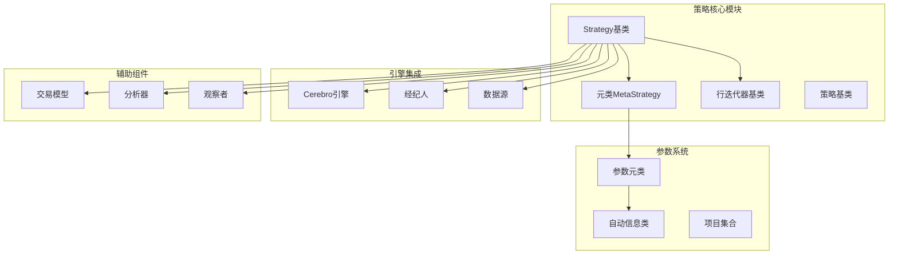
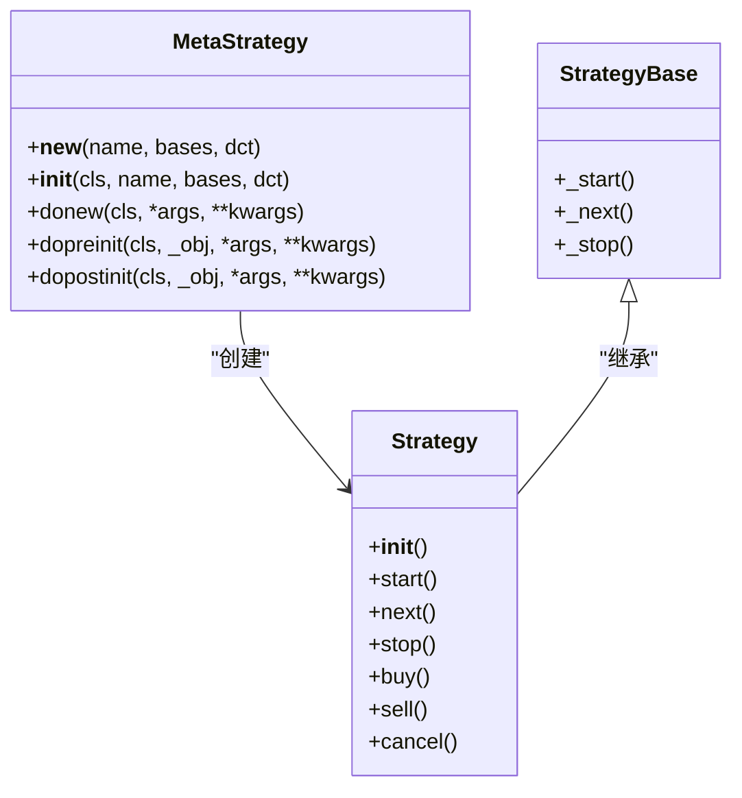
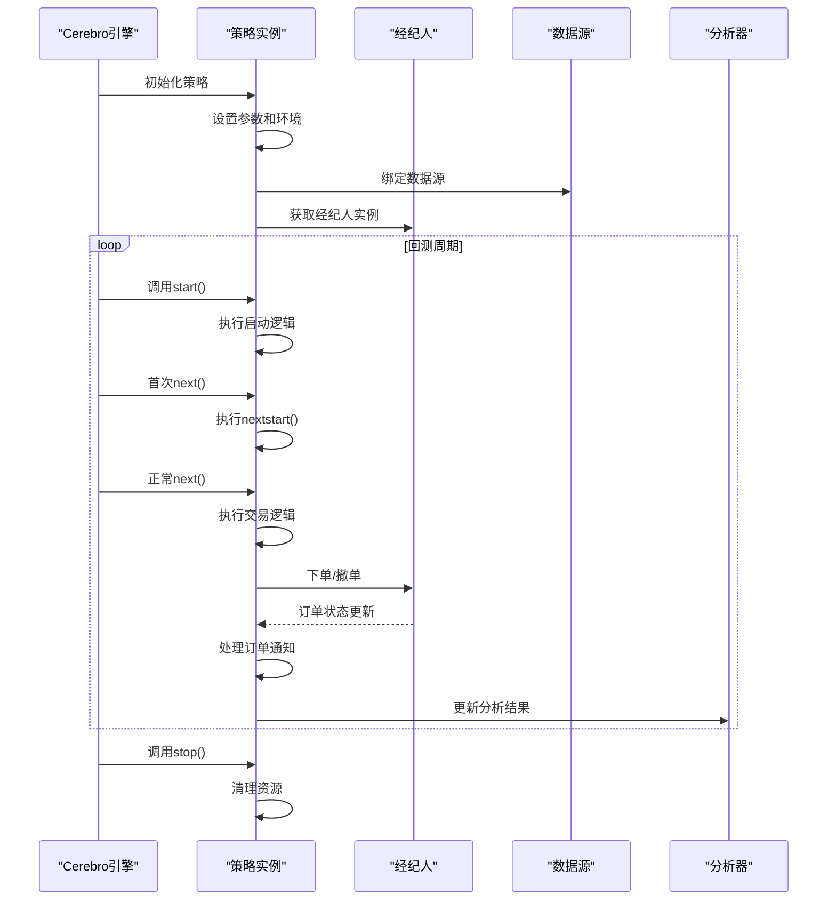
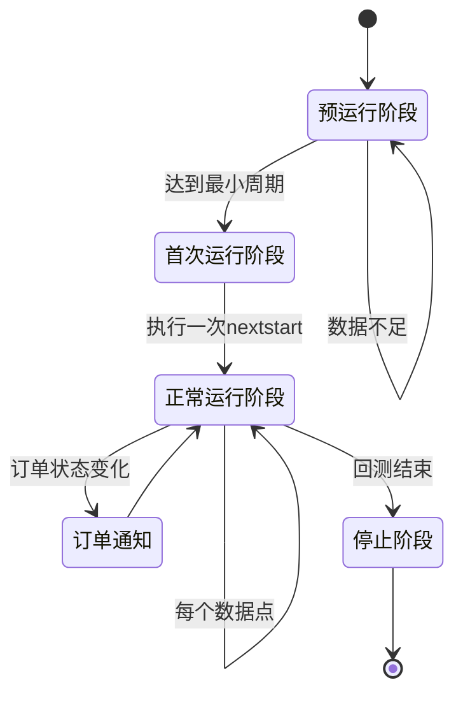
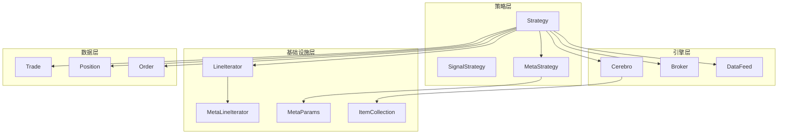

# 策略基类详解

<cite>
**本文档引用的文件**
- [backtrader/strategy.py](file://backtrader/strategy.py)
- [backtrader/cerebro.py](file://backtrader/cerebro.py)
- [backtrader/metabase.py](file://backtrader/metabase.py)
- [backtrader/lineiterator.py](file://backtrader/lineiterator.py)
- [backtrader/trade.py](file://backtrader/trade.py)
- [backtrader/__init__.py](file://backtrader/__init__.py)
- [backtrader/strategies/sma_crossover.py](file://backtrader/strategies/sma_crossover.py)
</cite>

## 目录
1. [简介](#简介)
2. [项目结构](#项目结构)
3. [核心组件](#核心组件)
4. [架构概览](#架构概览)
5. [详细组件分析](#详细组件分析)
6. [依赖关系分析](#依赖关系分析)
7. [性能考虑](#性能考虑)
8. [故障排除指南](#故障排除指南)
9. [结论](#结论)
10. [附录：API参考](#附录api参考)

## 简介

Backtrader的策略基类是整个量化交易回测框架的核心组件。本文档深入解析Strategy基类的设计架构，包括元类MetaStrategy的工作机制、策略生命周期管理、初始化过程、数据绑定机制、参数管理系统，以及策略与Cerebro引擎的交互方式。

Strategy基类采用元编程技术，通过自定义元类实现灵活的参数系统、自动化的生命周期管理和强大的扩展能力。它不仅支持传统的基于时间序列的交易逻辑，还提供了信号驱动的自动化交易模式。

## 项目结构

Backtrader策略系统的文件组织遵循清晰的模块化设计：



**图表来源**
- [backtrader/strategy.py](file://backtrader/strategy.py#L43-L107)
- [backtrader/metabase.py](file://backtrader/metabase.py#L203-L294)
- [backtrader/cerebro.py](file://backtrader/cerebro.py#L60-L120)

**章节来源**
- [backtrader/strategy.py](file://backtrader/strategy.py#L1-L120)
- [backtrader/metabase.py](file://backtrader/metabase.py#L1-L100)
- [backtrader/cerebro.py](file://backtrader/cerebro.py#L1-L120)

## 核心组件

### 元类MetaStrategy工作机制

MetaStrategy是Strategy基类的元类，负责处理类级别的初始化和配置。其核心功能包括：

1. **方法重命名兼容性**：自动将旧版方法名转换为新版
2. **子类注册**：跟踪所有Strategy子类
3. **环境绑定**：为策略实例绑定Cerebro环境
4. **初始化流程控制**：协调策略的预初始化和后初始化阶段



**图表来源**
- [backtrader/strategy.py](file://backtrader/strategy.py#L43-L107)
- [backtrader/strategy.py](file://backtrader/strategy.py#L107-L120)

### 参数管理系统

Backtrader采用AutoInfoClass实现智能参数系统，支持：

- **参数继承**：从基类继承参数定义
- **默认值处理**：自动处理参数默认值
- **类型检查**：运行时参数类型验证
- **动态生成**：根据参数组合动态生成新类

**章节来源**
- [backtrader/metabase.py](file://backtrader/metabase.py#L93-L201)
- [backtrader/metabase.py](file://backtrader/metabase.py#L203-L294)

## 架构概览

Strategy基类的架构设计体现了高度的模块化和可扩展性：



**图表来源**
- [backtrader/cerebro.py](file://backtrader/cerebro.py#L1375-L1716)
- [backtrader/strategy.py](file://backtrader/strategy.py#L393-L493)

## 详细组件分析

### 生命周期管理

Strategy基类实现了完整的生命周期管理，包括三个主要阶段：

#### 启动阶段（start）
策略在回测开始前执行初始化逻辑：
- 计算最小周期要求
- 初始化分析器和观察者
- 切换到第二阶段操作模式
- 设置数据长度跟踪

#### 运行阶段（next）
策略的核心执行阶段，包含三种状态：



**图表来源**
- [backtrader/lineiterator.py](file://backtrader/lineiterator.py#L332-L354)
- [backtrader/strategy.py](file://backtrader/strategy.py#L274-L318)

#### 停止阶段（stop）
策略在回测结束时清理资源：
- 执行停止逻辑
- 关闭分析器和观察者
- 切换回第一阶段操作模式

**章节来源**
- [backtrader/strategy.py](file://backtrader/strategy.py#L393-L493)
- [backtrader/lineiterator.py](file://backtrader/lineiterator.py#L332-L354)

### 数据绑定机制

Strategy基类提供了灵活的数据绑定机制：

#### 自动数据绑定
当策略实例创建时，会自动检测并绑定可用的数据源：
- 支持多数据源同时监控
- 自动设置主数据源（self.data）
- 提供按名称访问数据的方法

#### 行绑定系统
通过bindlines方法实现行之间的绑定：
- 支持字符串和索引两种绑定方式
- 自动处理不同数据源间的同步
- 实现复杂指标间的数据传递

**章节来源**
- [backtrader/lineiterator.py](file://backtrader/lineiterator.py#L223-L257)
- [backtrader/strategy.py](file://backtrader/strategy.py#L758-L768)

### 订单管理系统

Strategy基类提供了完整的订单管理功能：

#### 订单创建
支持多种订单类型：
- **市价单**：立即以市场最优价格成交
- **限价单**：在指定价格或更好价格成交
- **止损单**：达到止损价格触发市价单
- **止损限价单**：止损触发后转为限价单
- **追踪止损**：随价格变动调整止损距离

#### 订单控制
- **取消订单**：支持部分或全部取消
- **订单组**：支持OCO（相互取消）和支票订单
- **Bracket订单**：支持三重订单组合（主单+止损+止盈）

**章节来源**
- [backtrader/strategy.py](file://backtrader/strategy.py#L770-L941)
- [backtrader/strategy.py](file://backtrader/strategy.py#L1001-L1173)

### 通知系统

Strategy基类实现了多层次的通知机制：

#### 订单通知
- **notify_order**：接收订单状态变化通知
- **notify_trade**：接收交易完成通知
- **notify_cashvalue**：接收资金变化通知
- **notify_fund**：接收基金价值变化通知

#### 数据通知
- **notify_data**：接收数据源状态变化通知
- **notify_store**：接收存储层状态变化通知

#### 定时器通知
- **notify_timer**：接收定时器触发通知

**章节来源**
- [backtrader/strategy.py](file://backtrader/strategy.py#L738-L756)
- [backtrader/strategy.py](file://backtrader/strategy.py#L715-L724)

## 依赖关系分析

Strategy基类与其他组件的依赖关系：



**图表来源**
- [backtrader/strategy.py](file://backtrader/strategy.py#L43-L107)
- [backtrader/lineiterator.py](file://backtrader/lineiterator.py#L38-L146)
- [backtrader/metabase.py](file://backtrader/metabase.py#L300-L332)

**章节来源**
- [backtrader/strategy.py](file://backtrader/strategy.py#L1-L120)
- [backtrader/lineiterator.py](file://backtrader/lineiterator.py#L1-L120)
- [backtrader/metabase.py](file://backtrader/metabase.py#L1-L100)

## 性能考虑

### 内存优化
Strategy基类提供了多种内存优化选项：
- **qbuffer方法**：控制内存使用策略
- **exactbars模式**：精确的缓冲区管理
- **plot禁用**：在需要时禁用绘图以节省内存

### 执行效率
- **runonce模式**：向量化执行提高性能
- **预加载数据**：减少数据访问延迟
- **最小周期计算**：避免不必要的计算

## 故障排除指南

### 常见问题及解决方案

#### 订单执行失败
- 检查资金是否充足
- 验证订单参数是否正确
- 确认交易费用设置合理

#### 数据同步问题
- 确保所有数据源具有相同的时间轴
- 检查数据质量
- 验证时间戳格式

#### 性能问题
- 启用runonce模式
- 减少绘图操作
- 优化指标计算

**章节来源**
- [backtrader/strategy.py](file://backtrader/strategy.py#L503-L576)
- [backtrader/cerebro.py](file://backtrader/cerebro.py#L1375-L1716)

## 结论

Backtrader的Strategy基类通过精心设计的元类系统、灵活的参数管理、完善的生命周期控制和强大的扩展机制，为量化交易策略开发提供了坚实的基础。其架构既保证了易用性，又提供了足够的灵活性来支持复杂的交易逻辑。

通过理解Strategy基类的设计原理和实现细节，开发者可以更好地利用Backtrader的强大功能，构建高效、可靠的量化交易策略。

## 附录：API参考

### 核心方法

#### 生命周期方法
- `start()`：策略启动时调用
- `next()`：每个数据点调用的主要逻辑
- `stop()`：策略停止时调用

#### 数据访问方法
- `getdatanames()`：获取所有数据源名称
- `getdatabyname(name)`：按名称获取数据源
- `getposition(data=None, broker=None)`：获取当前持仓

#### 订单管理方法
- `buy(data=None, size=None, price=None, **kwargs)`：买入订单
- `sell(data=None, size=None, price=None, **kwargs)`：卖出订单
- `cancel(order)`：取消订单
- `close(data=None, size=None, **kwargs)`：平仓

#### 通知方法
- `notify_order(order)`：订单状态变化通知
- `notify_trade(trade)`：交易完成通知
- `notify_cashvalue(cash, value)`：资金变化通知
- `notify_fund(cash, value, fundvalue, shares)`：基金变化通知

### 参数系统

#### 参数定义
```python
class MyStrategy(bt.Strategy):
    params = (
        ('param1', default_value),
        ('param2', default_value),
    )
```

#### 参数访问
- `self.p.param_name`：访问参数值
- `self.params`：访问参数对象

### 使用示例

#### 简单移动平均交叉策略
```python
class SMA_CrossOver(bt.Strategy):
    params = (('fast', 10), ('slow', 30))
    
    def __init__(self):
        sma_fast = bt.indicators.SMA(period=self.p.fast)
        sma_slow = bt.indicators.SMA(period=self.p.slow)
        self.buysig = bt.indicators.CrossOver(sma_fast, sma_slow)
    
    def next(self):
        if self.position.size:
            if self.buysig < 0:
                self.sell()
        elif self.buysig > 0:
            self.buy()
```

**章节来源**
- [backtrader/strategy.py](file://backtrader/strategy.py#L1-L1719)
- [backtrader/strategies/sma_crossover.py](file://backtrader/strategies/sma_crossover.py#L29-L75)