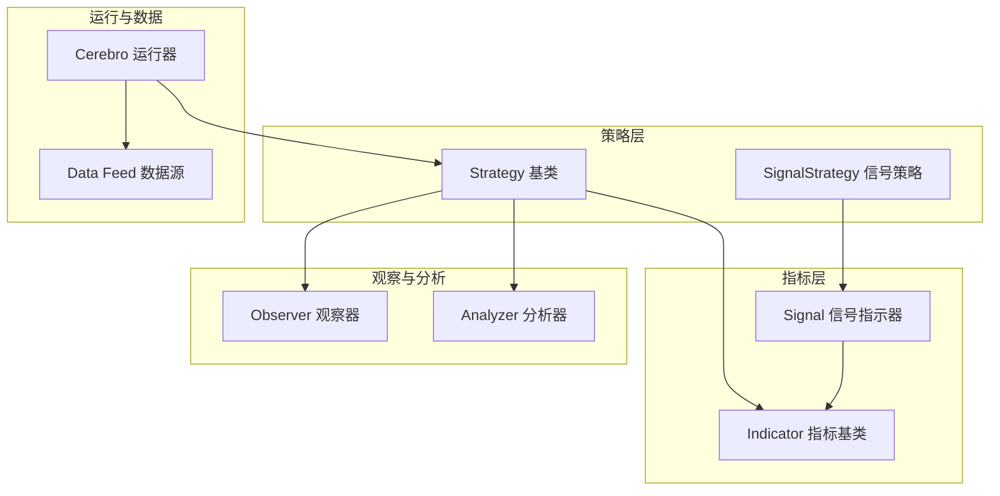
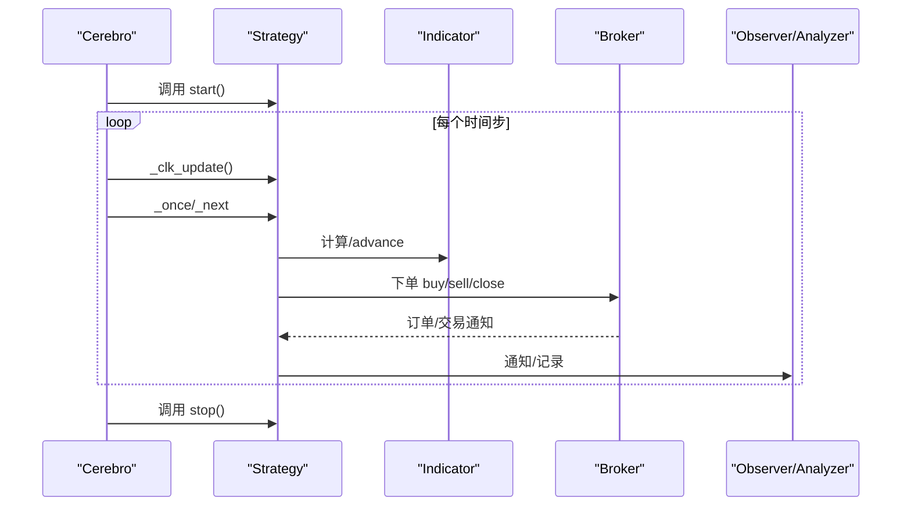
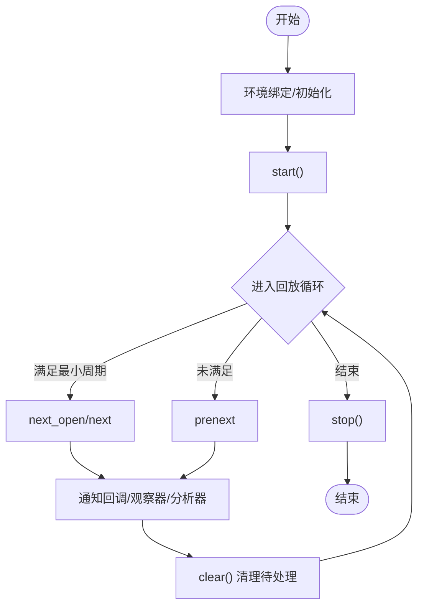
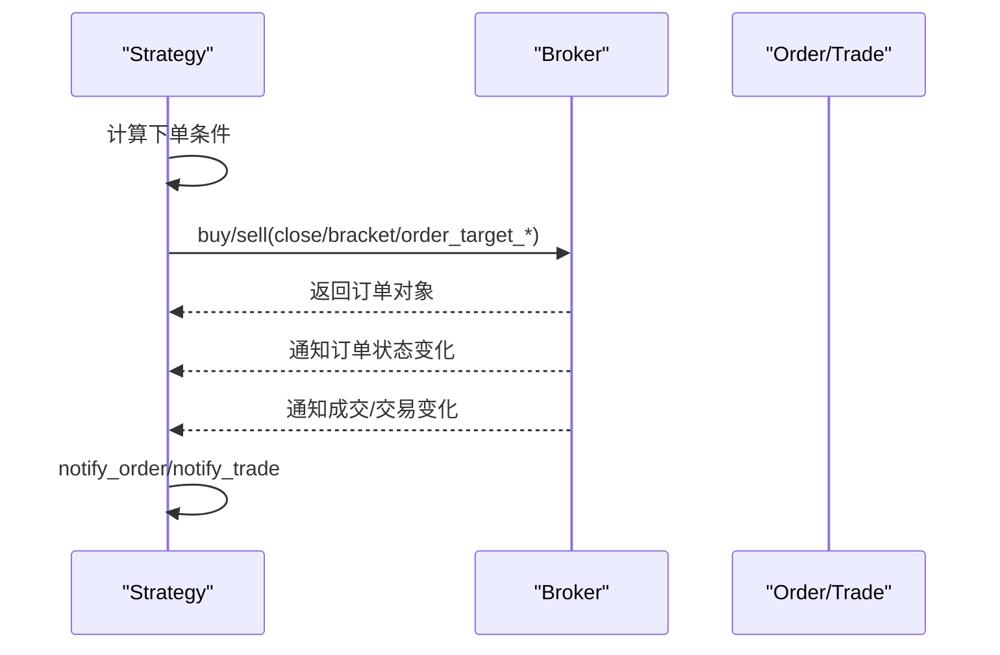
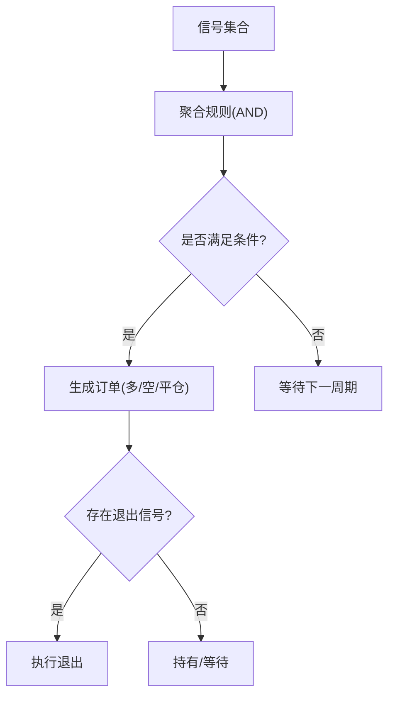
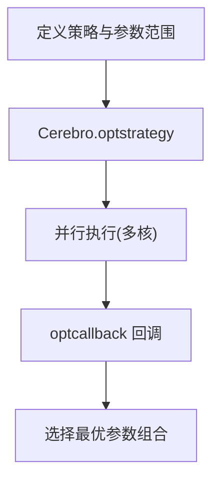
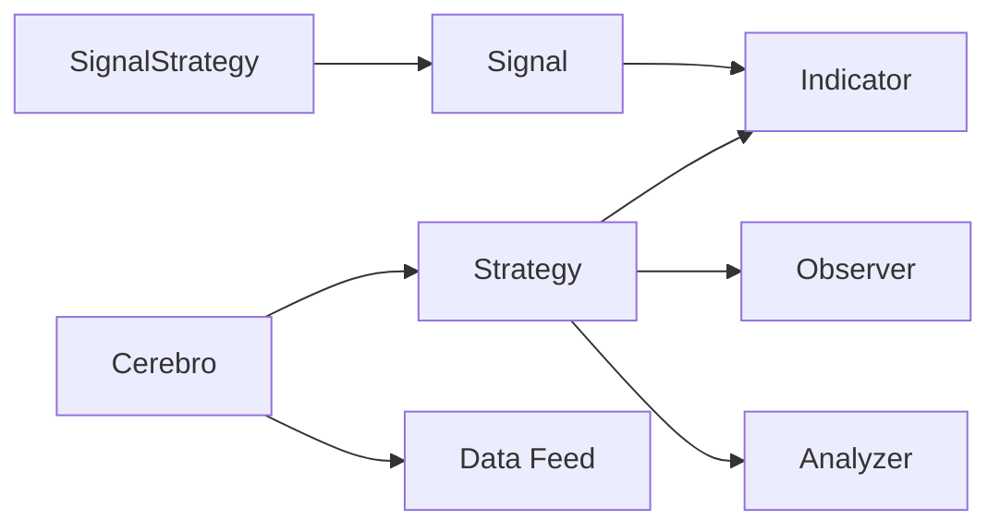

# 策略开发

<cite>
**本文引用的文件**
- [backtrader/__init__.py](file://backtrader/__init__.py)
- [backtrader/strategy.py](file://backtrader/strategy.py)
- [backtrader/cerebro.py](file://backtrader/cerebro.py)
- [backtrader/indicator.py](file://backtrader/indicator.py)
- [backtrader/signal.py](file://backtrader/signal.py)
- [backtrader/analyzer.py](file://backtrader/analyzer.py)
- [backtrader/observer.py](file://backtrader/observer.py)
- [backtrader/studies/contrib/fractal.py](file://backtrader/studies/contrib/fractal.py)
- [backtrader/strategies/sma_crossover.py](file://backtrader/strategies/sma_crossover.py)
- [samples/signals-strategy/signals-strategy.py](file://samples/signals-strategy/signals-strategy.py)
- [samples/optimization/optimization.py](file://samples/optimization/optimization.py)
- [samples/multi-example/mult-values.py](file://samples/multi-example/mult-values.py)
- [samples/pivot-point/pivotpoint.py](file://samples/pivot-point/pivotpoint.py)
</cite>

## 目录
1. [引言](#引言)
2. [项目结构](#项目结构)
3. [核心组件](#核心组件)
4. [架构总览](#架构总览)
5. [详细组件分析](#详细组件分析)
6. [依赖关系分析](#依赖关系分析)
7. [性能考量](#性能考量)
8. [故障排查指南](#故障排查指南)
9. [结论](#结论)
10. [附录](#附录)

## 引言
本文件面向Backtrader策略开发者，系统性梳理策略基类设计、生命周期管理、信号系统、研究模块与策略优化工具，并通过示例帮助读者从简单移动平均交叉策略逐步过渡到多因子模型开发流程。

## 项目结构
Backtrader采用模块化分层组织：策略层（Strategy）、指标层（Indicator）、观察器层（Observer）、分析器层（Analyzer）、运行器（Cerebro）以及数据源（Feed）等。策略基类位于策略层，负责生命周期调度、下单执行、通知回调；指标层提供技术分析能力；观察器与分析器用于记录状态与统计结果；Cerebro作为中枢协调各组件并驱动回测或实盘。

图示来源
- [backtrader/strategy.py](file://backtrader/strategy.py#L107-L1719)
- [backtrader/indicator.py](file://backtrader/indicator.py#L90-L165)
- [backtrader/signal.py](file://backtrader/signal.py#L56-L64)
- [backtrader/observer.py](file://backtrader/observer.py#L46-L69)
- [backtrader/analyzer.py](file://backtrader/analyzer.py#L89-L287)
- [backtrader/cerebro.py](file://backtrader/cerebro.py#L60-L1717)

章节来源
- [backtrader/__init__.py](file://backtrader/__init__.py#L24-L91)

## 核心组件
- 策略基类（Strategy）：定义策略生命周期（start/next/stop）、下单接口（buy/sell/close/bracket）、通知回调（notify_order/notify_trade/notify_cashvalue/notify_fund）、定时器（add_timer）等。
- 指标基类（Indicator）：支持向量化/事件驱动两种模式，提供 advance/once_via_next 等机制以适配多时间框架与不同长度数据。
- 信号系统（SignalStrategy + Signal）：基于信号值（>0 多头，<0 空头）自动下单，支持 LONGSHORT/LONG/SHORT 及 EXIT 类型信号组合。
- 观察器与分析器：Observer 在策略周期中记录状态；Analyzer 跟随策略生命周期收集统计信息。
- 运行器（Cerebro）：统一调度数据、策略、观察器、分析器与优化任务，提供参数扫描、网格搜索、随机搜索等优化能力。

章节来源
- [backtrader/strategy.py](file://backtrader/strategy.py#L107-L1719)
- [backtrader/indicator.py](file://backtrader/indicator.py#L90-L165)
- [backtrader/signal.py](file://backtrader/signal.py#L56-L64)
- [backtrader/analyzer.py](file://backtrader/analyzer.py#L89-L287)
- [backtrader/observer.py](file://backtrader/observer.py#L46-L69)
- [backtrader/cerebro.py](file://backtrader/cerebro.py#L60-L1717)

## 架构总览
下图展示策略在回测中的主控制流：Cerebro 驱动策略的 start/next/stop 生命周期，策略调用指标计算与下单接口，同时接收订单与交易通知，观察器与分析器在相应阶段记录与统计。

图示来源
- [backtrader/cerebro.py](file://backtrader/cerebro.py#L1116-L1145)
- [backtrader/strategy.py](file://backtrader/strategy.py#L320-L493)
- [backtrader/analyzer.py](file://backtrader/analyzer.py#L148-L201)
- [backtrader/observer.py](file://backtrader/observer.py#L61-L69)

## 详细组件分析

### 策略基类与生命周期管理
- 初始化阶段
  - 策略类元类（MetaStrategy）在实例化前后完成环境绑定、默认成员初始化（broker、sizer、orders、analyzers、observers 等），并设置最小周期约束。
  - 策略 start() 在所有数据与指标准备就绪后被调用，适合进行一次性初始化。
- 数据更新阶段
  - _clk_update() 同步各数据源的时钟，更新策略时间线与数据指针。
  - _once/_next 根据最小周期状态分别触发 next_open/next 或 prenext。
  - _next_observers/_next_analyzers 在每个周期末同步观察器与分析器。
- 结束阶段
  - _stop() 调用 stop() 并清理资源，切换到可复用状态。

图示来源
- [backtrader/strategy.py](file://backtrader/strategy.py#L393-L493)
- [backtrader/strategy.py](file://backtrader/strategy.py#L274-L354)

章节来源
- [backtrader/strategy.py](file://backtrader/strategy.py#L77-L1719)

### 下单执行与风险管理
- 下单入口
  - buy()/sell() 支持多种执行类型（市价、限价、止损、停价跟单等）、有效期、OCO/Bracket 组合、止盈止损等。
  - close() 根据现有持仓反向平仓。
  - bracket 订单族（buy_bracket/sell_bracket）一键生成主单+上下边界单。
- 风险管理
  - order_target_* 系列按目标数量/价值/比例重平衡，避免手动计算方向与数量。
  - sizer 控制每笔订单规模，策略提供 getsizing() 获取当前应下单手数。

图示来源
- [backtrader/strategy.py](file://backtrader/strategy.py#L770-L1377)

章节来源
- [backtrader/strategy.py](file://backtrader/strategy.py#L770-L1377)

### 信号系统与信号组合
- 信号类型
  - Signal 基类输出 signal 线，通常由 Indicator 派生，其值 >0 表示多头，<0 表示空头。
  - SignalStrategy 自动根据信号值与配置（LONG/LONGSHORT/SHORT/LONGEXIT/SHORTEXIT）生成订单。
- 信号组合与过滤
  - SignalStrategy 支持多信号聚合（AND 条件），并允许并发/累计下单策略。
  - 退出信号优先级高于入场信号，避免冲突。

图示来源
- [backtrader/signal.py](file://backtrader/signal.py#L56-L64)
- [backtrader/strategy.py](file://backtrader/strategy.py#L1524-L1649)

章节来源
- [backtrader/signal.py](file://backtrader/signal.py#L26-L64)
- [backtrader/strategy.py](file://backtrader/strategy.py#L1472-L1649)
- [samples/signals-strategy/signals-strategy.py](file://samples/signals-strategy/signals-strategy.py#L43-L89)

### 研究模块与技术研究
- 研究模块（Studies）
  - 提供对基础指标的扩展研究能力，如 Fractal 指标识别牛熊转折点，便于策略信号增强。
- 实战应用
  - 将研究型指标作为信号输入，结合趋势/震荡类指标构建复合信号，提升策略稳健性。

章节来源
- [backtrader/studies/contrib/fractal.py](file://backtrader/studies/contrib/fractal.py#L30-L71)
- [samples/pivot-point/pivotpoint.py](file://samples/pivot-point/pivotpoint.py#L46-L64)

### 策略优化工具
- 参数扫描与网格搜索
  - 使用 Cerebro.optstrategy 定义参数范围，系统自动生成组合并并行执行。
- 随机搜索与回调
  - 支持 optcallback 注册回调，逐个策略完成后接收结果以便筛选最优参数。
- 性能优化选项
  - runonce、exactbars、optdatas、optreturn 等参数可显著提升大规模优化效率。

图示来源
- [backtrader/cerebro.py](file://backtrader/cerebro.py#L859-L886)
- [samples/optimization/optimization.py](file://samples/optimization/optimization.py#L62-L87)

章节来源
- [backtrader/cerebro.py](file://backtrader/cerebro.py#L859-L886)
- [samples/optimization/optimization.py](file://samples/optimization/optimization.py#L51-L101)

### 典型策略开发示例

#### 示例一：移动平均交叉策略
- 思路：快线上穿慢线上穿做多，快线下穿慢线下穿做空。
- 关键点：使用 CrossOver 指标与 SMA，仅在无仓位时入场，有仓位时出场。

章节来源
- [backtrader/strategies/sma_crossover.py](file://backtrader/strategies/sma_crossover.py#L29-L75)

#### 示例二：信号策略（多因子信号）
- 思路：通过 SMA 与价格差构造信号，结合 LONG/SHORT/EXIT 信号类型实现自动下单。
- 关键点：使用 cerebro.add_signal 注入信号，SignalStrategy 自动执行。

章节来源
- [samples/signals-strategy/signals-strategy.py](file://samples/signals-strategy/signals-strategy.py#L61-L96)

#### 示例三：多数据与Bracket订单
- 思路：多数据并行回测，使用 Bracket 订单管理风险与止盈止损。
- 关键点：测试自定义 Sizer 的下单规模控制。

章节来源
- [samples/multi-example/mult-values.py](file://samples/multi-example/mult-values.py#L77-L128)

## 依赖关系分析
- 策略依赖指标与数据：策略通过 Indicator 计算信号，通过 Data Feed 获取价格序列。
- 观察器与分析器依赖策略生命周期：在 prenext/next/nextstart/stop 等阶段记录与统计。
- 运行器协调：Cerebro 统一调度策略、数据、观察器、分析器与优化任务。

图示来源
- [backtrader/cerebro.py](file://backtrader/cerebro.py#L60-L1717)
- [backtrader/strategy.py](file://backtrader/strategy.py#L107-L1719)
- [backtrader/indicator.py](file://backtrader/indicator.py#L90-L165)
- [backtrader/signal.py](file://backtrader/signal.py#L56-L64)

章节来源
- [backtrader/cerebro.py](file://backtrader/cerebro.py#L60-L1717)
- [backtrader/strategy.py](file://backtrader/strategy.py#L107-L1719)

## 性能考量
- 向量化与事件驱动：Indicator 支持 once_via_next 与 preonce_via_prenext，减少不必要的计算。
- 内存节省：qbuffer 与 exactbars 等参数可在保证绘图的前提下降低内存占用。
- 优化加速：runonce、optdatas、optreturn、maxcpus 等参数可显著缩短优化耗时。
- 数据预加载：在优化前预加载数据可避免重复 IO。

章节来源
- [backtrader/indicator.py](file://backtrader/indicator.py#L101-L137)
- [backtrader/strategy.py](file://backtrader/strategy.py#L120-L154)
- [backtrader/cerebro.py](file://backtrader/cerebro.py#L274-L294)
- [samples/optimization/optimization.py](file://samples/optimization/optimization.py#L55-L59)

## 故障排查指南
- 订单未成交/延迟
  - 检查执行类型与价格限制（市价/限价/止损），确认滑点与手续费设置。
  - 使用 quicknotify 与 notify_order/notify_trade 打印订单状态。
- 信号未生效
  - 确认 SignalStrategy 的信号聚合规则与 EXIT 优先级。
  - 检查信号指标的最小周期与数据长度。
- 优化结果异常
  - 核对参数范围与 optcallback 回调逻辑，确保筛选标准合理。
  - 开启 tradehistory 以追踪交易历史。

章节来源
- [backtrader/strategy.py](file://backtrader/strategy.py#L577-L614)
- [backtrader/strategy.py](file://backtrader/strategy.py#L1619-L1634)
- [backtrader/cerebro.py](file://backtrader/cerebro.py#L859-L886)

## 结论
Backtrader 提供了清晰的策略生命周期、灵活的信号系统与强大的优化工具。通过指标、观察器、分析器与运行器的协同，开发者可以快速从简单策略迭代到复杂多因子模型，并借助优化工具高效寻优参数空间。

## 附录
- 快速上手建议
  - 从 SMA_CrossOver 策略入手，理解策略生命周期与下单接口。
  - 引入 SignalStrategy 与自定义 Signal 指标，体验信号驱动的自动化交易。
  - 使用 Cerebro 的优化能力进行参数扫描，结合 Analyzer 输出评估指标。
- 推荐实践
  - 将信号与风险管理（止盈止损、固定比例下单）解耦，便于独立验证与调参。
  - 利用 Studies 模块引入研究型指标，增强信号质量。