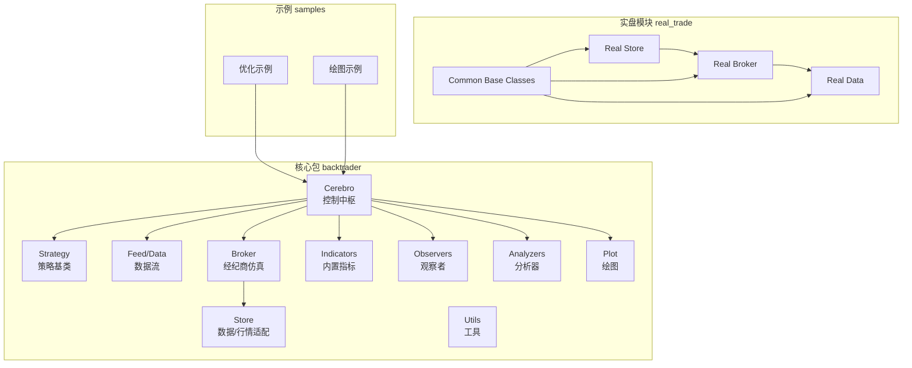
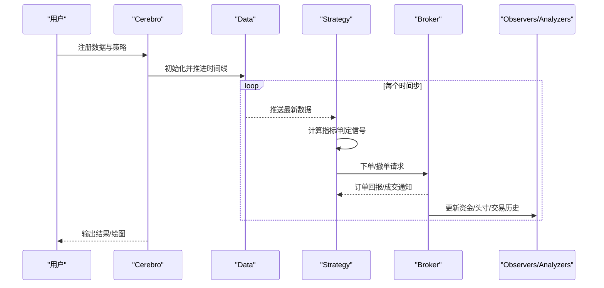
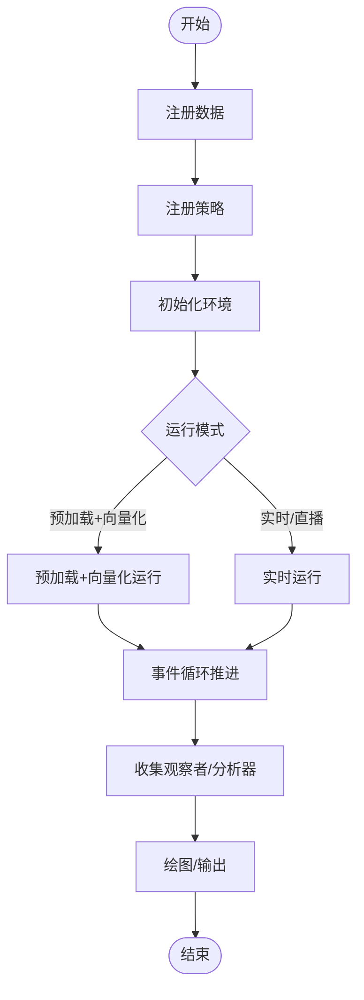
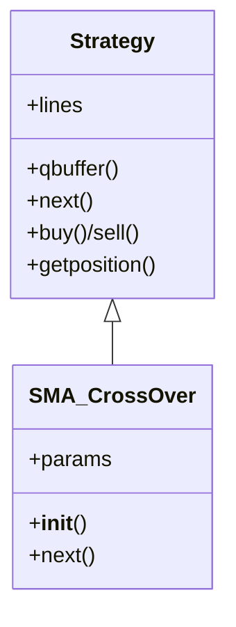
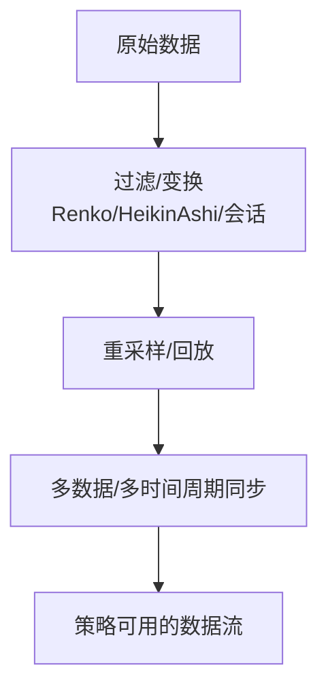
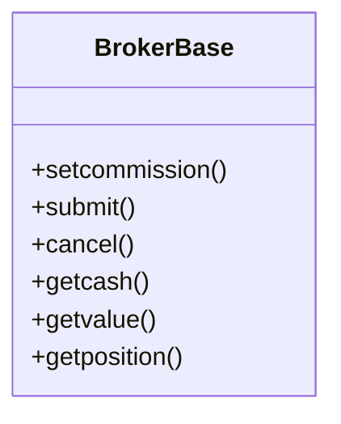
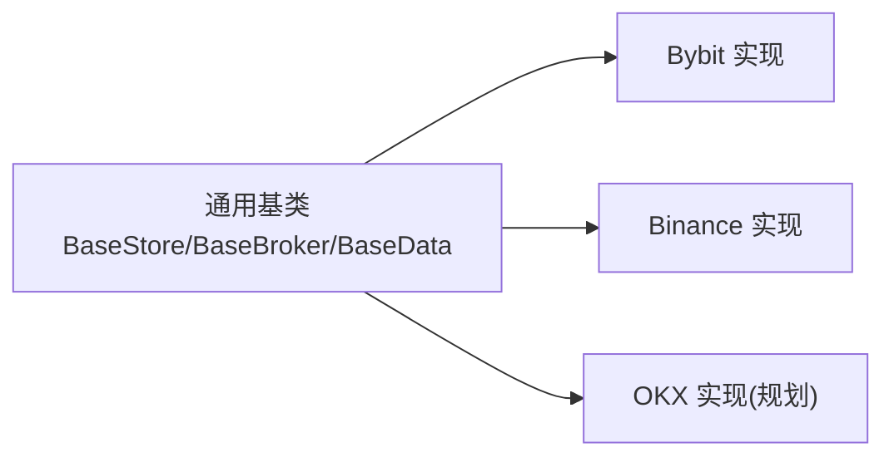
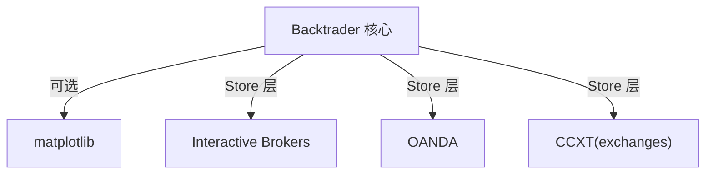

# 项目介绍与核心价值

<cite>
**本文引用的文件**
- [README.rst](file://README.rst)
- [setup.py](file://setup.py)
- [backtrader/__init__.py](file://backtrader/__init__.py)
- [backtrader/version.py](file://backtrader/version.py)
- [backtrader/cerebro.py](file://backtrader/cerebro.py)
- [backtrader/strategy.py](file://backtrader/strategy.py)
- [backtrader/feed.py](file://backtrader/feed.py)
- [backtrader/broker.py](file://backtrader/broker.py)
- [backtrader/strategies/sma_crossover.py](file://backtrader/strategies/sma_crossover.py)
- [real_trade/README.md](file://real_trade/README.md)
- [real_trade/ARCHITECTURE.md](file://real_trade/ARCHITECTURE.md)
- [samples/optimization/optimization.py](file://samples/optimization/optimization.py)
- [samples/plot-same-axis/plot-same-axis.py](file://samples/plot-same-axis/plot-same-axis.py)
- [contrib/utils/influxdb-import.py](file://contrib/utils/influxdb-import.py)
- [changelog.txt](file://changelog.txt)
</cite>

## 目录
1. [引言](#引言)
2. [项目结构](#项目结构)
3. [核心组件](#核心组件)
4. [架构总览](#架构总览)
5. [详细组件分析](#详细组件分析)
6. [依赖分析](#依赖分析)
7. [性能考量](#性能考量)
8. [故障排查指南](#故障排查指南)
9. [结论](#结论)
10. [附录](#附录)

## 引言
Backtrader 是一个用 Python 实现的量化交易回测与实盘平台，强调“纯 Python、零外部依赖”的设计理念，同时提供事件驱动的策略执行、插件化的数据与经纪商适配、灵活的指标体系与分析器、强大的绘图与可视化能力，并支持多数据源、多时间周期、多策略并行运行与优化。其核心价值在于：
- 低门槛：以 Python 生态为主，安装与使用简单，示例丰富，适合初学者快速上手。
- 高自由度：策略、指标、观察者、分析器均可自定义扩展；Broker/Data/Store 可按需替换或扩展。
- 高内聚：围绕 Cerebro 控制中枢，形成统一的事件循环与生命周期管理。
- 可扩展：通过 Store/Broker/Data 的适配层，轻松接入多家交易所与数据源。
- 可维护：版本演进稳定，变更记录详尽，社区活跃。

Backtrader 的目标是成为“从策略研发到实盘落地的一体化平台”，既可用于学术研究与策略回测，也可用于生产级实盘交易（配合 real_trade 模块）。

## 项目结构
Backtrader 采用“包内分层 + 功能域划分”的组织方式：
- backtrader 核心包：包含策略、指标、观察者、分析器、数据流、Broker、Store、绘图、工具等。
- real_trade 实盘模块：提供基于 CCXT 的交易所适配（Bybit、Binance 等），统一 Store/Broker/Data 接口，强调安全与可扩展。
- samples 示例：涵盖回测、优化、绘图、实时数据、多时间周期、多数据等场景。
- contrib 工具：数据导入、转换等辅助脚本。
- tests 测试：覆盖指标、策略、数据处理等关键路径。

图表来源
- [backtrader/cerebro.py](file://backtrader/cerebro.py#L60-L200)
- [backtrader/strategy.py](file://backtrader/strategy.py#L107-L200)
- [backtrader/feed.py](file://backtrader/feed.py#L122-L200)
- [backtrader/broker.py](file://backtrader/broker.py#L49-L169)
- [real_trade/README.md](file://real_trade/README.md#L1-L266)
- [real_trade/ARCHITECTURE.md](file://real_trade/ARCHITECTURE.md#L1-L295)

章节来源
- [README.rst](file://README.rst#L66-L102)
- [backtrader/__init__.py](file://backtrader/__init__.py#L1-L91)

## 核心组件
- Cerebro：回测/实盘的控制中枢，负责数据注册、策略注册、运行循环、观察者/分析器生命周期管理、绘图与结果输出。
- Strategy：策略基类，提供信号触发、下单、止盈止损、资金管理等接口；支持多数据、多时间周期与多策略并行。
- Feed/Data：数据源抽象，支持 CSV、pandas、在线数据、过滤器（如 Renko、HeikinAshi）、重采样/回放等。
- Broker：仿真/实盘经纪商抽象，支持多种委托类型（市价、限价、止损、OCO、Bracket 等）、滑点、成交量填充策略、保证金与杠杆。
- Store：数据/行情适配层，屏蔽不同交易所/数据源差异，便于扩展。
- Indicators/Observers/Analyzers：丰富的内置组件与扩展点，满足策略开发、风控、绩效评估与可视化需求。
- Plot：基于 matplotlib 的绘图模块，支持多子图、多轴、指标叠加、交易标记等。
- Utils：日期时间、缓存、字典等工具。

章节来源
- [backtrader/cerebro.py](file://backtrader/cerebro.py#L60-L200)
- [backtrader/strategy.py](file://backtrader/strategy.py#L107-L200)
- [backtrader/feed.py](file://backtrader/feed.py#L122-L200)
- [backtrader/broker.py](file://backtrader/broker.py#L49-L169)

## 架构总览
Backtrader 的运行流程以 Cerebro 为核心，围绕“事件驱动”的策略执行模型展开：Cerebro 驱动数据流推进，策略在每个时间点接收数据并根据信号下单，Broker 执行订单并更新仓位与现金，Observer/Analyzer 记录状态与指标，最终由 Plot 输出可视化结果。

图表来源
- [backtrader/cerebro.py](file://backtrader/cerebro.py#L60-L200)
- [backtrader/strategy.py](file://backtrader/strategy.py#L107-L200)
- [backtrader/broker.py](file://backtrader/broker.py#L49-L169)

## 详细组件分析

### Cerebro 控制中枢
- 关键职责：注册数据、策略、观察者、分析器；控制运行模式（预加载、向量化、实时）；优化与多进程；结果输出与绘图。
- 运行参数：preload、runonce、live、exactbars、stdstats、writer、tradehistory、optdatas、optreturn 等，支持内存节省、向量化加速与优化加速。
- 生命周期：start/next/start_clock/stop，确保各组件按序初始化与清理。

图表来源
- [backtrader/cerebro.py](file://backtrader/cerebro.py#L60-L200)

章节来源
- [backtrader/cerebro.py](file://backtrader/cerebro.py#L60-L200)

### Strategy 策略基类
- 信号与下单：通过内置信号/指标生成买卖信号，结合下单接口实现自动化交易。
- 多数据与多时间周期：支持多数据源与多时间周期同步，策略内部可跨数据进行联动。
- 内存节省：提供 qbuffer 机制，按需释放中间值，降低内存占用。
- 生命周期：preinit/postinit、next、stop 等钩子贯穿策略生命周期。

图表来源
- [backtrader/strategy.py](file://backtrader/strategy.py#L107-L200)
- [backtrader/strategies/sma_crossover.py](file://backtrader/strategies/sma_crossover.py#L29-L75)

章节来源
- [backtrader/strategy.py](file://backtrader/strategy.py#L107-L200)
- [backtrader/strategies/sma_crossover.py](file://backtrader/strategies/sma_crossover.py#L29-L75)

### Feed/Data 数据流
- 抽象与参数：提供时间框架、压缩周期、会话时间、过滤器、时区等参数化配置。
- 过滤与变换：支持 Renko、HeikinAshi、会话过滤、日步进等，便于构造更贴近市场的输入。
- 同步与回放：支持多数据/多时间周期的同步推进与回放，保证策略一致性。

图表来源
- [backtrader/feed.py](file://backtrader/feed.py#L122-L200)

章节来源
- [backtrader/feed.py](file://backtrader/feed.py#L122-L200)

### Broker 经纪商仿真
- 委托类型：市价、限价、止损、止损限价、追踪止损、OCO、Bracket 等。
- 资金与手续费：支持多种手续费方案、保证金与杠杆、信用利息等。
- 滑点与成交量：支持滑点与成交量填充策略，贴近真实市场微观结构。
- 接口抽象：通过 setcommission、submit、cancel、getcash/value 等统一接口，便于替换为实盘 Broker。

图表来源
- [backtrader/broker.py](file://backtrader/broker.py#L49-L169)

章节来源
- [backtrader/broker.py](file://backtrader/broker.py#L49-L169)

### 实盘模块 real_trade：统一架构与高复用
- 设计目标：通过通用基类实现 90%+ 代码复用，快速接入新交易所。
- 统一接口：Store/Broker/Data 三件套，API 设计一致，便于切换与迁移。
- 安全优先：默认模拟交易，测试网优先，明确真实交易开关。
- 扩展友好：遵循 SOLID 原则与 DRY 原则，易于维护与二次开发。

图表来源
- [real_trade/README.md](file://real_trade/README.md#L1-L266)
- [real_trade/ARCHITECTURE.md](file://real_trade/ARCHITECTURE.md#L1-L295)

章节来源
- [real_trade/README.md](file://real_trade/README.md#L1-L266)
- [real_trade/ARCHITECTURE.md](file://real_trade/ARCHITECTURE.md#L1-L295)

### 示例场景与应用
- 回测与绘图：通过策略与指标组合，输出多子图、多轴的可视化结果，便于策略验证与展示。
- 优化：利用 Cerebro 的优化接口，对策略参数空间进行网格搜索或并行探索，提升参数鲁棒性。
- 数据导入：提供 InfluxDB 导入工具，支持批量写入 OHLCV 数据，便于构建本地数据库。

章节来源
- [samples/plot-same-axis/plot-same-axis.py](file://samples/plot-same-axis/plot-same-axis.py#L1-L147)
- [samples/optimization/optimization.py](file://samples/optimization/optimization.py#L1-L197)
- [contrib/utils/influxdb-import.py](file://contrib/utils/influxdb-import.py#L1-L137)

## 依赖分析
- 安装与依赖：核心包“自包含、零外部依赖”（绘图需 matplotlib），可通过 extras 安装绘图支持。
- 版本与兼容：支持 Python 3.2+，在 PyPy/PyPy3 上可运行（绘图除外）。
- 第三方集成：通过 Store 层对接 IB、OANDA、Visual Chart、CCXT 等，保持核心与外部系统的松耦合。

图表来源
- [README.rst](file://README.rst#L126-L154)
- [setup.py](file://setup.py#L118-L141)

章节来源
- [README.rst](file://README.rst#L126-L154)
- [setup.py](file://setup.py#L118-L141)

## 性能考量
- 向量化与预加载：runonce 与 preload 可显著提升回测速度，适用于大规模数据与复杂策略。
- 内存节省：exactbars 与 qbuffer 机制可在保证精度的前提下减少内存占用，适合长周期回测。
- 并行优化：Cerebro 支持多核并行优化，结合 optdatas/optreturn 可进一步提速。
- 绘图开销：绘图在 exactbars 模式下不可用，建议在调试阶段开启，正式运行关闭。

章节来源
- [backtrader/cerebro.py](file://backtrader/cerebro.py#L60-L200)
- [backtrader/strategy.py](file://backtrader/strategy.py#L120-L155)

## 故障排查指南
- 版本与兼容性：若遇到第三方库兼容问题，检查 Python 版本与 matplotlib 版本要求；必要时降级或升级相关依赖。
- 数据格式：确保 CSV 字段顺序与日期时间格式正确；必要时使用内置数据适配器或转换工具。
- 实盘安全：默认模拟交易，真实交易需显式开启；建议先在测试网验证策略再切换至实盘。
- 优化耗时：若优化过程过慢，尝试关闭 runonce、减少参数范围或限制 CPU 数量。

章节来源
- [README.rst](file://README.rst#L126-L154)
- [real_trade/README.md](file://real_trade/README.md#L252-L261)

## 结论
Backtrader 以“纯 Python、事件驱动、插件化、零外部依赖”的核心理念，构建了从策略研发到实盘落地的完整闭环。其清晰的组件边界、统一的接口设计与丰富的生态工具，使其既能满足初学者入门，也能支撑专业用户的复杂需求。配合 real_trade 的高复用架构，Backtrader 在量化投资领域具备独特的可扩展性与可持续发展能力。

## 附录
- 版本信息：当前版本号与版本元组由版本模块提供，便于程序内版本判断与兼容性处理。
- 变更记录：详尽的变更日志体现了项目的稳定性与持续演进，涵盖绘图、指标、Broker、Store、优化等多个方面。

章节来源
- [backtrader/version.py](file://backtrader/version.py#L25-L28)
- [changelog.txt](file://changelog.txt#L1-L800)