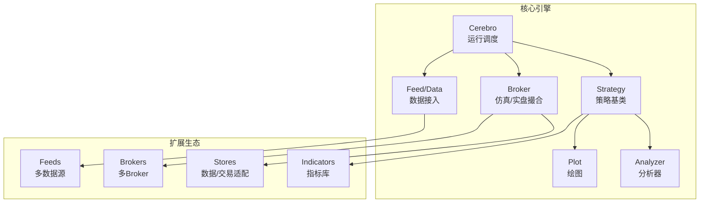
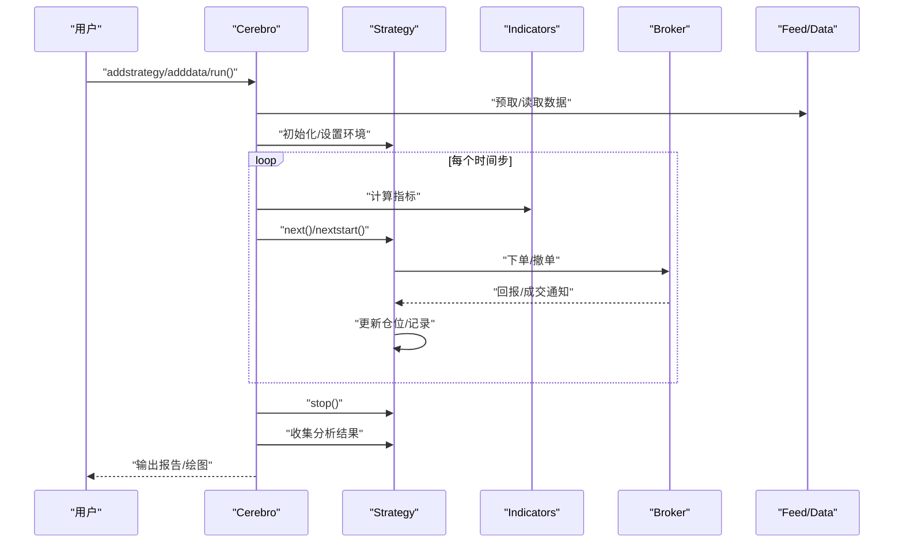
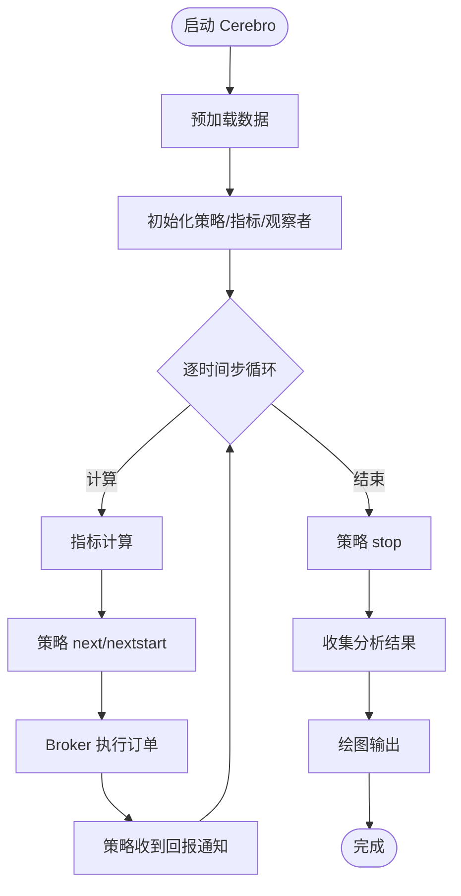
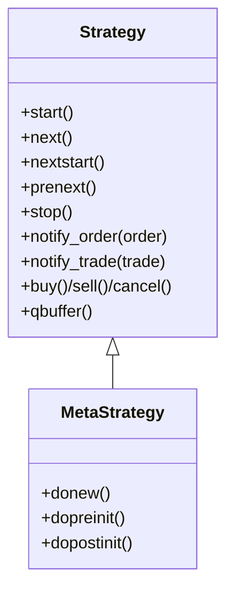
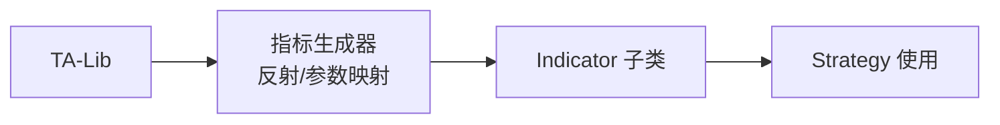
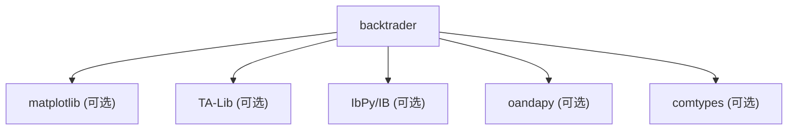

# 项目概述

<cite>
**本文引用的文件**
- [backtrader/__init__.py](file://backtrader/__init__.py)
- [README.rst](file://README.rst)
- [setup.py](file://setup.py)
- [backtrader/cerebro.py](file://backtrader/cerebro.py)
- [backtrader/strategy.py](file://backtrader/strategy.py)
- [backtrader/version.py](file://backtrader/version.py)
- [backtrader/feeds/__init__.py](file://backtrader/feeds/__init__.py)
- [backtrader/indicators/__init__.py](file://backtrader/indicators/__init__.py)
- [backtrader/brokers/__init__.py](file://backtrader/brokers/__init__.py)
- [backtrader/plot/__init__.py](file://backtrader/plot/__init__.py)
- [backtrader/analyzer.py](file://backtrader/analyzer.py)
- [backtrader/talib.py](file://backtrader/talib.py)
- [samples/yahoo-test/yahoo-test.py](file://samples/yahoo-test/yahoo-test.py)
- [real_trade/README.md](file://real_trade/README.md)
- [real_trade/ARCHITECTURE.md](file://real_trade/ARCHITECTURE.md)
</cite>

## 目录
1. [引言](#引言)
2. [项目结构](#项目结构)
3. [核心组件](#核心组件)
4. [架构总览](#架构总览)
5. [组件详解](#组件详解)
6. [依赖关系分析](#依赖关系分析)
7. [性能考量](#性能考量)
8. [故障排查指南](#故障排查指南)
9. [结论](#结论)
10. [附录](#附录)

## 引言
Backtrader 是一个用 Python 实现的量化交易回测与实盘平台，强调事件驱动、插件化与可扩展性。它提供完整的回测引擎、丰富的技术分析指标库、灵活的数据接入与过滤机制、内置的仿真撮合与订单执行模型、可视化绘图能力以及面向实盘的扩展模块。Backtrader 的目标是让开发者能够快速构建、测试并部署交易策略，同时保持对底层实现细节的可控性。

## 项目结构
Backtrader 采用按功能域划分的模块化组织方式，核心目录包括：
- backtrader：核心引擎与基础设施（Cerebro、Strategy、Broker、Feed、Analyzer、Plot 等）
- backtrader/feeds：多数据源接入（CSV、Yahoo Finance、Quandl、Interactive Brokers、OANDA、InfluxDB 等）
- backtrader/indicators：内置指标库（122+ 指标），支持 TA-Lib 集成
- backtrader/brokers：仿真与实盘 Broker（BackBroker、IB、OANDA、Visual Chart 等）
- backtrader/stores：与外部交易所/数据源的连接适配层
- backtrader/analyzers：收益、风险、夏普比率、最大回撤等分析器
- backtrader/plot：基于 matplotlib 的可视化绘图
- samples：大量示例，涵盖数据接入、指标使用、策略开发、优化与实盘对接
- real_trade：专业实盘模块，提供统一的交易所接入与扩展架构

图表来源
- [backtrader/cerebro.py](file://backtrader/cerebro.py#L60-L200)
- [backtrader/strategy.py](file://backtrader/strategy.py#L107-L200)
- [backtrader/brokers/__init__.py](file://backtrader/brokers/__init__.py#L27-L43)
- [backtrader/feeds/__init__.py](file://backtrader/feeds/__init__.py#L25-L55)
- [backtrader/indicators/__init__.py](file://backtrader/indicators/__init__.py#L24-L91)
- [backtrader/analyzer.py](file://backtrader/analyzer.py#L89-L200)
- [backtrader/plot/__init__.py](file://backtrader/plot/__init__.py#L27-L44)

章节来源
- [backtrader/__init__.py](file://backtrader/__init__.py#L24-L91)
- [README.rst](file://README.rst#L66-L125)

## 核心组件
- Cerebro：回测/实盘运行时的中枢，负责数据、策略、观察者、分析器、绘图等的编排与调度，支持向量化运行、预加载、内存节省模式、优化等。
- Strategy：策略基类，提供信号、下单、止盈止损、跟踪交易历史等能力；支持信号策略与传统策略两种范式。
- Broker：仿真/实盘撮合引擎，支持市价、限价、止损、停损追踪、oco、Bracket 等订单类型，内置滑点、成交量填充策略与保证金调整。
- Feed/Data：统一的数据接入接口，支持 CSV、pandas、Yahoo Finance、Quandl、MT4/5、InfluxDB、IB、OANDA 等，支持重采样与回放。
- Indicators：内置 122+ 指标，覆盖移动平均、震荡、动量、布林带、ATR、MACD、RSI、Ichimoku 等；可与 TA-Lib 集成。
- Analyzers：内置收益、回撤、夏普、SQN 等分析器，并提供扩展接口。
- Plot：基于 matplotlib 的绘图模块，支持 OHLC、指标叠加、买卖信号标注、多图层布局等。
- Stores/Brokers：与外部系统的适配层，便于扩展新的数据源与交易所。

章节来源
- [backtrader/cerebro.py](file://backtrader/cerebro.py#L60-L200)
- [backtrader/strategy.py](file://backtrader/strategy.py#L107-L200)
- [backtrader/analyzer.py](file://backtrader/analyzer.py#L89-L200)
- [backtrader/plot/__init__.py](file://backtrader/plot/__init__.py#L27-L44)

## 架构总览
Backtrader 采用“事件驱动 + 插件化”的架构理念：
- 事件驱动：Cerebro 驱动策略在每个时间步进行 next/nextstart/prenext 等生命周期回调，指标与观察者同步更新。
- 插件化设计：通过模块导入与元类机制，策略、指标、分析器、观察者、数据源、Broker 等均可按需扩展与替换。
- 数据管线：Feed 提供原始数据，Filter/Resample/Replay 进行加工与重采样，Indicators 生成信号线，Strategy 决策，Broker 执行，Analyzer 评估，Plot 展示。
- 可视化与实盘：Plot 依赖 matplotlib；real_trade 模块提供统一的交易所接入与扩展架构，便于快速落地实盘。

图表来源
- [backtrader/cerebro.py](file://backtrader/cerebro.py#L60-L200)
- [backtrader/strategy.py](file://backtrader/strategy.py#L107-L200)
- [backtrader/analyzer.py](file://backtrader/analyzer.py#L89-L200)

## 组件详解

### 回测引擎（Cerebro）
- 关键参数与行为
  - 预加载（preload）、向量化运行（runonce）、实时模式（live）、内存节省（exactbars、objcache）等。
  - 标准观察者（stdstats）、交易历史记录（tradehistory）、优化相关（optdatas、optreturn）等。
- 运行流程
  - 初始化环境与注册对象
  - 预取数据与指标最小周期计算
  - 事件循环：nextstart → prenext → next → stop
  - 输出与绘图

图表来源
- [backtrader/cerebro.py](file://backtrader/cerebro.py#L60-L200)
- [backtrader/strategy.py](file://backtrader/strategy.py#L107-L200)

章节来源
- [backtrader/cerebro.py](file://backtrader/cerebro.py#L60-L200)

### 策略（Strategy）
- 生命周期与通知
  - start/stop：策略生命周期开始与结束
  - next/nextstart/prenext：逐时间步回调
  - notify_order/notify_trade/notify_cashvalue/notify_fund：事件通知
- 订单与仓位
  - 支持下单、撤单、止盈止损、oco、bracket 等
  - 仓位跟踪与交易历史记录开关
- 内存节省
  - qbuffer：按策略层级控制内存占用，兼顾绘图与性能

图表来源
- [backtrader/strategy.py](file://backtrader/strategy.py#L43-L105)

章节来源
- [backtrader/strategy.py](file://backtrader/strategy.py#L107-L200)

### 技术分析指标库（Indicators）
- 内置指标数量与覆盖范围
  - 122+ 指标，包含移动平均族、布林带、震荡指标、动量指标、趋势与通道、波动率、时间序列回归等。
- 与 TA-Lib 集成
  - 自动反射 TA-Lib 函数，生成指标类，支持不稳定指标标记、绘制样式映射、最小周期推导等。

图表来源
- [backtrader/indicators/__init__.py](file://backtrader/indicators/__init__.py#L24-L91)
- [backtrader/talib.py](file://backtrader/talib.py#L65-L200)

章节来源
- [backtrader/indicators/__init__.py](file://backtrader/indicators/__init__.py#L24-L91)
- [backtrader/talib.py](file://backtrader/talib.py#L33-L200)

### 多数据源与过滤（Feeds/Filters）
- 数据源
  - CSV、Yahoo Finance、Quandl、MT4/5、pandas、InfluxDB、IB、OANDA、Visual Chart 等。
- 过滤与重采样
  - 日内拆分、Renko、会话过滤、日步进、Heikin Ashi、日历日等。
- 统一接入
  - 通过 feeds/__init__.py 导入，Cerebro 透明使用。

章节来源
- [backtrader/feeds/__init__.py](file://backtrader/feeds/__init__.py#L25-L55)

### Broker 与订单执行（Brokers）
- 支持的 Broker
  - BackBroker（默认仿真）、IB、OANDA、Visual Chart 等。
- 订单类型与策略
  - 市价、限价、止损、止损限价、追踪止损、oco、bracket 等。
  - 滑点、成交量填充策略、连续合约现金调整（期货类）。

章节来源
- [backtrader/brokers/__init__.py](file://backtrader/brokers/__init__.py#L27-L43)

### 可视化（Plot）
- 依赖 matplotlib，自动选择后端，提供主题与格式化工具。
- 支持 OHLC、指标叠加、买卖信号标注、多图层布局等。

章节来源
- [backtrader/plot/__init__.py](file://backtrader/plot/__init__.py#L27-L44)

### 实盘模块（real_trade）
- 统一架构
  - 通过通用基类（BaseStore/BaseBroker/BaseData）实现高复用率（90%+），新增交易所仅需少量配置与适配。
- 设计原则
  - 单例 Store、模板方法模式、SOLID 原则、DRY 原则。
- 快速开始
  - 提供 Bybit 与 Binance 的完整示例，API 设计一致，便于迁移与扩展。

章节来源
- [real_trade/README.md](file://real_trade/README.md#L1-L266)
- [real_trade/ARCHITECTURE.md](file://real_trade/ARCHITECTURE.md#L1-L295)

## 依赖关系分析
- Python 版本与安装
  - Python >= 3.2；推荐使用 3.6+；支持 pypy/pypy3（无 matplotlib 时不支持绘图）。
  - 安装：pip install backtrader；若需绘图，pip install backtrader[plotting]（matplotlib>=1.4.1）。
- 可选依赖
  - matplotlib：绘图
  - TA-Lib：指标扩展
  - IbPy/IB：Interactive Brokers
  - oandapy：OANDA
  - comtypes：Visual Chart
  - 其他：根据具体数据源/Broker 需求安装

图表来源
- [README.rst](file://README.rst#L126-L153)
- [setup.py](file://setup.py#L118-L120)

章节来源
- [README.rst](file://README.rst#L118-L153)
- [setup.py](file://setup.py#L118-L120)

## 性能考量
- 向量化运行（runonce）与预加载（preload）可在满足需求的前提下显著提升性能。
- 内存节省模式（exactbars、objcache）在长序列回测中可降低内存占用，但可能影响绘图与部分指标行为。
- 多进程优化（maxcpus）用于参数优化场景，减少搜索时间。
- 指标最小周期与数据最小缓冲区的合理设置有助于避免无效计算。

## 故障排查指南
- 绘图缺失或报错
  - 确认已安装 matplotlib 并满足最低版本要求；检查后端选择与平台兼容性。
- TA-Lib 相关问题
  - 确认已正确安装 python-ta-lib；若未安装，相关指标不可用。
- 数据源异常
  - 检查数据源依赖是否安装；确认网络与认证配置；核对时间范围与频率。
- 实盘连接问题
  - 确认 API Key/Secret、沙盒/实盘开关、交易所可用性；参考 real_trade 模块的示例与配置。

章节来源
- [backtrader/plot/__init__.py](file://backtrader/plot/__init__.py#L27-L44)
- [backtrader/talib.py](file://backtrader/talib.py#L33-L37)
- [real_trade/README.md](file://real_trade/README.md#L50-L116)

## 结论
Backtrader 以事件驱动与插件化为核心，提供了从数据接入、指标计算、策略开发到回测与可视化的完整闭环，并通过 real_trade 模块进一步拓展至实盘交易。其模块化设计与统一接口使得扩展新数据源与交易所变得极为简便，适合从入门到进阶的各类用户。

## 附录

### 安装与快速开始
- 安装
  - pip install backtrader
  - 若需绘图：pip install backtrader[plotting]
- 快速开始（示例路径）
  - 参考示例脚本：samples/yahoo-test/yahoo-test.py
  - 基本流程：创建 Cerebro → 添加策略与数据 → 运行 run() → 可选 plot()

章节来源
- [README.rst](file://README.rst#L126-L153)
- [samples/yahoo-test/yahoo-test.py](file://samples/yahoo-test/yahoo-test.py#L33-L67)

### 版本与发布
- 版本号格式：X.Y.Z.I；当前版本由 version.py 提供。

章节来源
- [backtrader/version.py](file://backtrader/version.py#L25-L28)