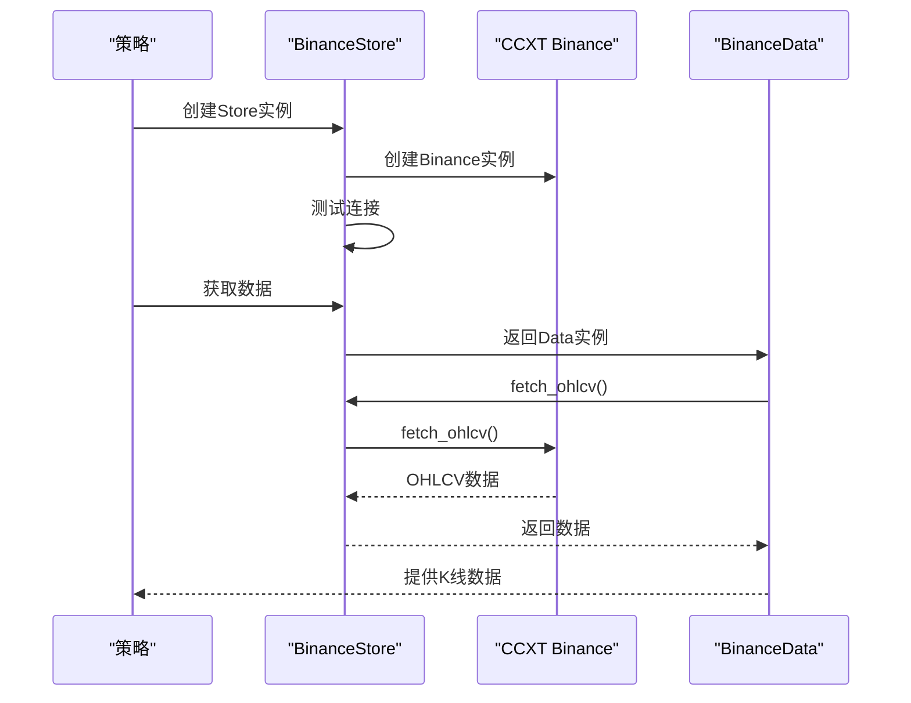
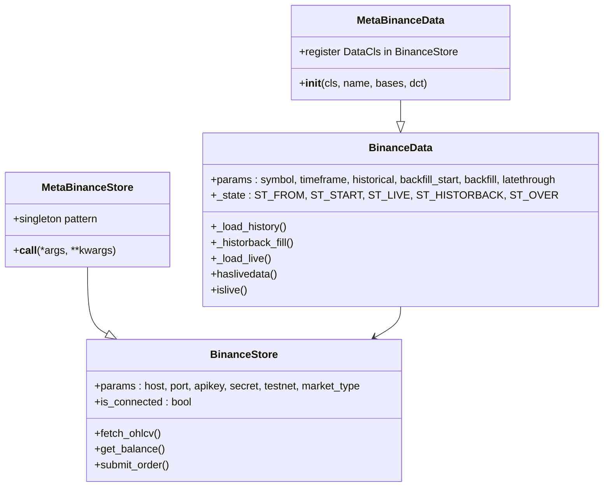
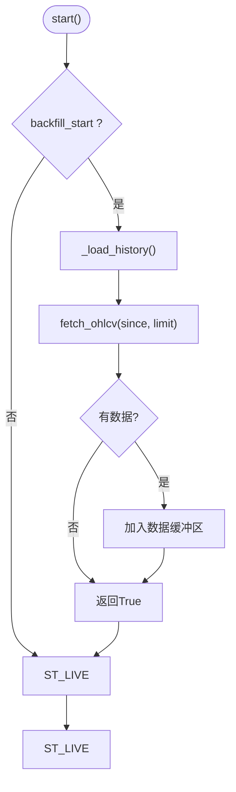
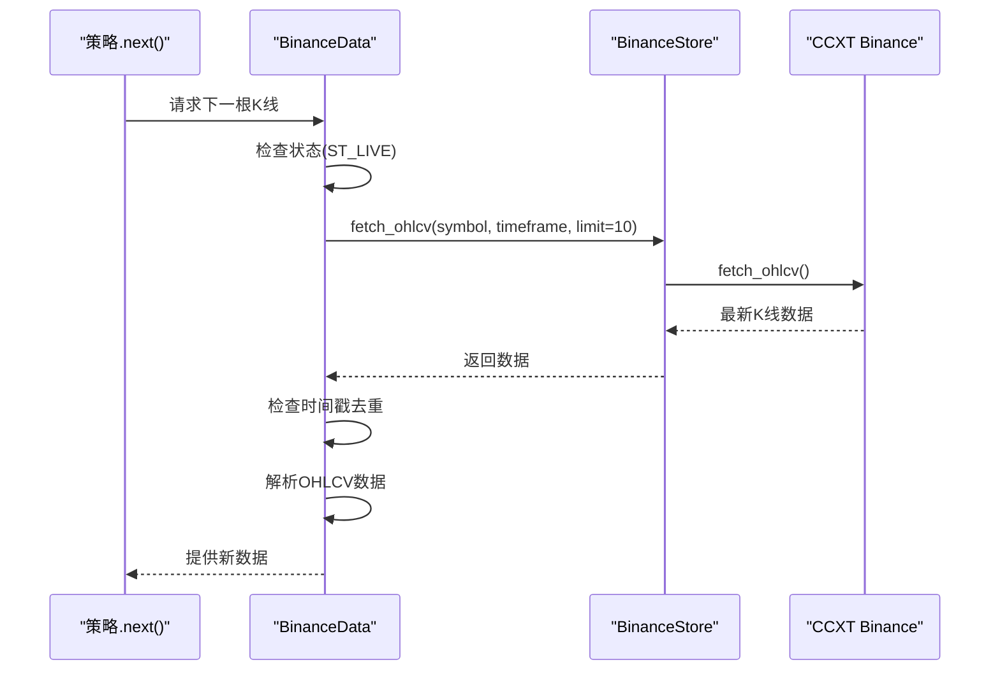
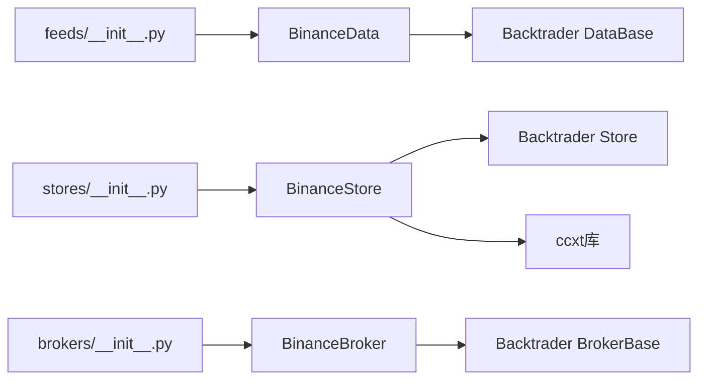

# BinanceDataFeed数据层

<cite>
**本文档引用的文件**
- [backtrader/feeds/binance.py](file://backtrader/feeds/binance.py)
- [backtrader/stores/binance.py](file://backtrader/stores/binance.py)
- [backtrader/brokers/binance.py](file://backtrader/brokers/binance.py)
- [examples/binance_example.py](file://examples/binance_example.py)
- [samples/binance-test/binance_test.py](file://samples/binance-test/binance_test.py)
- [samples/binance-test/binance_quick_start.py](file://samples/binance-test/binance_quick_start.py)
- [backtrader/feeds/__init__.py](file://backtrader/feeds/__init__.py)
- [backtrader/stores/__init__.py](file://backtrader/stores/__init__.py)
- [backtrader/brokers/__init__.py](file://backtrader/brokers/__init__.py)
</cite>

## 更新摘要
**所做更改**
- 更新了BinanceDataFeed的模块路径：从`real_trade/feeds/binancedata.py`迁移到`backtrader/feeds/binance.py`
- 更新了BinanceStore的模块路径：从`real_trade/stores/binancestore.py`迁移到`backtrader/stores/binance.py`
- 更新了BinanceBroker的模块路径：从`real_trade/brokers/binancebroker.py`迁移到`backtrader/brokers/binance.py`
- 更新了导入路径：从`from real_trade.feeds import BinanceData`更新为`from backtrader.feeds import BinanceData`
- 更新了backtrader主框架的集成实现，采用标准的Meta类注册机制
- 完善了完整的Binance生态系统实现，包括数据层、存储层、经纪商层的完整集成

## 目录
1. [简介](#简介)
2. [项目结构](#项目结构)
3. [核心组件](#核心组件)
4. [架构总览](#架构总览)
5. [详细组件分析](#详细组件分析)
6. [依赖关系分析](#依赖关系分析)
7. [性能考虑](#性能考虑)
8. [故障排查指南](#故障排查指南)
9. [结论](#结论)
10. [附录](#附录)

## 简介
本文件面向Backtrader主框架中的BinanceDataFeed数据层，系统性阐述实时数据获取与历史数据回测的实现机制。重点说明BinanceData类如何继承Backtrader的DataBase基类并实现Binance特定的数据获取逻辑，支持OHLCV（K线）数据的获取与处理，并给出时间框架配置、数据频率控制、内存管理、数据质量保障、回测优化等关键参数与最佳实践。同时提供端到端的使用示例与排障建议。

**更新** 本版本反映了BinanceDataFeed已完全整合到Backtrader主框架中，采用标准的Meta类注册机制，实现了与Backtrader生态系统的无缝集成。

## 项目结构
BinanceDataFeed位于`backtrader/feeds/`目录，采用"Backtrader标准架构 + 交易所适配"的分层设计：
- **数据层**：`backtrader/feeds/binance.py`中的BinanceData，继承自Backtrader的DataBase基类
- **存储层**：`backtrader/stores/binance.py`中的BinanceStore，继承自Backtrader的Store基类
- **经纪商层**：`backtrader/brokers/binance.py`中的BinanceBroker，继承自Backtrader的BrokerBase基类
- **模块导出**：通过`backtrader/feeds/__init__.py`、`backtrader/stores/__init__.py`、`backtrader/brokers/__init__.py`提供统一的导入接口

```mermaid
graph TB
subgraph "Backtrader核心层"
DB["DataBase<br/>Backtrader数据基类"]
SB["Store<br/>Backtrader存储基类"]
BB["BrokerBase<br/>Backtrader经纪商基类"]
END
subgraph "Binance适配层"
BData["BinanceData<br/>继承DataBase"]
BStore["BinanceStore<br/>继承Store"]
BBroker["BinanceBroker<br/>继承BrokerBase"]
END
subgraph "模块导出层"
FEEDS["feeds/__init__.py<br/>数据源导出"]
STORES["stores/__init__.py<br/>存储导出"]
BROKERS["brokers/__init__.py<br/>经纪商导出"]
end
DB --> BData
SB --> BStore
BB --> BBroker
BStore --> BData
BStore --> BBroker
FEEDS --> BData
STORES --> BStore
BROKERS --> BBroker
```

**图表来源**
- [backtrader/feeds/binance.py](file://backtrader/feeds/binance.py#L29-L343)
- [backtrader/stores/binance.py](file://backtrader/stores/binance.py#L32-L276)
- [backtrader/brokers/binance.py](file://backtrader/brokers/binance.py#L30-L382)
- [backtrader/feeds/__init__.py](file://backtrader/feeds/__init__.py#L44-L52)
- [backtrader/stores/__init__.py](file://backtrader/stores/__init__.py#L41-L43)
- [backtrader/brokers/__init__.py](file://backtrader/brokers/__init__.py#L42-L44)

**章节来源**
- [backtrader/feeds/binance.py](file://backtrader/feeds/binance.py#L1-L343)
- [backtrader/stores/binance.py](file://backtrader/stores/binance.py#L1-L276)
- [backtrader/brokers/binance.py](file://backtrader/brokers/binance.py#L1-L382)
- [backtrader/feeds/__init__.py](file://backtrader/feeds/__init__.py#L1-L58)
- [backtrader/stores/__init__.py](file://backtrader/stores/__init__.py#L1-L48)
- [backtrader/brokers/__init__.py](file://backtrader/brokers/__init__.py#L1-L46)

## 核心组件
- **BinanceData**：继承Backtrader的DataBase基类，实现Binance交易所的OHLCV数据获取与处理，支持回测与实盘两种模式
- **BinanceStore**：继承Backtrader的Store基类，封装CCXT Binance实例创建、连接管理、数据获取等核心功能
- **BinanceBroker**：继承Backtrader的BrokerBase基类，处理订单执行、资金管理、持仓管理等交易相关功能
- **Meta类注册机制**：通过MetaBinanceData和MetaBinanceBroker自动注册到对应的Store类中，实现松耦合的组件绑定

**更新** BinanceData、BinanceStore、BinanceBroker现在都位于Backtrader主框架内，采用标准的Backtrader架构模式。

**章节来源**
- [backtrader/feeds/binance.py](file://backtrader/feeds/binance.py#L29-L343)
- [backtrader/stores/binance.py](file://backtrader/stores/binance.py#L32-L276)
- [backtrader/brokers/binance.py](file://backtrader/brokers/binance.py#L30-L382)

## 架构总览
BinanceDataFeed遵循Backtrader标准的"Store—Data—Broker—Cerebro"架构。BinanceData通过Store获取OHLCV数据，支持回测（历史数据）与实盘（实时K线）两种模式；BinanceStore负责与CCXT Binance建立连接并管理连接状态；BinanceBroker提供订单执行与账户管理。



**图表来源**
- [backtrader/stores/binance.py](file://backtrader/stores/binance.py#L130-L161)
- [backtrader/feeds/binance.py](file://backtrader/feeds/binance.py#L103-L137)
- [backtrader/feeds/binance.py](file://backtrader/feeds/binance.py#L240-L249)

## 详细组件分析

### BinanceData类与Backtrader集成
- BinanceData继承Backtrader的DataBase基类，复用其统一的数据抽象和生命周期管理
- 通过MetaBinanceData元类自动注册到BinanceStore，实现松耦合的组件绑定
- 实现了完整的状态机：FROM、START、LIVE、HISTORBACK、OVER五种状态
- 支持历史数据回填和实时数据推送的无缝切换



**图表来源**
- [backtrader/feeds/binance.py](file://backtrader/feeds/binance.py#L18-L27)
- [backtrader/feeds/binance.py](file://backtrader/feeds/binance.py#L29-L343)
- [backtrader/stores/binance.py](file://backtrader/stores/binance.py#L18-L29)
- [backtrader/stores/binance.py](file://backtrader/stores/binance.py#L32-L276)

**章节来源**
- [backtrader/feeds/binance.py](file://backtrader/feeds/binance.py#L29-L343)
- [backtrader/stores/binance.py](file://backtrader/stores/binance.py#L32-L276)

### 历史数据回测流程
- **启动阶段**：根据backfill_start参数决定是否加载历史数据
- **历史数据加载**：使用fetch_ohlcv()获取指定时间段的数据，默认加载最近30天
- **数据回填**：将历史数据放入缓冲区，按时间顺序回放到策略
- **状态切换**：历史数据加载完成后进入LIVE状态，开始实时数据推送



**图表来源**
- [backtrader/feeds/binance.py](file://backtrader/feeds/binance.py#L176-L194)
- [backtrader/feeds/binance.py](file://backtrader/feeds/binance.py#L195-L227)

**章节来源**
- [backtrader/feeds/binance.py](file://backtrader/feeds/binance.py#L176-L227)

### 实时数据推送流程
- **实时状态**：当历史数据加载完成后进入LIVE状态
- **数据获取**：使用fetch_ohlcv()获取最新的K线数据，limit=10获取最近10条
- **去重检查**：通过_last_ts时间戳确保不会重复推送相同数据
- **数据解析**：解析时间戳和OHLCV字段，转换为Backtrader格式



**图表来源**
- [backtrader/feeds/binance.py](file://backtrader/feeds/binance.py#L139-L174)
- [backtrader/feeds/binance.py](file://backtrader/feeds/binance.py#L262-L308)

**章节来源**
- [backtrader/feeds/binance.py](file://backtrader/feeds/binance.py#L262-L308)

### BinanceStore连接管理
- **单例模式**：通过MetaSingleton实现BinanceStore的单例管理
- **CCXT集成**：使用ccxt.binance创建交易所实例，支持测试网和正式网
- **连接测试**：通过load_markets()测试连接有效性
- **参数配置**：支持apikey、secret、testnet、market_type等参数

**章节来源**
- [backtrader/stores/binance.py](file://backtrader/stores/binance.py#L32-L276)

### BinanceBroker订单管理
- **订单类型**：支持Market、Limit、Stop、StopLimit等订单类型
- **资金验证**：在实盘模式下验证资金充足性
- **订单跟踪**：使用_lock_orders确保线程安全，跟踪所有订单状态
- **佣金设置**：支持自定义佣金信息，适用于Binance的0.1%交易费率

**章节来源**
- [backtrader/brokers/binance.py](file://backtrader/brokers/binance.py#L30-L382)

## 依赖关系分析
- **BinanceData依赖**：依赖Backtrader的DataBase基类和Store注册机制
- **BinanceStore依赖**：依赖ccxt库进行Binance连接，提供OHLCV数据获取
- **BinanceBroker依赖**：依赖BinanceStore进行订单执行和账户管理
- **模块导出**：通过各层的__init__.py文件提供统一的导入接口



**图表来源**
- [backtrader/feeds/binance.py](file://backtrader/feeds/binance.py#L14-L15)
- [backtrader/stores/binance.py](file://backtrader/stores/binance.py#L97-L116)
- [backtrader/feeds/__init__.py](file://backtrader/feeds/__init__.py#L44-L52)
- [backtrader/stores/__init__.py](file://backtrader/stores/__init__.py#L41-L43)
- [backtrader/brokers/__init__.py](file://backtrader/brokers/__init__.py#L42-L44)

**章节来源**
- [backtrader/feeds/binance.py](file://backtrader/feeds/binance.py#L14-L15)
- [backtrader/stores/binance.py](file://backtrader/stores/binance.py#L97-L116)
- [backtrader/feeds/__init__.py](file://backtrader/feeds/__init__.py#L44-L52)
- [backtrader/stores/__init__.py](file://backtrader/stores/__init__.py#L41-L43)
- [backtrader/brokers/__init__.py](file://backtrader/brokers/__init__.py#L42-L44)

## 性能考虑
- **连接池管理**：BinanceStore采用单例模式，避免重复创建连接
- **数据批处理**：fetch_ohlcv()支持limit参数，平衡数据获取效率和内存占用
- **状态机优化**：通过状态机避免不必要的网络请求
- **线程安全**：BinanceBroker使用锁机制确保订单管理的线程安全
- **内存管理**：历史数据使用deque缓冲区，支持动态增长和清理

## 故障排查指南
- **导入错误**：使用正确的导入路径`from backtrader.feeds import BinanceData`
- **ccxt依赖**：确保安装ccxt库：`pip install ccxt`
- **API配置**：检查apikey、secret配置，测试网使用testnet=True
- **连接失败**：通过store.start()测试连接，检查网络和防火墙设置
- **数据获取失败**：检查symbol格式（如BTCUSDT），验证时间框架参数

**章节来源**
- [backtrader/stores/binance.py](file://backtrader/stores/binance.py#L123-L128)
- [examples/binance_example.py](file://examples/binance_example.py#L99-L115)

## 结论
BinanceDataFeed已完全整合到Backtrader主框架中，实现了标准化的交易所适配层。通过Meta类注册机制，BinanceData、BinanceStore、BinanceBroker形成了完整的数据获取、存储管理和交易执行生态系统。该实现遵循Backtrader的设计原则，提供了统一的API接口，支持回测与实盘的无缝切换，具备良好的扩展性和维护性。建议在生产环境中结合示例代码和测试脚本，确保配置正确和连接稳定。

## 附录
- **快速开始参考**
  - 使用示例：参见`examples/binance_example.py`中的完整示例
  - 实盘测试：运行`samples/binance-test/binance_test.py`验证实盘功能
  - 快速入门：参考`samples/binance-test/binance_quick_start.py`的基础使用
  - 导入路径：`from backtrader.feeds import BinanceData`
- **关键参数清单**
  - BinanceData: symbol、timeframe、historical、backfill_start、backfill、latethrough
  - BinanceStore: apikey、secret、testnet、market_type、recv_window、rate_limit
  - BinanceBroker: paper_trading、commission、margin、slippage、fill_strategy
- **时间框架支持**
  - 分钟级：1m、3m、5m、15m、30m
  - 小时级：1h、2h、4h、6h、8h、12h
  - 日级：1d、3d、1w、1M
- **交易对格式**
  - 标准格式：BTCUSDT、ETHUSDT、BNBUSDT等
  - 支持的市场类型：spot、futures、delivery

**章节来源**
- [examples/binance_example.py](file://examples/binance_example.py#L91-L161)
- [samples/binance-test/binance_test.py](file://samples/binance-test/binance_test.py#L293-L615)
- [samples/binance-test/binance_quick_start.py](file://samples/binance-test/binance_quick_start.py#L115-L207)
- [backtrader/feeds/binance.py](file://backtrader/feeds/binance.py#L62-L79)