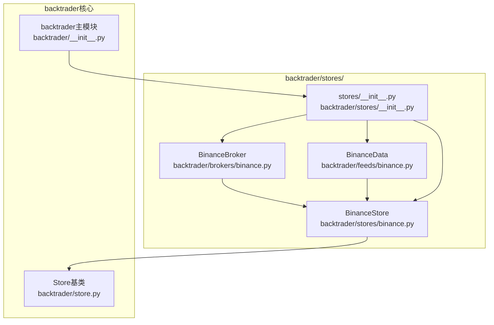
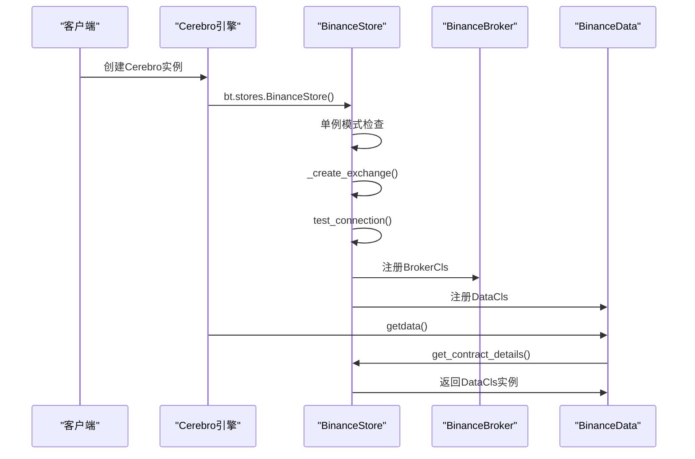
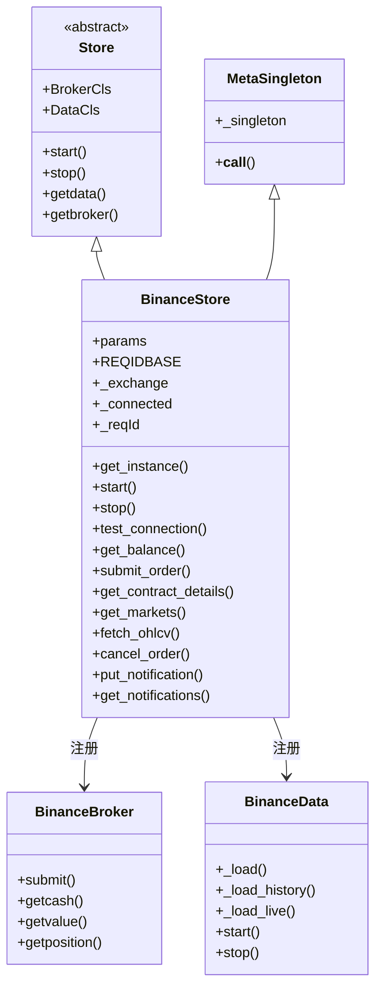
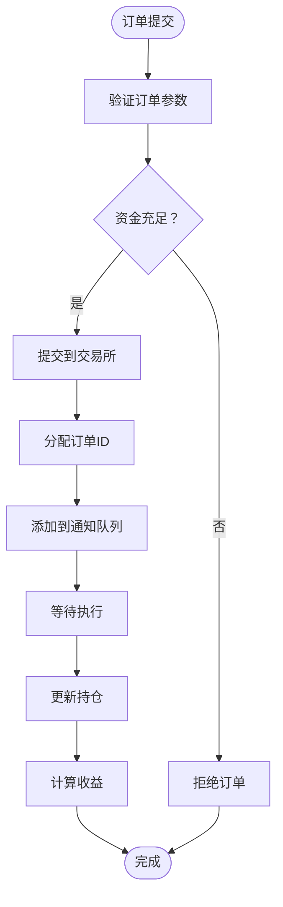
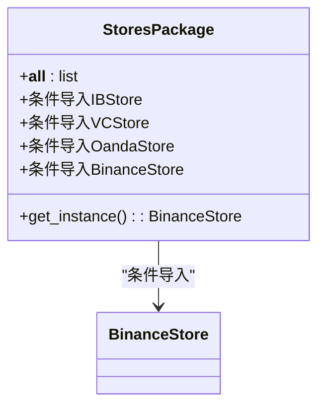
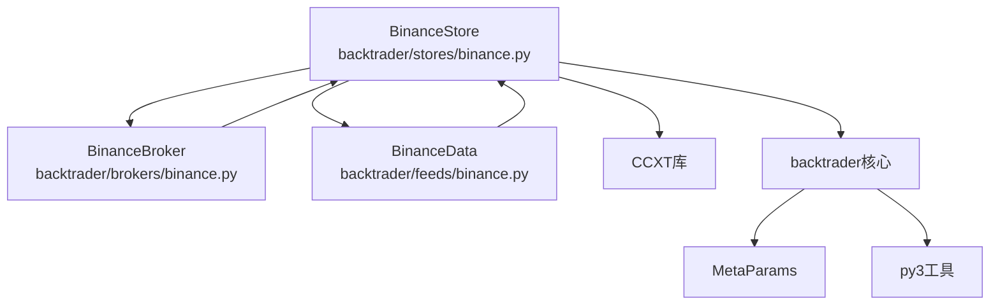

# BinanceStore存储层

<cite>
**本文档引用的文件**
- [binance.py](file://backtrader/stores/binance.py)
- [__init__.py](file://backtrader/stores/__init__.py)
- [binance.py](file://backtrader/brokers/binance.py)
- [binance.py](file://backtrader/feeds/binance.py)
- [binance_example.py](file://examples/binance_example.py)
- [binance_quick_start.py](file://samples/binance-test/binance_quick_start.py)
- [binance_test.py](file://samples/binance-test/binance_test.py)
- [store.py](file://backtrader/store.py)
- [__init__.py](file://backtrader/__init__.py)
</cite>

## 更新摘要
**所做更改**
- 更新模块结构：BinanceStore已整合到backtrader主框架的stores目录中
- 更新导入路径：从backtrader.stores import BinanceStore
- 更新架构设计：采用IBStore设计模式，集成Broker和Data组件
- 更新功能增强：支持单例模式、请求ID管理、通知机制等
- 更新示例文件：提供完整的集成使用示例

## 目录
1. [简介](#简介)
2. [项目结构](#项目结构)
3. [核心组件](#核心组件)
4. [架构概览](#架构概览)
5. [详细组件分析](#详细组件分析)
6. [依赖分析](#依赖分析)
7. [性能考虑](#性能考虑)
8. [故障排除指南](#故障排除指南)
9. [结论](#结论)
10. [附录](#附录)

## 简介
本文档详细阐述基于CCXT库的BinanceStore存储层实现，该实现已完全整合到backtrader主框架中。BinanceStore采用IBStore设计模式，通过单例模式管理连接，提供统一的API接口，支持现货和合约交易。该实现继承自backtrader的Store基类，集成了Broker和Data组件，形成完整的交易生态系统。

**更新** BinanceStore现已完全整合到backtrader主框架，位于backtrader/stores/目录下，采用标准的IBStore设计模式。

## 项目结构
Binance模块采用backtrader主框架的标准三层架构：Store（连接管理）、Broker（订单与资金）、Data（数据源）。所有组件都位于backtrader/stores/目录下，通过stores/__init__.py提供统一的模块接口。



**图表来源**
- [binance.py](file://backtrader/stores/binance.py#L32-L275)
- [binance.py](file://backtrader/brokers/binance.py#L30-L382)
- [binance.py](file://backtrader/feeds/binance.py#L29-L343)
- [__init__.py](file://backtrader/stores/__init__.py#L41-L44)
- [store.py](file://backtrader/store.py#L44-L86)

**章节来源**
- [binance.py](file://backtrader/stores/binance.py#L1-L276)
- [__init__.py](file://backtrader/stores/__init__.py#L1-L48)
- [store.py](file://backtrader/store.py#L1-L91)

## 核心组件
- **BinanceStore**：核心存储层，继承自Store基类，实现单例模式、连接管理、API接口封装
- **BinanceBroker**：订单执行层，实现订单提交、资金管理和持仓跟踪
- **BinanceData**：数据获取层，实现历史数据和实时数据的获取与管理
- **stores包**：提供统一的模块接口，支持条件导入和组件注册

**更新** 所有组件都已整合到backtrader主框架中，采用标准的设计模式和接口规范。

**章节来源**
- [binance.py](file://backtrader/stores/binance.py#L32-L275)
- [binance.py](file://backtrader/brokers/binance.py#L30-L382)
- [binance.py](file://backtrader/feeds/binance.py#L29-L343)
- [__init__.py](file://backtrader/stores/__init__.py#L41-L44)

## 架构概览
BinanceStore采用IBStore设计模式，通过元类实现单例模式，提供统一的连接管理和API接口。整个架构围绕Store基类展开，Broker和Data组件通过元类注册机制自动关联到Store。



**图表来源**
- [binance.py](file://backtrader/stores/binance.py#L73-L137)
- [binance.py](file://backtrader/brokers/binance.py#L19-L28)
- [binance.py](file://backtrader/feeds/binance.py#L18-L27)

**章节来源**
- [binance.py](file://backtrader/stores/binance.py#L73-L137)
- [binance.py](file://backtrader/brokers/binance.py#L19-L28)
- [binance.py](file://backtrader/feeds/binance.py#L18-L27)

## 详细组件分析

### BinanceStore类分析
BinanceStore继承自Store基类，实现了单例模式、连接管理和API接口封装。其核心特性包括：

- **单例模式**：通过MetaSingleton元类实现线程安全的单例管理
- **连接管理**：创建CCXT交易所实例，支持测试网和生产环境
- **API接口**：提供余额查询、订单提交、市场数据等核心功能
- **通知机制**：实现消息队列和通知处理



**图表来源**
- [store.py](file://backtrader/store.py#L44-L86)
- [binance.py](file://backtrader/stores/binance.py#L18-L275)
- [binance.py](file://backtrader/brokers/binance.py#L30-L382)
- [binance.py](file://backtrader/feeds/binance.py#L29-L343)

**章节来源**
- [binance.py](file://backtrader/stores/binance.py#L32-L275)
- [store.py](file://backtrader/store.py#L44-L86)

### BinanceBroker类分析
BinanceBroker实现订单执行和资金管理功能，采用IBBroker设计模式：

- **订单管理**：支持多种订单类型（市价、限价、止损等）
- **资金管理**：实时获取账户余额和持仓价值
- **状态跟踪**：维护订单状态和执行历史
- **线程安全**：使用锁机制保护共享资源



**图表来源**
- [binance.py](file://backtrader/brokers/binance.py#L149-L200)

**章节来源**
- [binance.py](file://backtrader/brokers/binance.py#L30-L382)

### BinanceData类分析
BinanceData实现数据获取和管理功能，支持历史数据和实时数据：

- **状态管理**：实现五种状态机状态（FROM、START、LIVE、HISTORBACK、OVER）
- **数据缓冲**：使用双端队列管理数据缓冲
- **时间管理**：处理时间戳和数据排序
- **回填机制**：支持历史数据回填和实时数据同步

**章节来源**
- [binance.py](file://backtrader/feeds/binance.py#L29-L343)

### stores包接口分析
stores包提供统一的模块接口，支持条件导入和组件注册：



**图表来源**
- [__init__.py](file://backtrader/stores/__init__.py#L41-L44)

**章节来源**
- [__init__.py](file://backtrader/stores/__init__.py#L1-L48)

### API调用示例与实践
以下示例展示了如何使用BinanceStore进行完整交易流程：

```python
import backtrader as bt

# 创建Cerebro引擎
cerebro = bt.Cerebro()

# 创建Binance Store（测试网配置）
store = bt.stores.BinanceStore(
    apikey="your_api_key",
    secret="your_secret",
    testnet=True,
    _debug=False,
)

# 创建数据feed
data = bt.stores.BinanceStore.getdata(
    store=store,
    dataname="BTCUSDT",
    timeframe=bt.TimeFrame.Days,
    compression=1,
    historical=True,
)

# 添加数据到Cerebro
cerebro.adddata(data)

# 设置初始资金和佣金
cerebro.broker.setcash(10000.0)
cerebro.broker.setcommission(commission=0.001)

# 添加策略并运行
cerebro.addstrategy(YourStrategy)
cerebro.run()
```

**更新** 示例代码现在使用backtrader主框架的标准导入方式。

**章节来源**
- [binance_example.py](file://examples/binance_example.py#L91-L161)
- [binance_quick_start.py](file://samples/binance-test/binance_quick_start.py#L115-L207)
- [binance_test.py](file://samples/binance-test/binance_test.py#L293-L346)

### Binance特有功能支持
- **单例模式**：通过MetaSingleton元类实现线程安全的单例管理
- **请求ID管理**：使用REQIDBASE常量和itertools.count实现请求ID分配
- **通知机制**：实现消息队列和通知处理，支持优先级消息
- **测试网支持**：通过testnet参数自动配置测试网URL
- **多市场类型**：支持spot、futures、delivery三种市场类型

**章节来源**
- [binance.py](file://backtrader/stores/binance.py#L18-L88)
- [binance.py](file://backtrader/stores/binance.py#L94-L128)

### 连接配置参数与关键选项
- **API认证**
  - apikey：交易所API Key
  - secret：交易所API Secret
- **环境配置**
  - testnet：是否启用测试网（True为测试网，False为生产环境）
  - market_type：defaultType，支持 "spot"、"futures"、"delivery"
- **性能配置**
  - rate_limit：是否启用CCXT速率限制
  - timeout：超时时间（秒）
  - reconnect：重连尝试次数
- **调试配置**
  - _debug：调试模式开关
  - notifyall：是否通知所有消息

**章节来源**
- [binance.py](file://backtrader/stores/binance.py#L55-L68)
- [binance.py](file://backtrader/stores/binance.py#L99-L105)

## 依赖分析
BinanceStore的依赖关系清晰，主要依赖于backtrader核心框架和CCXT库：



**图表来源**
- [binance.py](file://backtrader/stores/binance.py#L14-L16)
- [binance.py](file://backtrader/brokers/binance.py#L14-L16)
- [binance.py](file://backtrader/feeds/binance.py#L13-L16)

**章节来源**
- [binance.py](file://backtrader/stores/binance.py#L1-L276)
- [binance.py](file://backtrader/brokers/binance.py#L1-L382)
- [binance.py](file://backtrader/feeds/binance.py#L1-L343)

## 性能考虑
- **单例模式**：避免重复创建CCXT实例，降低内存和连接开销
- **速率限制**：启用CCXT的rate_limit功能，避免API限流
- **线程安全**：使用threading.Lock保护共享资源
- **数据缓冲**：合理配置数据缓冲大小，平衡内存使用和性能
- **连接池**：通过单例模式实现连接复用

## 故障排除指南
- **API密钥认证失败**
  - 确认apikey和secret正确，且已授予相应权限
  - 检查testnet参数与密钥来源匹配
  - 验证API密钥是否具有正确的权限范围
- **连接问题**
  - 检查网络连接和防火墙设置
  - 验证CCXT库版本兼容性
  - 确认测试网URL配置正确
- **订单执行问题**
  - 检查资金是否充足
  - 验证订单参数格式
  - 确认交易所市场状态
- **数据获取问题**
  - 检查交易对符号格式
  - 验证时间周期参数
  - 确认数据源可用性

**章节来源**
- [binance.py](file://backtrader/stores/binance.py#L152-L161)
- [binance.py](file://backtrader/brokers/binance.py#L173-L200)

## 结论
BinanceStore通过整合到backtrader主框架，实现了高度模块化的交易系统。其关键优势在于：
- **标准化设计**：采用IBStore设计模式，符合backtrader框架规范
- **完整生态**：集成Store、Broker、Data三个层次，形成完整交易闭环
- **易于扩展**：通过元类注册机制，便于添加新的交易所支持
- **性能优化**：单例模式、线程安全、速率限制等优化措施
- **开发友好**：提供丰富的示例和完善的错误处理机制

**更新** 整合后的BinanceStore已成为backtrader框架的重要组成部分，为用户提供了一站式的加密货币交易解决方案。

## 附录

### 配置文件与加载器
- **配置文件位置**：backtrader/stores/目录下的配置文件
- **配置项**：API密钥、测试网设置、市场类型等
- **加载方式**：通过stores/__init__.py的条件导入机制

**章节来源**
- [__init__.py](file://backtrader/stores/__init__.py#L41-L44)

### 常用API一览
- **连接管理**
  - bt.stores.BinanceStore()：创建存储实例
  - store.start()：启动连接
  - store.stop()：停止连接
- **账户管理**
  - store.get_balance()：获取账户余额
  - store.get_total_value()：获取总资产价值
- **订单管理**
  - store.submit_order()：提交订单
  - store.cancel_order()：取消订单
- **数据管理**
  - store.get_markets()：获取市场信息
  - store.fetch_ohlcv()：获取K线数据
  - store.get_contract_details()：获取合约详情

**更新** 所有API现在都通过backtrader主框架的标准接口访问。

**章节来源**
- [binance.py](file://backtrader/stores/binance.py#L169-L258)
- [binance_example.py](file://examples/binance_example.py#L91-L161)
- [binance_quick_start.py](file://samples/binance-test/binance_quick_start.py#L115-L207)