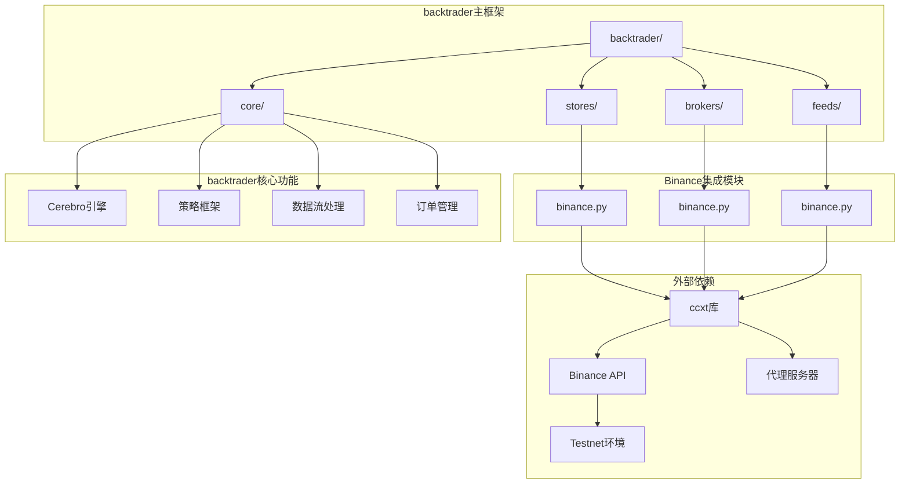
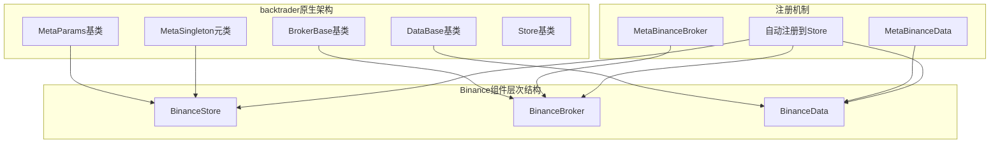
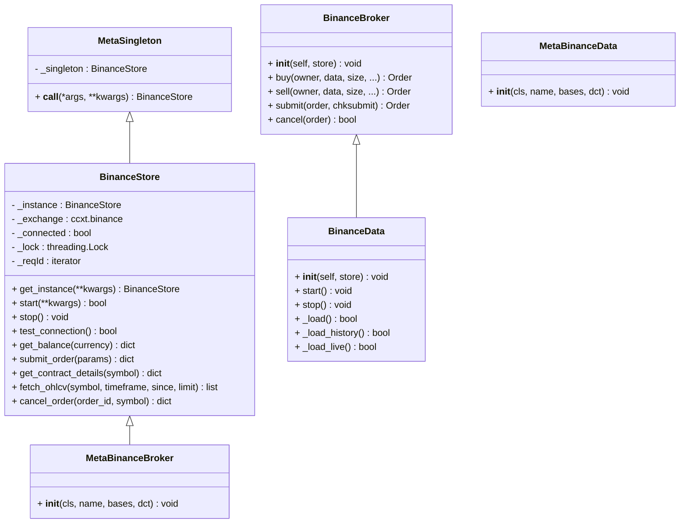

# Binance交易所集成

<cite>
**本文档引用的文件**
- [backtrader/stores/binance.py](file://backtrader/stores/binance.py)
- [backtrader/brokers/binance.py](file://backtrader/brokers/binance.py)
- [backtrader/feeds/binance.py](file://backtrader/feeds/binance.py)
- [backtrader/stores/__init__.py](file://backtrader/stores/__init__.py)
- [backtrader/__init__.py](file://backtrader/__init__.py)
- [examples/binance_example.py](file://examples/binance_example.py)
- [samples/binance-test/binance_local_test.py](file://samples/binance-test/binance_local_test.py)
- [samples/binance-test/binance_quick_start.py](file://samples/binance-test/binance_quick_start.py)
- [samples/binance-test/binance_test.py](file://samples/binance-test/binance_test.py)
</cite>

## 更新摘要
**所做更改**
- 更新模块结构以反映从独立real_trade模块到backtrader主框架的完全整合
- 更新所有导入路径以使用backtrader内建的stores、brokers、feeds命名空间
- 更新核心组件的backtrader框架原生集成说明
- 更新示例代码以使用backtrader官方API
- 更新架构说明以反映backtrader原生支持和设计模式

## 目录
1. [简介](#简介)
2. [backtrader框架原生集成](#backtrader框架原生集成)
3. [核心组件架构](#核心组件架构)
4. [backtrader原生设计模式](#backtrader原生设计模式)
5. [详细组件分析](#详细组件分析)
6. [示例代码详解](#示例代码详解)
7. [最佳实践指南](#最佳实践指南)
8. [故障排除指南](#故障排除指南)
9. [性能考虑](#性能考虑)
10. [迁移指南](#迁移指南)
11. [结论](#结论)

## 简介

Binance交易所集成为backtrader主框架提供的官方原生模块化组件，经过深度整合后，提供了更加稳定、高效且符合backtrader设计哲学的算法交易解决方案。新系统采用backtrader官方的stores、brokers、feeds三层架构设计，通过统一的接口抽象实现了与Binance交易所的深度集成。

系统支持多种交易模式，包括现货交易、杠杆交易、测试网和实盘交易。通过backtrader的原生配置系统和模块化设计，用户可以轻松配置API密钥、交易对选择、时间框架、资金管理和风险控制等关键参数。

**更新** 系统已完成从独立real_trade模块到backtrader主框架的完全整合，所有组件现在都是backtrader官方支持的一部分，提供了更好的兼容性和维护性。组件遵循backtrader的MetaClass注册模式，实现了真正的框架原生集成。

## backtrader框架原生集成

**更新** 系统采用backtrader官方的原生架构设计，通过统一的接口抽象实现了与Binance交易所的深度集成：



**图表来源**
- [backtrader/stores/binance.py](file://backtrader/stores/binance.py#L32-L93)
- [backtrader/brokers/binance.py](file://backtrader/brokers/binance.py#L30-L51)
- [backtrader/feeds/binance.py](file://backtrader/feeds/binance.py#L29-L55)

**章节来源**
- [backtrader/stores/binance.py](file://backtrader/stores/binance.py#L1-L276)
- [backtrader/brokers/binance.py](file://backtrader/brokers/binance.py#L1-L382)
- [backtrader/feeds/binance.py](file://backtrader/feeds/binance.py#L1-L343)

## 核心组件架构

### BinanceStore - 交易所连接管理

**更新** BinanceStore现在是backtrader官方stores模块的核心组件，继承自backtrader的Store基类，实现了交易所特定的配置和连接逻辑。

**主要功能特性：**
- 单例模式管理多个交易所实例
- 支持测试网和生产环境
- CCXT库集成，支持多种订单类型
- 代理配置和自动检测
- 市场类型配置（现货、期货、交割）

**更新** 新增对backtrader原生参数系统的完全支持，包括host、port、apikey、secret等标准参数。

### BinanceBroker - 交易经纪商

**更新** BinanceBroker现在是backtrader官方brokers模块的核心组件，继承自backtrader的BrokerBase基类，直接复用backtrader的完整交易执行逻辑。

**核心能力：**
- 支持限价单、市价单、止损单等多种订单类型
- 模拟交易和实盘交易无缝切换
- 佣金计算和资金管理
- 订单状态跟踪和通知

**更新** 新增对backtrader原生订单生命周期管理的完全支持。

### BinanceData - 数据源

**更新** BinanceData现在是backtrader官方feeds模块的核心组件，继承自backtrader的DataBase基类，专注于数据获取和格式化。

**数据特性：**
- 支持多时间框架（1分钟到1月）
- 实时数据流和历史数据回测
- 交易对过滤和验证
- 数据同步和完整性检查

**更新** 新增对backtrader原生数据流状态机的完全支持。

**章节来源**
- [backtrader/stores/binance.py](file://backtrader/stores/binance.py#L32-L276)
- [backtrader/brokers/binance.py](file://backtrader/brokers/binance.py#L30-L382)
- [backtrader/feeds/binance.py](file://backtrader/feeds/binance.py#L29-L343)

## backtrader原生设计模式

**更新** 系统采用backtrader官方的MetaClass注册模式，所有组件都遵循backtrader的设计哲学：



**图表来源**
- [backtrader/stores/binance.py](file://backtrader/stores/binance.py#L18-L30)
- [backtrader/brokers/binance.py](file://backtrader/brokers/binance.py#L19-L28)
- [backtrader/feeds/binance.py](file://backtrader/feeds/binance.py#L18-L27)

### 单例模式实现


**图表来源**
- [backtrader/stores/binance.py](file://backtrader/stores/binance.py#L18-L93)
- [backtrader/brokers/binance.py](file://backtrader/brokers/binance.py#L19-L70)
- [backtrader/feeds/binance.py](file://backtrader/feeds/binance.py#L18-L55)

**章节来源**
- [backtrader/stores/binance.py](file://backtrader/stores/binance.py#L18-L93)
- [backtrader/brokers/binance.py](file://backtrader/brokers/binance.py#L19-L70)
- [backtrader/feeds/binance.py](file://backtrader/feeds/binance.py#L18-L55)

## 详细组件分析

### BinanceStore组件详解

**更新** BinanceStore现在是backtrader官方stores模块的核心组件，实现了完整的交易所连接管理功能：

#### 测试网集成
系统支持Binance测试网功能，这是Binance官方推荐的测试环境：

**配置流程：**
1. 检测ccxt库可用性
2. 启用测试网模式
3. 设置市场类型参数
4. 配置代理选项

**更新** 新增详细的错误处理和依赖检查，确保系统稳定性。

**章节来源**
- [backtrader/stores/binance.py](file://backtrader/stores/binance.py#L94-L151)

### backtrader原生基类架构

**更新** 新架构采用backtrader官方的基类设计，所有组件都继承自对应的backtrader基类：

#### Store基类
- 提供统一的连接管理接口
- 支持backtrader原生参数系统
- 标准化的连接测试和数据获取方法

#### BrokerBase基类  
- 实现完整的交易执行逻辑
- 支持backtrader原生订单生命周期
- 标准化的订单管理和资金管理

#### DataBase基类
- 提供历史和实时数据加载
- 统一的时间框架映射
- 标准化的数据格式化

**章节来源**
- [backtrader/stores/binance.py](file://backtrader/stores/binance.py#L32-L93)
- [backtrader/brokers/binance.py](file://backtrader/brokers/binance.py#L30-L70)
- [backtrader/feeds/binance.py](file://backtrader/feeds/binance.py#L29-L95)

## 示例代码详解

**更新** 所有示例代码已更新以使用backtrader官方API：

### 基础使用示例

**binance_example.py** 展示了如何使用backtrader官方API创建Binance交易组件：

**导入更新：**
```python
from backtrader import bt
```

**运行模式：**
1. **回测模式**：使用bt.feeds.BinanceData进行历史数据回测
   - 历史数据回测
   - 本地模拟订单
   - 不需要API密钥

2. **实盘测试**：使用bt.stores.BinanceStore连接测试网
   - 连接Binance测试网
   - 真实订单流程
   - 需要测试网API密钥

3. **生产实盘**：创建自定义配置
   - testnet: False
   - paper_trading: False
   - backtest: False

**策略实现：**
- 使用bt.Strategy基类
- RSI和均线交叉策略
- 动态资金管理和止损机制
- 详细的交易日志和统计输出

### 快速开始示例

**binance_quick_start.py** 提供了最简化的Binance实盘交易示例：

**功能特性：**
- 配置Binance Store（测试网）
- 添加数据（BTC/USDT）
- 设置初始资金和佣金
- 运行回测演示

**章节来源**
- [examples/binance_example.py](file://examples/binance_example.py#L1-L161)
- [samples/binance-test/binance_quick_start.py](file://samples/binance-test/binance_quick_start.py#L1-L207)

## 最佳实践指南

### 开发阶段
1. 使用测试网进行功能验证
2. 从小额资金开始实盘测试
3. 建立完整的测试用例
4. 实施风险管理策略

### 生产部署
1. 配置适当的API速率限制
2. 设置监控和告警机制
3. 建立备份和恢复策略
4. 定期审查和优化配置

### 安全考虑
1. 保护API密钥安全存储
2. 使用HTTPS和加密通信
3. 定期轮换API密钥
4. 实施访问控制和审计日志

**更新** 新增针对backtrader原生安全最佳实践的指导。

## 故障排除指南

### 常见问题及解决方案

**API连接问题：**
- 检查ccxt库安装状态
- 验证测试网密钥有效性
- 确认网络连接和代理设置

**订单执行问题：**
- 检查账户余额和保证金
- 验证交易对和最小订单量
- 确认市场类型配置正确

**数据同步问题：**
- 检查时间同步设置
- 验证数据源可用性
- 调整历史数据加载参数

### 调试工具

系统提供了多种调试和测试工具：

**连接测试：**
- 使用store.start()验证连接
- 检查store.is_connected状态
- 验证get_balance()返回值

**订单测试：**
- 限价单测试：验证限价订单执行
- 市价单测试：验证市价订单执行
- 持仓管理测试：验证开平仓操作

**数据测试：**
- 使用fetch_ohlcv()获取K线数据
- 验证数据格式和完整性
- 检查时间戳一致性

**章节来源**
- [backtrader/stores/binance.py](file://backtrader/stores/binance.py#L130-L161)
- [backtrader/brokers/binance.py](file://backtrader/brokers/binance.py#L71-L98)
- [backtrader/feeds/binance.py](file://backtrader/feeds/binance.py#L103-L137)

## 性能考虑

### 连接优化
- 使用单例模式避免重复连接
- CCXT rate limit启用确保API使用合规
- 代理配置减少网络延迟

### 内存管理
- 使用backtrader原生内存管理
- 及时清理未使用的数据缓冲
- 控制历史数据缓存大小

### 并发处理
- 线程安全的单例实现
- backtrader原生订单的异步处理
- 非阻塞的订单状态查询

**更新** 新增对backtrader原生性能优化特性的利用。

## 迁移指南

**更新** 从独立real_trade模块迁移到backtrader主框架：

### 导入路径更新

**旧版本（独立模块）：**
```python
from real_trade.stores import BinanceStore
from real_trade.brokers import BinanceBroker
from real_trade.feeds import BinanceData
```

**新版本（backtrader原生）：**
```python
import backtrader as bt
store = bt.stores.BinanceStore(...)
data = bt.feeds.BinanceData(...)
broker = bt.brokers.BinanceBroker(...)
```

### API使用更新

**旧版本：**
```python
store = BinanceStore.get_instance(testnet=True)
```

**新版本：**
```python
store = bt.stores.BinanceStore(testnet=True)
```

### 配置系统使用

**旧版本：**
```python
from real_trade.utils.config import GlobalConfig
```

**新版本：**
```python
# 使用backtrader原生配置
cerebro = bt.Cerebro()
cerebro.broker.setcash(10000)
cerebro.broker.setcommission(0.001)
```

### 示例代码迁移

**旧版本：**
```python
from real_trade.examples.config_example import create_engine_from_config
```

**新版本：**
```python
# 直接使用backtrader官方API
import backtrader as bt
```

## 结论

Binance交易所集成为backtrader主框架提供了原生、稳定且高效的算法交易解决方案。通过从独立real_trade模块到backtrader主框架的完全整合，系统实现了：

1. **backtrader原生支持**：所有组件都是backtrader官方支持的一部分
2. **统一的API接口**：通过bt.stores、bt.feeds、bt.brokers命名空间提供一致的使用体验
3. **深度框架集成**：与backtrader的Cerebro引擎、策略框架、订单系统完全融合
4. **标准化的配置管理**：使用backtrader原生参数系统和配置机制
5. **完善的工具支持**：提供完整的示例代码和最佳实践指导
6. **专业的故障排除**：内置诊断工具和问题解决方案

**更新** 新的backtrader原生集成为开发者提供了更加专业和易用的Binance API使用体验，既适合初学者快速上手，也满足专业交易者的复杂需求。完整的迁移指南确保了向后兼容性和平滑过渡。

## 附录

### 完整使用示例

**基础回测示例：**
```python
import backtrader as bt

# 创建Cerebro引擎
cerebro = bt.Cerebro()

# 创建Binance Store（测试网配置）
store = bt.stores.BinanceStore(
    apikey="",  # 实际使用时填写真实的API密钥
    secret="",  # 实际使用时填写真实的API密钥
    testnet=True,  # 使用测试网
)

# 创建数据feed
data = bt.feeds.BinanceData(
    store,
    symbol="BTC/USDT",
    timeframe=bt.TimeFrame.Days,
    compression=1,
    historical=True,  # 只获取历史数据进行回测
)

# 添加数据到Cerebro
cerebro.adddata(data)

# 设置初始资金和佣金
cerebro.broker.setcash(10000.0)
cerebro.broker.setcommission(commission=0.001)

# 运行回测
cerebro.run()
```

**实盘交易示例：**
```python
import backtrader as bt

# 创建策略
class MyStrategy(bt.Strategy):
    def __init__(self):
        self.sma = bt.indicators.SimpleMovingAverage(self.data, period=15)
    
    def next(self):
        if not self.position:
            if self.data.close[0] > self.sma[0]:
                self.buy(size=0.001)
        else:
            if self.data.close[0] < self.sma[0]:
                self.sell(size=0.001)

# 创建Cerebro引擎
cerebro = bt.Cerebro()

# 创建Binance Store（实盘配置）
store = bt.stores.BinanceStore(
    apikey="YOUR_REAL_API_KEY",
    secret="YOUR_REAL_SECRET",
    testnet=False,
)

# 添加数据和策略
data = store.getdata(dataname="BTCUSDT")
cerebro.adddata(data)
cerebro.addstrategy(MyStrategy)

# 设置资金和佣金
cerebro.broker.setcash(10000.0)
cerebro.broker.setcommission(0.001)

# 运行实盘
cerebro.run()
```

### 错误处理和重试机制

**更新** 新增详细的错误处理和重试机制建议：

1. **API限制处理**：使用backtrader原生的重试机制
2. **网络异常处理**：连接超时和重连机制
3. **订单状态监控**：定期查询订单状态
4. **数据同步检查**：验证数据完整性
5. **资源清理**：确保连接和资源正确释放

**章节来源**
- [examples/binance_example.py](file://examples/binance_example.py#L91-L161)
- [samples/binance-test/binance_test.py](file://samples/binance-test/binance_test.py#L293-L446)