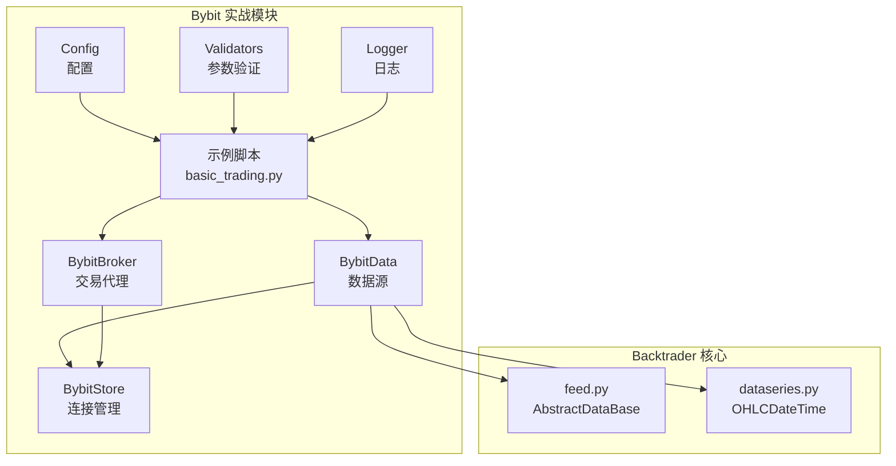
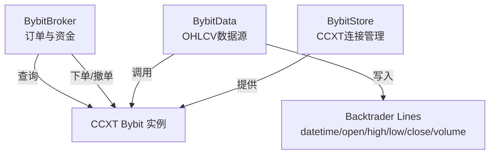
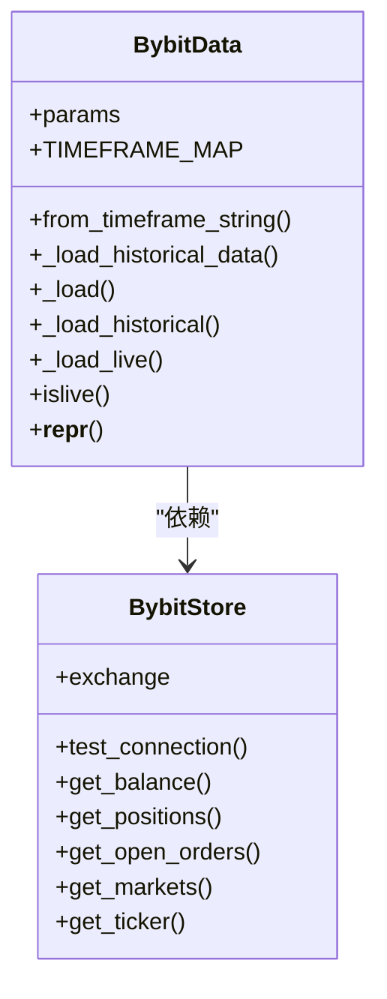
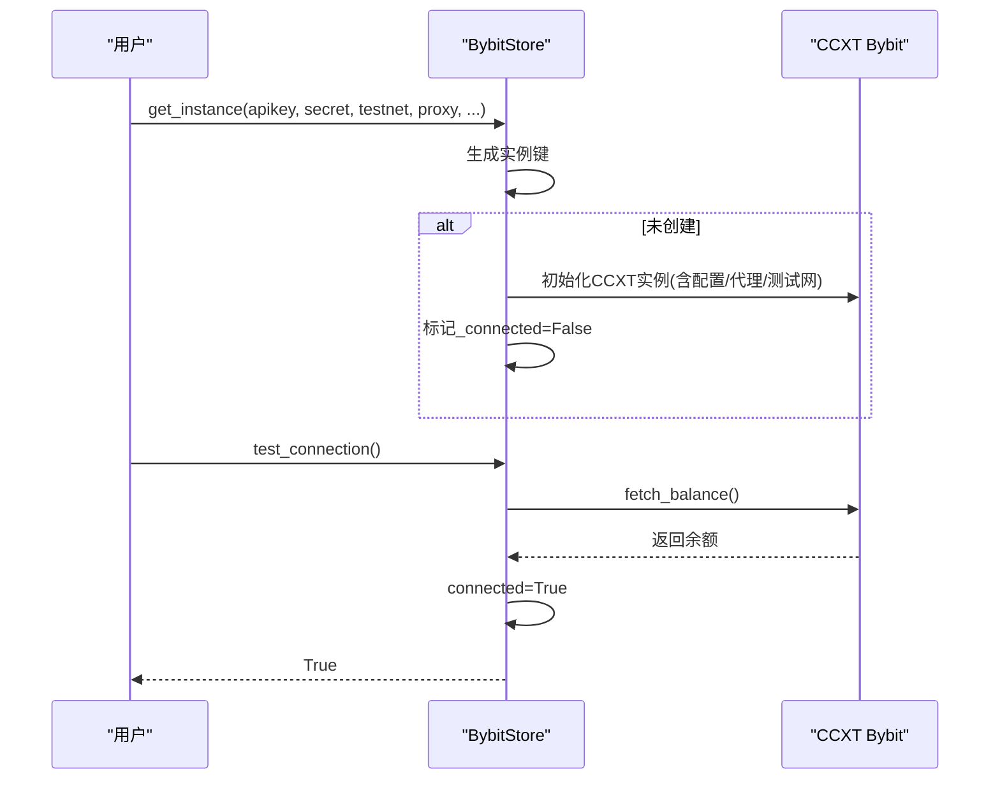
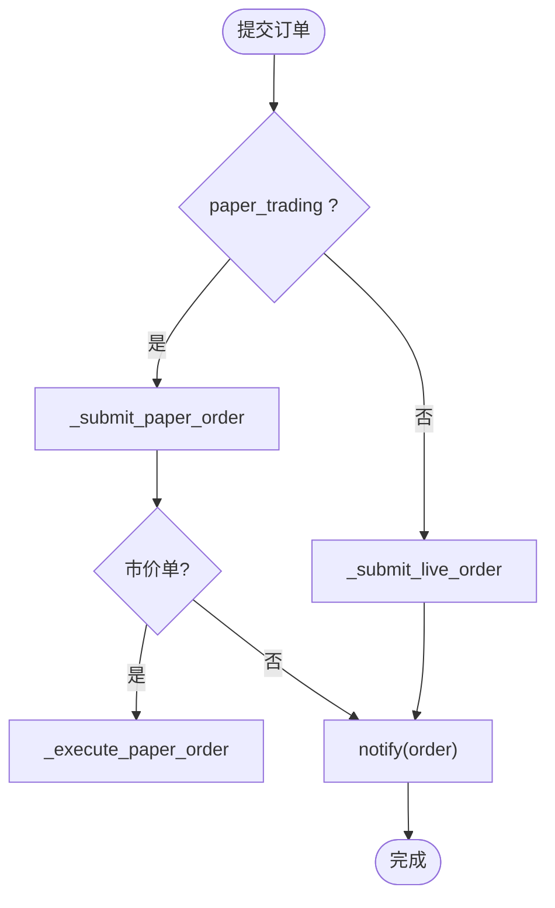
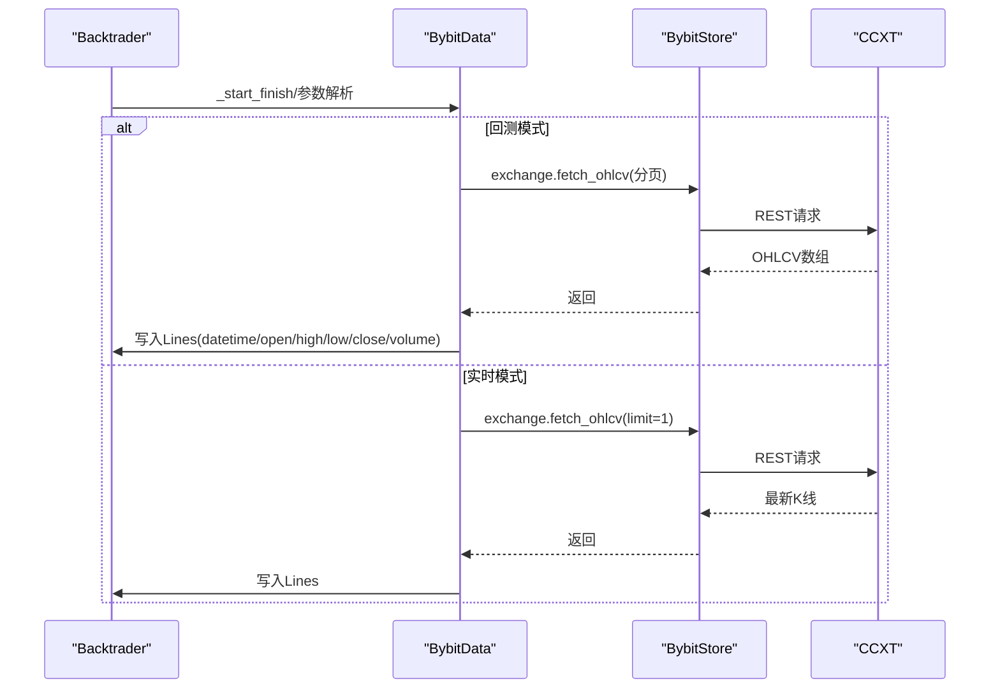
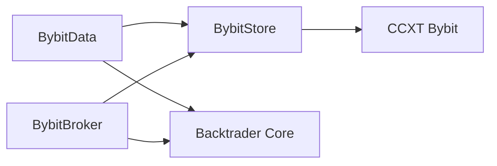

# BybitDataFeed数据层

<cite>
**本文引用的文件**
- [real_trade/bybit/datafeed.py](file://real_trade/bybit/datafeed.py)
- [real_trade/bybit/store.py](file://real_trade/bybit/store.py)
- [real_trade/bybit/broker.py](file://real_trade/bybit/broker.py)
- [real_trade/bybit/__init__.py](file://real_trade/bybit/__init__.py)
- [real_trade/bybit/utils/config.py](file://real_trade/bybit/utils/config.py)
- [real_trade/bybit/utils/validators.py](file://real_trade/bybit/utils/validators.py)
- [real_trade/bybit/utils/logger.py](file://real_trade/bybit/utils/logger.py)
- [real_trade/bybit/examples/basic_trading.py](file://real_trade/bybit/examples/basic_trading.py)
- [backtrader/feed.py](file://backtrader/feed.py)
- [backtrader/dataseries.py](file://backtrader/dataseries.py)
</cite>

## 目录
1. [简介](#简介)
2. [项目结构](#项目结构)
3. [核心组件](#核心组件)
4. [架构总览](#架构总览)
5. [详细组件分析](#详细组件分析)
6. [依赖关系分析](#依赖关系分析)
7. [性能考量](#性能考量)
8. [故障排查指南](#故障排查指南)
9. [结论](#结论)
10. [附录](#附录)

## 简介
本文件面向BybitDataFeed数据层，系统化阐述其设计架构与数据获取机制，覆盖以下要点：
- 实时K线数据与Tick级订阅能力（通过CCXT封装的REST接口实现）
- 历史K线批量拉取与回测模式集成
- 时间框架映射、数据精度与延迟特性
- DataFeed配置参数详解（交易对、时间框架、数据质量、连接参数等）
- WebSocket连接处理流程（连接建立、心跳维护、断线重连、消息解析）
- 与Backtrader数据系统的集成方式（数据格式转换、时间对齐、缓冲管理）
- 使用示例、数据质量保障（校验、异常处理、性能优化）与常见问题解决方案

## 项目结构
BybitDataFeed位于real_trade/bybit子模块，围绕BybitStore统一管理CCXT连接，BybitData实现OHLCV数据的回测与实时拉取，BybitBroker负责订单与资金管理。工具模块提供配置、验证与日志能力。

**图示来源**
- [real_trade/bybit/datafeed.py](file://real_trade/bybit/datafeed.py#L19-L235)
- [real_trade/bybit/store.py](file://real_trade/bybit/store.py#L16-L262)
- [real_trade/bybit/broker.py](file://real_trade/bybit/broker.py#L18-L381)
- [real_trade/bybit/utils/config.py](file://real_trade/bybit/utils/config.py#L17-L145)
- [real_trade/bybit/utils/validators.py](file://real_trade/bybit/utils/validators.py#L15-L183)
- [real_trade/bybit/utils/logger.py](file://real_trade/bybit/utils/logger.py#L16-L85)
- [real_trade/bybit/examples/basic_trading.py](file://real_trade/bybit/examples/basic_trading.py#L19-L119)
- [backtrader/feed.py](file://backtrader/feed.py#L122-L200)
- [backtrader/dataseries.py](file://backtrader/dataseries.py#L60-L200)

**章节来源**
- [real_trade/bybit/datafeed.py](file://real_trade/bybit/datafeed.py#L1-L235)
- [real_trade/bybit/store.py](file://real_trade/bybit/store.py#L1-L262)
- [real_trade/bybit/broker.py](file://real_trade/bybit/broker.py#L1-L381)
- [real_trade/bybit/__init__.py](file://real_trade/bybit/__init__.py#L1-L215)
- [real_trade/bybit/utils/config.py](file://real_trade/bybit/utils/config.py#L1-L145)
- [real_trade/bybit/utils/validators.py](file://real_trade/bybit/utils/validators.py#L1-L183)
- [real_trade/bybit/utils/logger.py](file://real_trade/bybit/utils/logger.py#L1-L85)
- [real_trade/bybit/examples/basic_trading.py](file://real_trade/bybit/examples/basic_trading.py#L1-L119)
- [backtrader/feed.py](file://backtrader/feed.py#L1-L200)
- [backtrader/dataseries.py](file://backtrader/dataseries.py#L1-L200)

## 核心组件
- BybitData：继承Backtrader的AbstractDataBase，负责OHLCV数据的回测与实时拉取；支持多时间框架映射与历史数据分页加载。
- BybitStore：单例化的CCXT Bybit连接管理器，支持测试网/主网切换、代理、速率限制与市场信息查询。
- BybitBroker：支持模拟交易与实盘交易，负责订单提交、取消、查询与资金/持仓管理。
- 配置与验证：Config类提供统一配置，Validators提供参数校验，Logger提供日志输出。
- 示例：basic_trading.py展示从环境变量加载配置、创建引擎、添加策略与运行。

**章节来源**
- [real_trade/bybit/datafeed.py](file://real_trade/bybit/datafeed.py#L19-L235)
- [real_trade/bybit/store.py](file://real_trade/bybit/store.py#L16-L262)
- [real_trade/bybit/broker.py](file://real_trade/bybit/broker.py#L18-L381)
- [real_trade/bybit/utils/config.py](file://real_trade/bybit/utils/config.py#L17-L145)
- [real_trade/bybit/utils/validators.py](file://real_trade/bybit/utils/validators.py#L15-L183)
- [real_trade/bybit/utils/logger.py](file://real_trade/bybit/utils/logger.py#L16-L85)
- [real_trade/bybit/examples/basic_trading.py](file://real_trade/bybit/examples/basic_trading.py#L19-L119)

## 架构总览
BybitDataFeed采用“Store-Data-Broker”三层架构：
- Store层：统一管理CCXT连接，提供测试网/主网、代理、速率限制、市场信息等能力。
- Data层：基于CCXT fetch_ohlcv实现历史与实时K线拉取，适配Backtrader OHLCV数据结构。
- Broker层：封装订单生命周期与资金/持仓管理，支持paper/live双模式。

**图示来源**
- [real_trade/bybit/store.py](file://real_trade/bybit/store.py#L68-L137)
- [real_trade/bybit/datafeed.py](file://real_trade/bybit/datafeed.py#L58-L235)
- [real_trade/bybit/broker.py](file://real_trade/bybit/broker.py#L37-L381)

## 详细组件分析

### BybitData：数据源与时间框架映射
- 参数与职责
  - symbol：交易对（如BTC/USDT），用于区分不同资产。
  - timeframe/compression：Backtrader内部时间框架与压缩倍数。
  - ccxt_timeframe：CCXT可识别的时间周期字符串（如1m/5m/1h/1d等）。
  - backtest：是否启用回测模式（历史数据加载）。
  - fromdate/todate：历史数据起止时间。
  - historical_limit：单次历史拉取条数上限。
- 时间框架映射
  - 将CCXT时间周期字符串映射到Backtrader TimeFrame枚举与压缩值，确保策略层以统一单位工作。
- 历史数据加载
  - 通过exchange.fetch_ohlcv循环拉取，按since递增与结束时间过滤，累积至缓存队列。
  - 支持回测模式下的顺序消费与数据对齐。
- 实时数据加载
  - 通过exchange.fetch_ohlcv(limit=1)获取最新K线，写入Backtrader Lines。
- 生命周期与模式
  - backtest=True时进入历史模式；否则标记为实时模式，islive返回True。

**图示来源**
- [real_trade/bybit/datafeed.py](file://real_trade/bybit/datafeed.py#L19-L235)
- [real_trade/bybit/store.py](file://real_trade/bybit/store.py#L16-L262)

**章节来源**
- [real_trade/bybit/datafeed.py](file://real_trade/bybit/datafeed.py#L30-L117)
- [real_trade/bybit/datafeed.py](file://real_trade/bybit/datafeed.py#L119-L194)
- [real_trade/bybit/datafeed.py](file://real_trade/bybit/datafeed.py#L196-L226)

### BybitStore：连接管理与市场信息
- 单例模式
  - 通过get_instance按apikey+testnet生成实例键，避免重复初始化。
- CCXT配置
  - apiKey/secret/enableRateLimit/options/defaultType（spot/linear/inverse）。
  - 支持代理（proxies）与测试网URL覆盖。
- 连接与查询
  - test_connection：通过fetch_balance探测连接状态。
  - get_balance/get_total_value：查询可用/总资金。
  - get_positions/get_open_orders：查询持仓与未成交订单。
  - get_markets/get_ticker：加载市场与行情快照。

**图示来源**
- [real_trade/bybit/store.py](file://real_trade/bybit/store.py#L30-L137)
- [real_trade/bybit/store.py](file://real_trade/bybit/store.py#L139-L154)

**章节来源**
- [real_trade/bybit/store.py](file://real_trade/bybit/store.py#L27-L137)
- [real_trade/bybit/store.py](file://real_trade/bybit/store.py#L139-L254)

### BybitBroker：订单与资金管理
- 模式
  - paper_trading=True：模拟交易，维护paper_cash、paper_positions、paper_orders。
  - paper_trading=False：实盘交易，直接调用exchange.create_order/cancel_order/fetch_order。
- 资金与持仓
  - getcash/getvalue：模拟模式读取本地变量，实盘模式调用store查询。
  - getposition：根据data._name获取对应持仓。
- 订单生命周期
  - submit：根据执行类型（市价/限价/止损）提交；市价单在paper模式下即时执行。
  - cancel：paper模式直接移除，实盘模式调用exchange.cancel_order。
  - get_order_status：paper模式返回本地状态，实盘模式查询exchange。

**图示来源**
- [real_trade/bybit/broker.py](file://real_trade/bybit/broker.py#L133-L219)
- [real_trade/bybit/broker.py](file://real_trade/bybit/broker.py#L220-L299)

**章节来源**
- [real_trade/bybit/broker.py](file://real_trade/bybit/broker.py#L31-L132)
- [real_trade/bybit/broker.py](file://real_trade/bybit/broker.py#L133-L332)
- [real_trade/bybit/broker.py](file://real_trade/bybit/broker.py#L333-L381)

### 配置与验证、日志
- Config：集中管理API、交易、Broker、策略、回测、日志等配置项，并支持from_env、to_json、save_to_file等操作。
- Validators：提供交易对格式、时间周期、API密钥、订单大小、价格、手续费、初始资金等校验。
- Logger：统一日志格式与输出目标（控制台/文件），便于调试与审计。

**章节来源**
- [real_trade/bybit/utils/config.py](file://real_trade/bybit/utils/config.py#L17-L145)
- [real_trade/bybit/utils/validators.py](file://real_trade/bybit/utils/validators.py#L15-L183)
- [real_trade/bybit/utils/logger.py](file://real_trade/bybit/utils/logger.py#L16-L85)

### 与Backtrader数据系统的集成
- 数据结构
  - BybitData继承AbstractDataBase，内部使用OHLCDateTime数据系列（datetime/open/high/low/close/volume/openinterest）。
- 时间对齐与格式转换
  - 将CCXT返回的毫秒级时间戳转换为Backtrader内部数值格式。
- 缓冲与回放
  - 历史模式下通过historical_data与historical_index顺序消费；实时模式下逐条拉取最新K线。
- 生命周期
  - Backtrader在启动阶段调用_start_finish，完成时区、会话时间等参数的最终确定。

**图示来源**
- [backtrader/feed.py](file://backtrader/feed.py#L122-L200)
- [backtrader/dataseries.py](file://backtrader/dataseries.py#L60-L200)
- [real_trade/bybit/datafeed.py](file://real_trade/bybit/datafeed.py#L168-L226)
- [real_trade/bybit/store.py](file://real_trade/bybit/store.py#L135-L137)

**章节来源**
- [backtrader/feed.py](file://backtrader/feed.py#L122-L200)
- [backtrader/dataseries.py](file://backtrader/dataseries.py#L60-L200)
- [real_trade/bybit/datafeed.py](file://real_trade/bybit/datafeed.py#L168-L226)

## 依赖关系分析
- 组件耦合
  - BybitData强依赖BybitStore提供的exchange实例；BybitBroker依赖BybitStore进行外部交互。
  - 配置与验证模块独立，被__init__.py的便捷函数与示例脚本使用。
- 外部依赖
  - CCXT Bybit：提供REST接口与连接管理（速率限制、代理、测试网）。
  - Backtrader核心：AbstractDataBase、OHLCDateTime、时间序列与数据管线。

**图示来源**
- [real_trade/bybit/datafeed.py](file://real_trade/bybit/datafeed.py#L58-L70)
- [real_trade/bybit/store.py](file://real_trade/bybit/store.py#L88-L137)
- [real_trade/bybit/broker.py](file://real_trade/bybit/broker.py#L37-L47)

**章节来源**
- [real_trade/bybit/datafeed.py](file://real_trade/bybit/datafeed.py#L58-L70)
- [real_trade/bybit/store.py](file://real_trade/bybit/store.py#L88-L137)
- [real_trade/bybit/broker.py](file://real_trade/bybit/broker.py#L37-L47)

## 性能考量
- 历史数据拉取
  - 分页拉取（since递增）避免一次性请求过大；合理设置historical_limit以平衡吞吐与内存占用。
- 实时数据拉取
  - fetch_ohlcv(limit=1)按周期轮询，建议结合策略频率与网络延迟调整调用节奏。
- 速率限制
  - 启用enableRateLimit由CCXT自动节流；必要时配置代理与测试网以降低网络抖动。
- 内存与缓冲
  - 回测模式下historical_data为数组存储，注意大数据集的内存占用；可考虑分批回测或外部数据源。

[本节为通用指导，无需列出具体文件来源]

## 故障排查指南
- 连接失败
  - 使用test_connection确认网络与凭据；检查代理与测试网配置。
- API密钥错误
  - 使用validate_api_keys核验长度与非空；确保未在代码中硬编码。
- 交易对/时间周期无效
  - 使用validate_symbol与validate_timeframe校验格式与取值范围。
- 实时数据为空
  - 检查ccxt_timeframe是否在TIMEFRAME_MAP中；确认交易所支持该周期。
- 回测数据不足
  - 调整fromdate/todate与historical_limit；确认时间段内存在K线。
- 日志定位
  - 通过Logger设置日志级别与文件输出，结合示例脚本的print输出定位问题。

**章节来源**
- [real_trade/bybit/store.py](file://real_trade/bybit/store.py#L139-L154)
- [real_trade/bybit/utils/validators.py](file://real_trade/bybit/utils/validators.py#L33-L111)
- [real_trade/bybit/datafeed.py](file://real_trade/bybit/datafeed.py#L103-L107)
- [real_trade/bybit/utils/logger.py](file://real_trade/bybit/utils/logger.py#L16-L85)

## 结论
BybitDataFeed通过Store-Data-Broker三层架构，将CCXT的REST能力与Backtrader的数据管线无缝衔接。其优势在于：
- 明确的回测/实时双模式与时间框架映射
- 完善的参数验证与配置管理
- 与Backtrader核心数据结构的深度集成
在实际部署中，建议优先使用回测与测试网验证策略，再逐步过渡到实盘与主网，并结合代理与速率限制策略提升稳定性。

[本节为总结性内容，无需列出具体文件来源]

## 附录

### DataFeed配置参数详解
- symbol：交易对（BASE/QUOTE），需通过validate_symbol校验。
- timeframe/compression：Backtrader内部时间框架与压缩倍数。
- ccxt_timeframe：CCXT时间周期字符串（1m/3m/5m/15m/30m/1h/2h/4h/6h/12h/1d/1w/1M）。
- backtest：是否回测模式（仅读取历史数据）。
- fromdate/todate：回测起止时间。
- historical_limit：单次历史拉取条数上限。

**章节来源**
- [real_trade/bybit/datafeed.py](file://real_trade/bybit/datafeed.py#L30-L39)
- [real_trade/bybit/datafeed.py](file://real_trade/bybit/datafeed.py#L42-L56)
- [real_trade/bybit/utils/validators.py](file://real_trade/bybit/utils/validators.py#L15-L30)

### 使用示例与最佳实践
- 示例脚本basic_trading.py展示了从环境变量加载配置、创建引擎、添加策略与运行的完整流程。
- 建议：
  - 在回测模式充分验证策略后再进入测试网模拟交易。
  - 使用代理与测试网降低网络与资金风险。
  - 合理设置initial_cash与commission，确保回测与实盘一致性。

**章节来源**
- [real_trade/bybit/examples/basic_trading.py](file://real_trade/bybit/examples/basic_trading.py#L19-L119)
- [real_trade/bybit/__init__.py](file://real_trade/bybit/__init__.py#L89-L187)