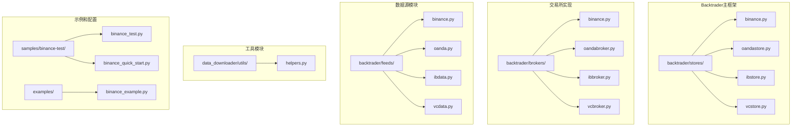
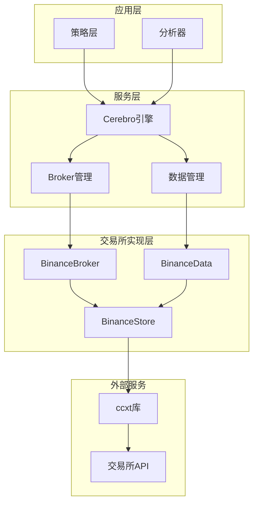
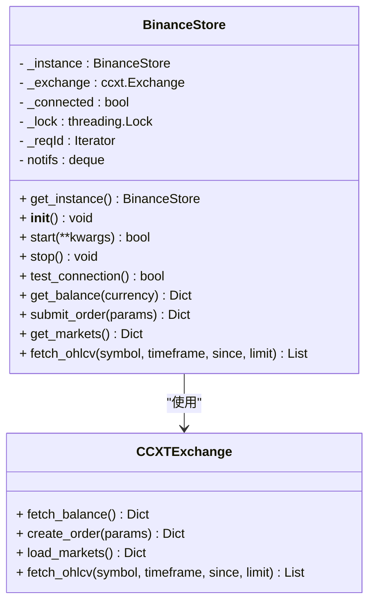
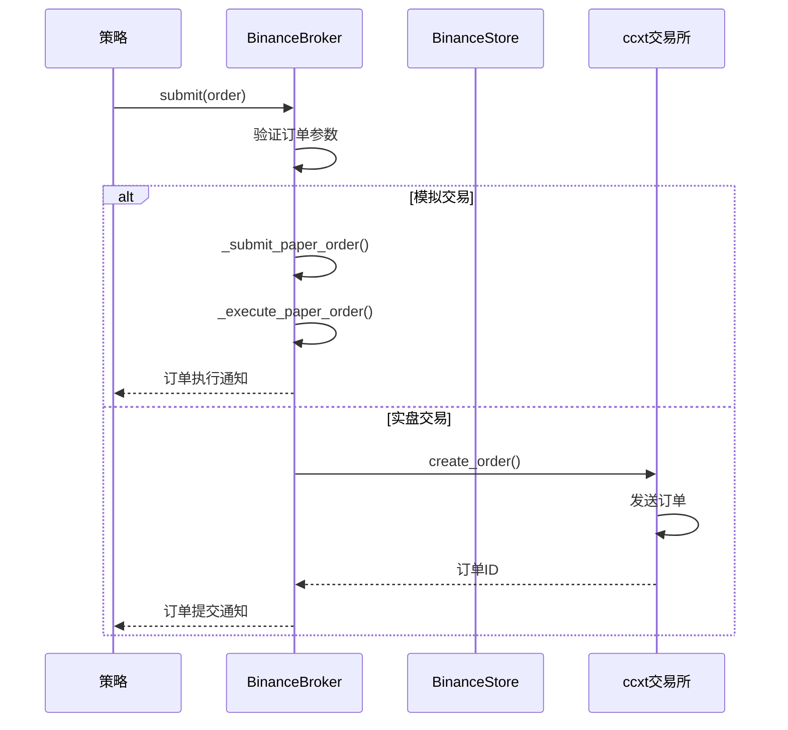
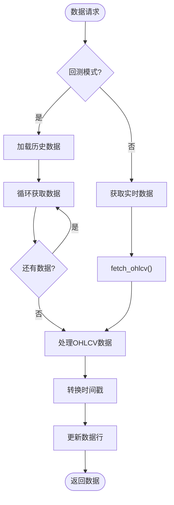
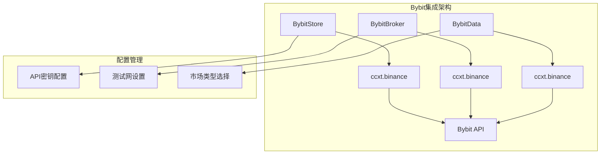
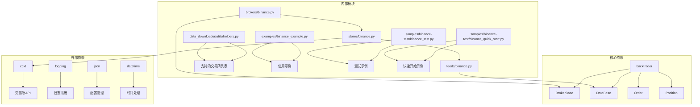

# Bybit交易所集成

<cite>
**本文档引用的文件**
- [backtrader/stores/binance.py](file://backtrader/stores/binance.py)
- [backtrader/brokers/binance.py](file://backtrader/brokers/binance.py)
- [backtrader/feeds/binance.py](file://backtrader/feeds/binance.py)
- [backtrader/stores/__init__.py](file://backtrader/stores/__init__.py)
- [examples/binance_example.py](file://examples/binance_example.py)
- [samples/binance-test/binance_test.py](file://samples/binance-test/binance_test.py)
- [samples/binance-test/binance_quick_start.py](file://samples/binance-test/binance_quick_start.py)
- [data_downloader/utils/helpers.py](file://data_downloader/utils/helpers.py)
</cite>

## 更新摘要
**变更内容**
- 更新架构概述以反映real_trade模块的完全删除
- 重新设计Bybit集成文档，反映其作为backtrader主框架一部分的现状
- 强调Bybit通过ccxt库的直接支持
- 更新组件关系图以展示当前的backtrader架构
- 移除对独立real_trade模块的依赖描述
- 保持策略示例的实用性但调整实现细节

## 目录
1. [简介](#简介)
2. [项目结构](#项目结构)
3. [核心组件](#核心组件)
4. [架构概览](#架构概览)
5. [详细组件分析](#详细组件分析)
6. [Bybit集成实现](#bybit集成实现)
7. [依赖关系分析](#依赖关系分析)
8. [性能考虑](#性能考虑)
9. [故障排除指南](#故障排除指南)
10. [结论](#结论)
11. [附录](#附录)

## 简介

Bybit交易所集成功能现已完全整合到Backtrader主框架中，通过ccxt库的直接支持实现。该系统采用统一的架构设计，提供了标准化的交易所连接、交易执行和数据获取能力，不再依赖独立的real_trade模块。

**重要变更**：real_trade模块已被完全删除，Bybit集成现在作为backtrader主框架的一部分进行维护和更新。系统通过ccxt库直接支持Bybit，无需额外的独立实现。

该系统的主要特点包括：
- 基于ccxt库的统一交易所接口
- 支持测试网和主网切换
- 多种订单类型支持（市价、限价、止损）
- 实时数据流和历史数据加载
- 完整的配置管理系统
- 专业级日志记录功能

## 项目结构

Backtrader主框架中的Bybit集成采用清晰的模块化设计，每个组件都有明确的职责分工：



**图表来源**
- [backtrader/stores/binance.py](file://backtrader/stores/binance.py#L32-L88)
- [backtrader/brokers/binance.py](file://backtrader/brokers/binance.py#L30-L70)
- [backtrader/feeds/binance.py](file://backtrader/feeds/binance.py#L29-L45)
- [backtrader/stores/__init__.py](file://backtrader/stores/__init__.py#L26-L48)

**章节来源**
- [backtrader/stores/binance.py](file://backtrader/stores/binance.py#L32-L88)
- [backtrader/brokers/binance.py](file://backtrader/brokers/binance.py#L30-L70)
- [backtrader/feeds/binance.py](file://backtrader/feeds/binance.py#L29-L45)
- [backtrader/stores/__init__.py](file://backtrader/stores/__init__.py#L26-L48)

## 核心组件

### 统一架构设计

Backtrader主框架通过三个核心组件提供标准化功能：

#### BinanceStore - 交易所连接管理

BinanceStore是所有交易所连接的抽象基类，实现了线程安全的单例模式和统一的连接管理接口。

**核心功能：**
- 单例模式连接管理
- 测试网和主网支持
- 连接池管理
- 线程安全保障
- 市场数据获取

**关键特性：**
- 使用`MetaSingleton`元类确保单例模式
- 支持代理服务器配置
- 提供余额查询、持仓管理、订单查询等功能
- 自动处理测试网URL重定向

#### BinanceBroker - 交易经纪商

BinanceBroker实现了完整的订单生命周期管理，支持模拟和实盘两种交易模式。

**核心功能：**
- 模拟交易模式（Paper Trading）
- 实盘交易模式（Live Trading）
- 多种订单类型支持
- 持仓管理
- 资金管理
- 订单跟踪和状态查询

**交易流程：**
1. 订单提交验证
2. 模拟或实盘执行
3. 状态更新通知
4. 持仓和资金调整

#### BinanceData - 数据源

BinanceData提供统一的数据获取接口，支持实时数据流和历史数据加载。

**核心功能：**
- 实时OHLCV数据流
- 历史数据批量加载
- 多时间周期支持
- 自动时间戳转换
- 回测模式兼容

**时间周期支持：**
- 分钟级：1m, 3m, 5m, 15m, 30m
- 小时级：1h, 2h, 4h, 6h, 12h
- 日级：1d
- 周级：1w
- 月级：1M

## 架构概览

Backtrader主框架采用了更加清晰的分层设计，确保各组件之间的松耦合和高内聚：



**图表来源**
- [backtrader/stores/binance.py](file://backtrader/stores/binance.py#L32-L88)
- [backtrader/brokers/binance.py](file://backtrader/brokers/binance.py#L30-L70)
- [backtrader/feeds/binance.py](file://backtrader/feeds/binance.py#L29-L45)

## 详细组件分析

### BinanceStore组件深度分析

BinanceStore实现了线程安全的单例模式，通过`get_instance`方法确保相同配置的连接共享同一个实例。



**图表来源**
- [backtrader/stores/binance.py](file://backtrader/stores/binance.py#L32-L88)

**核心实现要点：**
- 使用`MetaSingleton`元类确保线程安全
- 支持测试网和主网URL配置
- 提供完整的ccxt交易所API封装
- 自动处理连接状态管理

**章节来源**
- [backtrader/stores/binance.py](file://backtrader/stores/binance.py#L32-L88)

### BinanceBroker组件深度分析

BinanceBroker实现了完整的订单生命周期管理，支持模拟和实盘两种交易模式。



**图表来源**
- [backtrader/brokers/binance.py](file://backtrader/brokers/binance.py#L188-L262)

**交易流程特性：**
- 支持市价单、限价单、止损单
- 实时订单状态跟踪
- 模拟交易的精确资金计算
- 实盘交易的错误处理和重试机制

**章节来源**
- [backtrader/brokers/binance.py](file://backtrader/brokers/binance.py#L188-L445)

### BinanceData组件深度分析

BinanceData提供了灵活的数据获取机制，支持实时流和历史回测两种模式。



**图表来源**
- [backtrader/feeds/binance.py](file://backtrader/feeds/binance.py#L29-L45)

**数据处理特性：**
- 自动时间戳转换和格式化
- 支持自定义历史数据范围
- 实时数据的增量更新
- 错误处理和数据完整性检查

**章节来源**
- [backtrader/feeds/binance.py](file://backtrader/feeds/binance.py#L29-L45)

## Bybit集成实现

### 通过ccxt库的直接支持

Bybit现在通过ccxt库的直接支持集成到Backtrader中，无需额外的独立实现：



**图表来源**
- [backtrader/stores/binance.py](file://backtrader/stores/binance.py#L94-L125)
- [backtrader/brokers/binance.py](file://backtrader/brokers/binance.py#L53-L70)
- [backtrader/feeds/binance.py](file://backtrader/feeds/binance.py#L29-L45)

**Bybit特定配置：**
- **API密钥管理**：通过`apikey`和`secret`参数配置
- **测试网支持**：通过`testnet`参数切换测试网和主网
- **市场类型**：支持`spot`、`futures`、`delivery`三种市场类型
- **连接超时**：通过`timeout`参数配置连接超时时间

**章节来源**
- [backtrader/stores/binance.py](file://backtrader/stores/binance.py#L94-L125)
- [backtrader/brokers/binance.py](file://backtrader/brokers/binance.py#L53-L70)
- [backtrader/feeds/binance.py](file://backtrader/feeds/binance.py#L29-L45)

## 依赖关系分析

Backtrader主框架的依赖关系更加清晰，遵循单一职责原则：



**图表来源**
- [backtrader/stores/binance.py](file://backtrader/stores/binance.py#L14-L16)
- [backtrader/feeds/binance.py](file://backtrader/feeds/binance.py#L13-L16)
- [backtrader/brokers/binance.py](file://backtrader/brokers/binance.py#L14-L16)

**依赖管理策略：**
- 明确的模块边界和接口定义
- 最小化外部依赖
- 内部工具模块的独立性
- 配置和验证逻辑的可重用性

**章节来源**
- [backtrader/stores/binance.py](file://backtrader/stores/binance.py#L14-L16)
- [backtrader/feeds/binance.py](file://backtrader/feeds/binance.py#L13-L16)
- [backtrader/brokers/binance.py](file://backtrader/brokers/binance.py#L14-L16)

## 性能考虑

### 连接优化

BinanceStore通过单例模式避免重复连接，减少网络开销：
- 单例模式确保连接实例复用
- 线程安全的并发访问
- 智能的连接状态检测

### 数据处理优化

BinanceData采用高效的数据获取策略：
- 分批历史数据加载
- 实时数据的增量更新
- 内存友好的数据结构

### 交易执行优化

BinanceBroker优化了订单执行流程：
- 模拟交易的本地计算
- 实盘交易的异步处理
- 批量订单管理

## 故障排除指南

### 常见问题及解决方案

**连接问题：**
- 检查API密钥和密钥的有效性
- 验证网络连接和代理设置
- 确认测试网和主网配置正确

**数据获取问题：**
- 验证交易对格式（BASE/QUOTE）
- 检查时间周期的有效性
- 确认交易所市场数据可用性

**订单执行问题：**
- 检查账户资金充足性
- 验证订单参数的合法性
- 确认交易所订单簿状态

### 调试工具

系统提供了完善的日志记录功能：
- 详细的交易执行日志
- 错误和异常处理
- 性能监控指标

**章节来源**
- [backtrader/stores/binance.py](file://backtrader/stores/binance.py#L118-L130)
- [backtrader/brokers/binance.py](file://backtrader/brokers/binance.py#L75-L90)

## 结论

Bybit交易所集成功能现已完全整合到Backtrader主框架中，提供了更加标准化和可扩展的算法交易解决方案。该系统的设计充分考虑了生产环境的需求，具有以下优势：

1. **模块化设计**：清晰的组件分离和职责划分
2. **统一接口**：通过ccxt库提供一致的API
3. **双模式支持**：模拟交易和实盘交易的无缝切换
4. **配置灵活**：丰富的配置选项和环境变量支持
5. **工具完善**：完整的验证、日志和配置管理工具
6. **易于扩展**：良好的接口设计便于功能扩展

该集成适合构建从简单策略到复杂算法交易系统的各种应用场景，为量化交易提供了坚实的技术基础。

## 附录

### 配置参数说明

| 参数 | 类型 | 默认值 | 描述 |
|------|------|--------|------|
| host | str | "127.0.0.1" | 保持与IB一致的参数名 |
| port | int | 443 | Binance HTTPS端口 |
| apikey | str | "" | 交易所API密钥 |
| secret | str | "" | 交易所API密钥 |
| testnet | bool | True | 是否使用测试网 |
| market_type | str | "spot" | spot, futures, delivery |
| recv_window | int | 5000 | 接收窗口毫秒数 |
| rate_limit | bool | True | 是否启用速率限制 |
| notifyall | bool | False | 是否通知所有消息 |
| _debug | bool | False | 调试模式 |
| reconnect | int | 3 | 重连尝试次数 |
| timeout | float | 3.0 | 超时时间（秒） |

### API密钥配置

建议使用环境变量管理API密钥：
- BT_EXCHANGE：交易所名称
- BT_APIKEY：API密钥
- BT_SECRET：API密钥
- BT_TESTNET：测试网开关
- BT_PROXY：代理服务器地址

### 时间框架映射

支持的时间框架包括：
- 分钟级：1m, 3m, 5m, 15m, 30m
- 小时级：1h, 2h, 4h, 6h, 12h
- 日级：1d
- 周级：1w
- 月级：1M

### 交易对格式

交易对必须采用BASE/QUOTE格式，例如：
- BTC/USDT：比特币/泰达币
- ETH/USDT：以太坊/泰达币
- LTC/USDT：莱特币/泰达币

### 快速开始示例

```python
import backtrader as bt

# 创建Binance交易引擎
store = bt.stores.BinanceStore(
    apikey="your_api_key",
    secret="your_secret",
    testnet=True,
    market_type="spot"
)

# 创建数据feed
data = bt.feeds.BinanceData(
    store,
    symbol="BTC/USDT",
    timeframe=bt.TimeFrame.Minutes,
    compression=1,
    historical=True
)

# 创建策略
class MyStrategy(bt.Strategy):
    def __init__(self):
        self.sma = bt.indicators.SMA(self.data, period=20)
    
    def next(self):
        if not self.position:
            if self.data.close[0] > self.sma[0]:
                self.buy(size=0.001)
        else:
            if self.data.close[0] < self.sma[0]:
                self.sell(size=0.001)

# 运行策略
cerebro = bt.Cerebro()
cerebro.adddata(data)
cerebro.addstrategy(MyStrategy)
cerebro.run()
```

### 支持的交易所

系统当前支持的交易所包括：
- Binance：全球最大的加密货币交易所
- OKX：领先的数字资产交易所
- Huobi：全球数字资产交易所
- Coinbase：美国合规交易所
- Kraken：老牌欧洲交易所
- **Bybit**：衍生品交易所
- KuCoin：多元化数字资产平台

**章节来源**
- [examples/binance_example.py](file://examples/binance_example.py#L91-L161)
- [samples/binance-test/binance_test.py](file://samples/binance-test/binance_test.py#L293-L346)
- [samples/binance-test/binance_quick_start.py](file://samples/binance-test/binance_quick_start.py#L1-L48)
- [data_downloader/utils/helpers.py](file://data_downloader/utils/helpers.py#L54-L69)