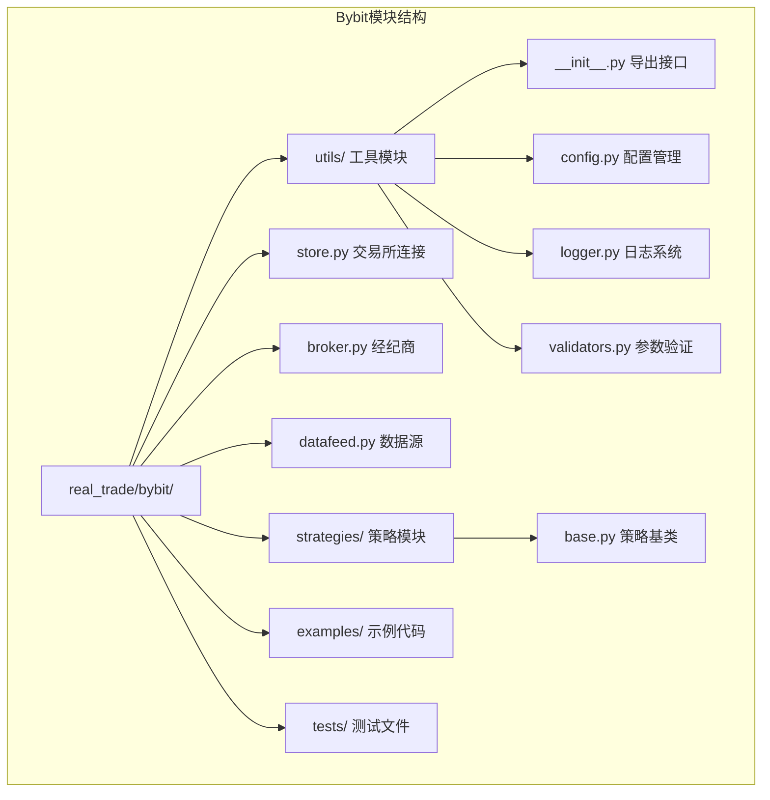
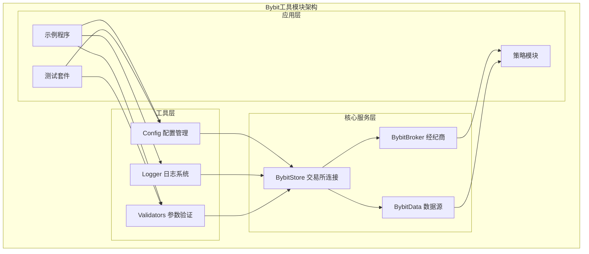
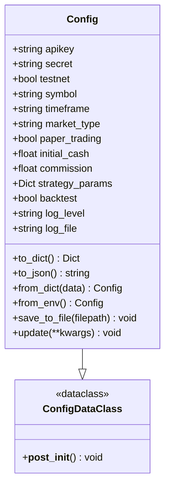
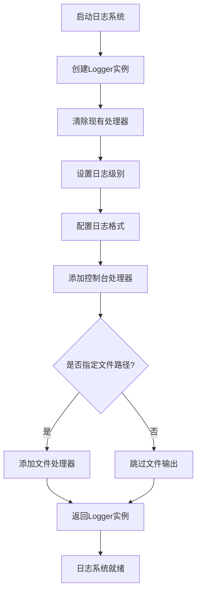
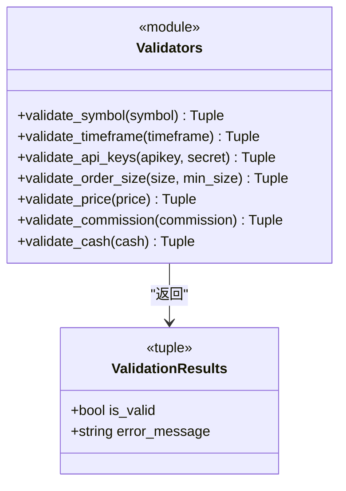
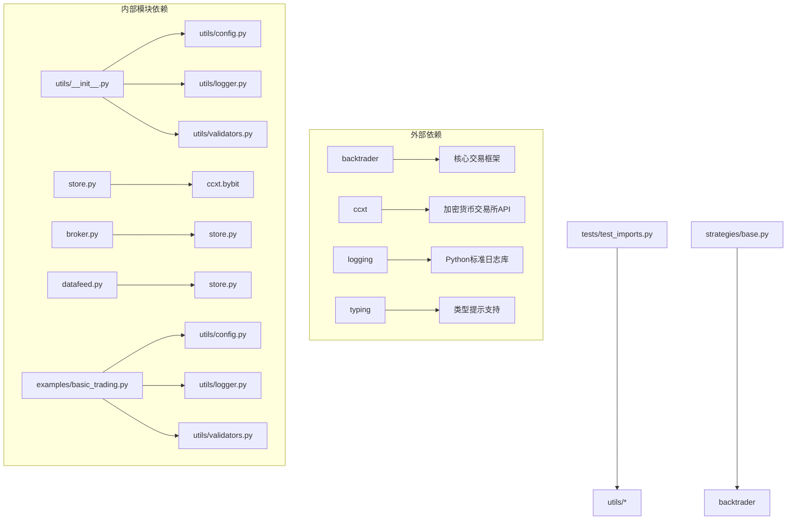

# Bybit工具模块

<cite>
**本文档引用的文件**
- [real_trade/bybit/utils/__init__.py](file://real_trade/bybit/utils/__init__.py)
- [real_trade/bybit/utils/config.py](file://real_trade/bybit/utils/config.py)
- [real_trade/bybit/utils/logger.py](file://real_trade/bybit/utils/logger.py)
- [real_trade/bybit/utils/validators.py](file://real_trade/bybit/utils/validators.py)
- [real_trade/bybit/__init__.py](file://real_trade/bybit/__init__.py)
- [real_trade/bybit/store.py](file://real_trade/bybit/store.py)
- [real_trade/bybit/broker.py](file://real_trade/bybit/broker.py)
- [real_trade/bybit/datafeed.py](file://real_trade/bybit/datafeed.py)
- [real_trade/bybit/examples/basic_trading.py](file://real_trade/bybit/examples/basic_trading.py)
- [real_trade/bybit/tests/test_imports.py](file://real_trade/bybit/tests/test_imports.py)
- [real_trade/bybit/strategies/base.py](file://real_trade/bybit/strategies/base.py)
</cite>

## 目录
1. [简介](#简介)
2. [项目结构](#项目结构)
3. [核心组件](#核心组件)
4. [架构概览](#架构概览)
5. [详细组件分析](#详细组件分析)
6. [依赖关系分析](#依赖关系分析)
7. [性能考虑](#性能考虑)
8. [故障排除指南](#故障排除指南)
9. [结论](#结论)
10. [附录](#附录)

## 简介

Bybit工具模块是Backtrader框架中专门用于集成Bybit加密货币交易所的专业化工具集合。该模块提供了完整的配置管理、日志系统、参数验证等功能，支持模拟交易和实盘交易两种模式，涵盖从基础交易到高级策略开发的完整生态系统。

该模块的核心目标是为用户提供一个健壮、可扩展且易于使用的Bybit交易集成解决方案，通过统一的工具接口简化复杂的交易系统开发过程。

## 项目结构

Bybit工具模块采用清晰的分层架构设计，主要包含以下核心目录和文件：



**图表来源**
- [real_trade/bybit/utils/__init__.py](file://real_trade/bybit/utils/__init__.py#L1-L18)
- [real_trade/bybit/store.py](file://real_trade/bybit/store.py#L1-L262)
- [real_trade/bybit/broker.py](file://real_trade/bybit/broker.py#L1-L381)
- [real_trade/bybit/datafeed.py](file://real_trade/bybit/datafeed.py#L1-L235)

**章节来源**
- [real_trade/bybit/utils/__init__.py](file://real_trade/bybit/utils/__init__.py#L1-L18)
- [real_trade/bybit/__init__.py](file://real_trade/bybit/__init__.py#L1-L215)

## 核心组件

Bybit工具模块由四个核心工具组件构成，每个组件都有明确的职责分工：

### 配置管理组件 (Config)
负责管理整个交易系统的配置信息，支持多种配置源和格式：
- JSON配置文件支持
- Python配置文件支持  
- 环境变量配置
- 默认值设置和参数验证

### 日志系统组件 (Logger)
提供统一的日志记录功能，支持：
- 多级别日志记录
- 控制台和文件双重输出
- 可定制的日志格式
- 线程安全的日志处理

### 参数验证组件 (Validators)
提供全面的参数验证功能：
- 交易对格式验证
- 时间周期有效性检查
- API密钥安全验证
- 业务规则合规性检查

### 工具模块导出接口
通过统一的导出接口，为外部模块提供简洁的访问方式，确保API的一致性和易用性。

**章节来源**
- [real_trade/bybit/utils/config.py](file://real_trade/bybit/utils/config.py#L17-L145)
- [real_trade/bybit/utils/logger.py](file://real_trade/bybit/utils/logger.py#L16-L85)
- [real_trade/bybit/utils/validators.py](file://real_trade/bybit/utils/validators.py#L15-L183)
- [real_trade/bybit/utils/__init__.py](file://real_trade/bybit/utils/__init__.py#L5-L17)

## 架构概览

Bybit工具模块采用模块化的架构设计，各个组件之间通过清晰的接口进行交互：



**图表来源**
- [real_trade/bybit/__init__.py](file://real_trade/bybit/__init__.py#L89-L187)
- [real_trade/bybit/store.py](file://real_trade/bybit/store.py#L16-L262)
- [real_trade/bybit/broker.py](file://real_trade/bybit/broker.py#L18-L381)
- [real_trade/bybit/datafeed.py](file://real_trade/bybit/datafeed.py#L19-L235)

该架构实现了以下设计原则：
- **单一职责原则**：每个组件专注于特定的功能领域
- **依赖倒置原则**：高层模块不依赖于低层模块的具体实现
- **开闭原则**：对扩展开放，对修改封闭
- **接口隔离原则**：提供细粒度的接口定义

## 详细组件分析

### 配置管理模块 (Config)

配置管理模块是Bybit工具模块的核心基础设施，提供了灵活的配置加载和管理机制：

#### 配置类设计



**图表来源**
- [real_trade/bybit/utils/config.py](file://real_trade/bybit/utils/config.py#L17-L94)

#### 配置加载机制

配置管理支持三种主要的配置加载方式：

1. **文件配置加载**：支持JSON和Python格式的配置文件
2. **环境变量配置**：通过环境变量动态设置配置参数
3. **运行时配置**：通过构造函数直接设置配置参数

#### 环境变量支持

模块提供了丰富的环境变量支持，便于在不同环境中部署：

| 环境变量 | 默认值 | 描述 |
|---------|--------|------|
| BYBIT_API_KEY | "" | Bybit API密钥 |
| BYBIT_API_SECRET | "" | Bybit API密钥 |
| BYBIT_TESTNET | "true" | 是否使用测试网 |
| BYBIT_SYMBOL | "BTC/USDT" | 交易对 |
| BYBIT_TIMEFRAME | "1m" | 时间周期 |
| BYBIT_MARKET_TYPE | "spot" | 市场类型 |
| BYBIT_PAPER_TRADING | "true" | 模拟交易模式 |
| BYBIT_INITIAL_CASH | "10000.0" | 初始资金 |
| BYBIT_COMMISSION | "0.001" | 手续费率 |
| LOG_LEVEL | "INFO" | 日志级别 |

**章节来源**
- [real_trade/bybit/utils/config.py](file://real_trade/bybit/utils/config.py#L17-L145)

### 日志系统模块 (Logger)

日志系统模块提供了专业级的日志记录功能，支持多级别的日志输出和灵活的配置选项：

#### 日志配置流程



**图表来源**
- [real_trade/bybit/utils/logger.py](file://real_trade/bybit/utils/logger.py#L16-L67)

#### 日志级别配置

支持的标准日志级别包括：
- DEBUG：详细的技术信息，用于调试目的
- INFO：一般性的信息，确认程序按预期工作
- WARNING：表示出现意外情况，但程序仍能继续运行
- ERROR：由于严重问题，程序无法执行某些功能
- CRITICAL：严重错误，表明程序无法继续运行

#### 输出格式定制

默认的日志格式包含以下信息：
- 时间戳：精确到毫秒的时间信息
- 日志器名称：标识日志来源
- 日志级别：当前日志的严重程度
- 日志消息：实际的业务信息

**章节来源**
- [real_trade/bybit/utils/logger.py](file://real_trade/bybit/utils/logger.py#L16-L85)

### 参数验证模块 (Validators)

参数验证模块提供了全面的数据验证功能，确保交易系统的输入数据符合业务规则和技术要求：

#### 验证器类图



**图表来源**
- [real_trade/bybit/utils/validators.py](file://real_trade/bybit/utils/validators.py#L15-L183)

#### 支持的时间周期

模块支持Bybit交易所的所有标准时间周期：

| 时间周期 | 描述 | 对应分钟数 |
|---------|------|-----------|
| 1m | 1分钟 | 1 |
| 3m | 3分钟 | 3 |
| 5m | 5分钟 | 5 |
| 15m | 15分钟 | 15 |
| 30m | 30分钟 | 30 |
| 1h | 1小时 | 60 |
| 2h | 2小时 | 120 |
| 4h | 4小时 | 240 |
| 6h | 6小时 | 360 |
| 12h | 12小时 | 720 |
| 1d | 1天 | 1440 |
| 1w | 1周 | 10080 |
| 1M | 1个月 | 43200 |

#### 验证规则说明

每个验证器都遵循统一的返回约定：
- 返回元组：(是否有效, 错误信息)
- 有效时：错误信息为None
- 无效时：返回具体的错误描述

**章节来源**
- [real_trade/bybit/utils/validators.py](file://real_trade/bybit/utils/validators.py#L15-L183)

## 依赖关系分析

Bybit工具模块的依赖关系体现了清晰的分层架构和模块化设计：



**图表来源**
- [real_trade/bybit/utils/__init__.py](file://real_trade/bybit/utils/__init__.py#L5-L17)
- [real_trade/bybit/store.py](file://real_trade/bybit/store.py#L89-L91)
- [real_trade/bybit/broker.py](file://real_trade/bybit/broker.py#L13-L15)
- [real_trade/bybit/datafeed.py](file://real_trade/bybit/datafeed.py#L12-L16)

### 关键依赖特性

1. **外部依赖最小化**：仅依赖backtrader和ccxt两个核心库
2. **内部模块解耦**：工具模块相互独立，可通过导出接口访问
3. **向后兼容性**：保持与Backtrader框架的完全兼容
4. **类型安全**：使用Python类型提示确保代码质量

**章节来源**
- [real_trade/bybit/utils/__init__.py](file://real_trade/bybit/utils/__init__.py#L5-L17)
- [real_trade/bybit/store.py](file://real_trade/bybit/store.py#L89-L91)

## 性能考虑

Bybit工具模块在设计时充分考虑了性能优化和资源管理：

### 内存管理优化

1. **延迟加载**：配置文件和日志处理器采用延迟初始化
2. **缓存机制**：交易所连接使用单例模式避免重复创建
3. **资源清理**：及时释放不再使用的资源和连接

### 并发处理能力

1. **线程安全**：日志系统和连接管理器都实现了线程安全
2. **异步支持**：数据源支持异步数据加载
3. **连接池管理**：通过单例模式管理连接资源

### 性能监控建议

1. **日志级别调优**：在生产环境中使用INFO或WARNING级别
2. **批量操作**：对于大量数据处理，考虑使用批处理模式
3. **缓存策略**：合理使用缓存减少重复计算

## 故障排除指南

### 常见配置问题

#### 配置文件格式错误

**问题症状**：
- 配置文件加载失败
- 抛出ValueError异常
- 程序启动中断

**解决方案**：
1. 检查JSON格式的语法正确性
2. 验证Python配置文件的变量命名
3. 确认文件编码格式为UTF-8

#### 环境变量未设置

**问题症状**：
- API密钥为空
- 交易对格式错误
- 日志级别设置无效

**解决方案**：
1. 在启动前设置所有必需的环境变量
2. 使用配置文件作为备用方案
3. 实现环境变量的默认值处理

### 日志系统问题

#### 日志输出异常

**问题症状**：
- 日志文件无法创建
- 控制台输出格式异常
- 日志级别设置无效

**解决方案**：
1. 检查文件权限和路径有效性
2. 验证日志格式字符串的正确性
3. 确认日志级别映射表的完整性

#### 性能问题

**问题症状**：
- 日志输出影响程序性能
- 文件过大导致磁盘空间不足
- 多线程环境下日志冲突

**解决方案**：
1. 调整日志级别减少输出量
2. 实施日志轮转机制
3. 使用异步日志处理器

### 参数验证失败

#### 交易对验证错误

**问题症状**：
- validate_symbol返回False
- 抛出格式错误异常
- 交易无法正常进行

**解决方案**：
1. 确保交易对格式为BASE/QUOTE
2. 验证货币代码的有效性
3. 检查字符集限制（仅允许大写字母和数字）

#### 时间周期验证失败

**问题症状**：
- validate_timeframe返回False
- 数据加载异常
- 策略执行错误

**解决方案**：
1. 使用支持的时间周期列表
2. 检查时间周期字符串的格式
3. 验证时间周期的有效性

**章节来源**
- [real_trade/bybit/utils/config.py](file://real_trade/bybit/utils/config.py#L108-L132)
- [real_trade/bybit/utils/logger.py](file://real_trade/bybit/utils/logger.py#L16-L67)
- [real_trade/bybit/utils/validators.py](file://real_trade/bybit/utils/validators.py#L33-L84)

## 结论

Bybit工具模块通过精心设计的架构和完善的工具集，为Backtrader框架提供了专业级的Bybit交易所集成解决方案。该模块的主要优势包括：

### 设计优势

1. **模块化设计**：清晰的职责分离和接口定义
2. **灵活性**：支持多种配置方式和部署场景
3. **可扩展性**：良好的架构为功能扩展预留空间
4. **易用性**：简洁的API设计降低使用门槛

### 技术特点

1. **类型安全**：完整的类型提示支持
2. **线程安全**：并发环境下的稳定性保证
3. **性能优化**：高效的内存管理和资源利用
4. **错误处理**：完善的异常处理和恢复机制

### 应用价值

该模块不仅适用于个人开发者进行算法交易开发，也适合专业机构构建自动化交易系统。通过标准化的工具接口，开发者可以专注于核心交易逻辑的实现，而无需关心底层的配置管理、日志记录和参数验证等基础设施问题。

## 附录

### 使用示例

#### 基础配置示例

```python
# 从环境变量加载配置
config = Config.from_env()

# 手动创建配置
config = Config(
    apikey="YOUR_API_KEY",
    secret="YOUR_SECRET",
    symbol="BTC/USDT",
    timeframe="1h",
    testnet=True,
    paper_trading=True
)
```

#### 日志配置示例

```python
# 设置默认日志器
logger = setup_logger(
    name="bybit_trading",
    level="INFO",
    log_file="trading.log",
    format_string="%(asctime)s - %(levelname)s - %(message)s"
)

# 获取日志器
logger = get_logger("bybit_trading")
```

#### 参数验证示例

```python
# 验证交易对
valid, error = validate_symbol("BTC/USDT")
if not valid:
    raise ValueError(f"Invalid symbol: {error}")

# 验证时间周期
valid, error = validate_timeframe("1h")
if not valid:
    raise ValueError(f"Invalid timeframe: {error}")
```

### 最佳实践

1. **配置管理**：优先使用环境变量进行配置，文件配置作为备份
2. **日志记录**：在开发阶段使用DEBUG级别，在生产环境使用INFO级别
3. **参数验证**：在关键业务逻辑前后添加参数验证
4. **错误处理**：实现完善的异常捕获和错误恢复机制
5. **性能监控**：定期检查日志文件大小和系统资源使用情况

### 扩展指南

#### 自定义验证器

```python
def validate_custom_parameter(value: str) -> Tuple[bool, Optional[str]]:
    """自定义参数验证器示例"""
    if not value:
        return False, "Parameter cannot be empty"
    
    if len(value) < MIN_LENGTH:
        return False, f"Parameter too short (minimum {MIN_LENGTH} characters)"
    
    return True, None
```

#### 配置扩展

```python
@dataclass
class ExtendedConfig(Config):
    """扩展配置类"""
    custom_param: str = "default_value"
    
    @classmethod
    def from_env(cls) -> "ExtendedConfig":
        """扩展环境变量加载"""
        base_config = super().from_env()
        return cls(
            **base_config.__dict__,
            custom_param=os.getenv("CUSTOM_PARAM", "default_value")
        )
```